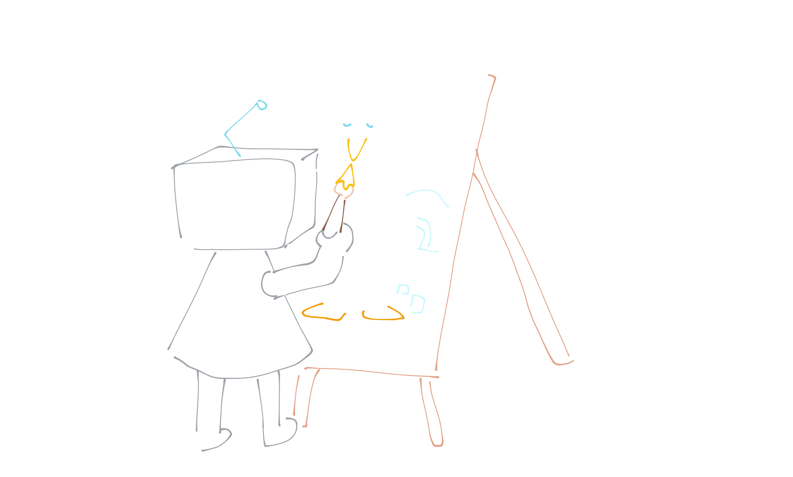
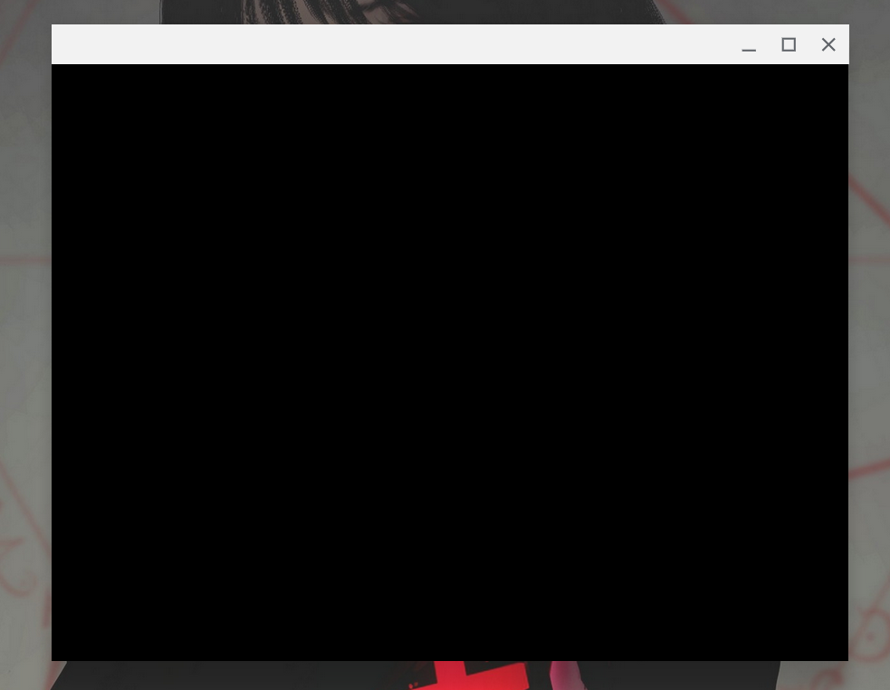

# O Primeiro Passo

Olá! Seja muito bem vindo ao primeiro passo nesta jornada pelo mundo do OpenGL. Como você deve ter visto no nosso README, esta trilha é dividida em vários módulos ou capítulos, e este é o primeiro deles.

Neste capítulo, iremos estabelecer e nos familiarizar com o ambiente próprio para a criação de um projeto usando OpenGL. Ao fim dele, você terá escrito um programa capaz de criar uma **incrível** e **_fabulosa_** **JANELA EM BRANCOOOOOoooo**oooo..... Calma, só isso? Cadê os gráficos 3D ultra-realistas que me prometeram? Então, acontece que no mundo do OpenGL (e da computação gráfica no geral) nada é tão simples quanto parece. Aqui, nós estaremos lidando com os próprios _sustentáculos_ e _fundamentos_ da renderização! Então, é importante aprendermos com calma até mesmo as coisas que a princípio parecem frívolas.

Dito isso, vamos parar de enrolação e partir para o conteúdo, que neste capítulo será:

1. O que de fato é o OpenGL?
2. Inicializando um projeto   
3. Ferramenta de build
4. Bibliotecas amigas: GLFW e GLAD
5. Instalações
6. O boilerplate do GLFW e GLAD
7. O loop de renderização
8. Como lidar com inputs do usuário com GLFW

## O Que de fato é o OpenGL?

No README, nós temos nos referido ao OpenGL como sendo uma "biblioteca", e de certa forma nós não mentimos. Contudo, o OpenGL está mais para uma **especificação** do que uma biblioteca de fato, tanto é que você pode ler a especificação do OpenGL 4.3 (a versão que usaremos neste curso) [aqui](https://registry.khronos.org/OpenGL/specs/gl/glspec43.core.pdf). Esta especificação é um tijolão de 700 páginas descrevendo em bom detalhe quais são as funções que uma **implementação** do OpenGL deve expor e como elas devem funcionar. Como o objetivo de uma especificação não é ser didática, não é recomendada a sua leitura - existem livros muito mais eficázes neste quesito caso você queira usá-los para complementar esta trilha, como o "OpenGL Programming Guide 8th Edition".

Tá, mas que diferença faz se o OpenGL é uma biblioteca ou uma especificação? Na verdade, não faz muita diferença não. O fato é que, para nós, o OpenGL não será nem uma biblioteca nem uma especificação. A partir daqui, iremos pensar no OpenGL como sendo uma gigante **Máquina de Estado**!

Uma máquina de estado é basicamente um robozão cheio de alavancas e botões cujo comportamento é determinado pela configuração atual dessas alavancas e botões. Ou seja, podemos girar e apertar os botões e alavancas disponíveis no robozão para mudar o **estado** interno dele. Estas mudanças de estado podem ser regidas/limitadas por algum mecanismo que impeça que o robô entre em um estado ilegal (sem nexo). O OpenGL em especial é um robozão artista, então definir o seu estado interno é definir como ele vai desenhar.



> O estado interno do OpenGL é geralmente chamado de **_Contexto_**

Conforme formos aprendendo mais sobre o OpenGL, observem que as funções podem ser basicamente agrupadas em dois grandes grupos: funções que **alteram** o estado da máquina e funções que **utilizam** o estado atual para fazer algo.

Como o estado interno dele é excepcionalmente complexo, muitas "configurações" são agrupadas em forma de objetos. Nós podemos pensar nos objetos como sendo estruturas como esta:

``` C
struct objeto_massa {
    int estado_1;
    float estado_2;
    ...
}
```

Seguindo esta lógica, o contexto do OpenGL se parece muito com isso:

``` C
struct contexto_OpenGL {
    objeto_massa *parte_do_contexto_1;
    objeto_xyz *parte_do_contexto_2;
    bool configuracao_isolada_1;
    ...
}
```

Tendo isto em mente, um padrão que você verá muitas vezes (principalmente se continuar estudando OpenGL após terminar esta trilha) é o seguinte:

``` C
unsigned int ID_objeto = 0;
glGenObjeto(1, &ID_objeto);
glBindObjeto(ALVO, ID_objeto);
glSetEstadoDoObjeto(ALVO, OPCAO, valor);
...
glBindObjeto(ALVO, 0);
```

Obviamente, as palavras em português aí (como "alvo" e "estado do objeto") são placeholders que serão substituidos por termos reais da biblioteca. Vamos entender o que cada parte desse código faz mais ou menos:

- `unsigned int ID_objeto = 0`: cria um ID que iremos usar para nos referirmos a um objeto (por ex um `objeto_massa`) passando-o como argumento para outras funções.
- `glGenObjeto(1, &ID_objeto)`: inicializa o ID que criamos na linha anterior para conter de fato um identificador válido e disponível para um objeto.
- `glBindObjeto(ALVO, ID_objeto)`: define o objeto associado ao ID_objeto como sendo o objeto ativo no `ALVO`. O alvo é basicamente um slot onde podemos encaixar ("_bindar_") um objeto de um tipo específico. Os alvos serão um enum, como `GL_TEXTURE_2D`.
- `glSetEstadoDoObjeto(ALVO, OPCAO, valor)`: atualiza o valor do estado/atributo `OPCAO` do objeto no slot `ALVO` para um determinado valor. Assim como o alvo, a opção também é um enum, como `GL_TEXTURE_WRAP_S`.
- `glBindObjeto(ALVO, 0)`: retira o objeto préviamente encaixado no slot `ALVO`, para previnir que não iremos modificá-lo sem querer.

O OpenGL 4.3 **nunca** nos dá um objeto de fato, toda função que gera um objeto (as `glGen____`) apenas devolve um ID. Além disso, a máquina de estado do OpenGL é cheia desses slots que chamamos de alvo ou target, onde encaixamos um objeto. Sendo assim, nós nunca modificamos um objeto diretamente, nós apenas encaixamos ele em um target próprio (com as funções `glBind____`) e então modificamos o que quer que esteja naquele target usando uma função que altera estado. Este design permite que criemos vários objetos de um mesmo tipo e alternemos qual está atualmente ativo (bindado) de acordo com a lógica do nosso programa, efetivamente mudando a "configuração" da máquina de estado sem muito esforço.

Resumindo, ao invés de o processo ser o seguinte, como seria sensato se esperar:

1. Pedir um objeto para o OpenGL
2. Modificar o objeto diretamente

O que nós temos na verdade é:

1. Pedir um objeto para o OpenGL
2. Colocar ele em uma gaveta
3. Pedir para ele modificar o que quer que esteja na gaveta

> Esta indireção é possívelmente um dos maiores defeitos da API do OpenGL. Por conta disso, versões mais recentes (da 4.5 para frente) incrementaram a API para incluir funções que modificam diretamente objetos, algo chamado de **_Direct State Access_** (DSA). Contudo, nós não teremos esse luxo todo, pois estamos usando a versão 4.3 por motivos de compatibilidade.

## Inicializando um projeto

Por agora, tudo que precisaremos para nosso projeto é um diretório com uma pasta `src` e um arquivo C++ básico. Se estiver no Linux, você pode simplesmente rodar os comandos abaixo:

``` Bash
mkdir trilha_opengl
cd trilha_opengl
mkdir src
touch src/main.cpp
```

E, é claro, abrir o projeto com seu editor de texto preferido.

Dentro do `main.cpp`, você pode só definir o main por enquanto (e incluir headers básicos se quiser).

``` C
// main.cpp
#include <iostream>

int main() {

}
```

## Ferramenta de build

Para compilar e rodar nosso projeto, usaremos um `makefile`; um arquivo usado em conjunto com o comando [make](https://en.wikipedia.org/wiki/Make_(software)). Primeiro, crie um arquivo chamado "Makefile" na raiz do seu projeto:

``` Bash
touch Makefile
```

e depois coloque todo esse código dentro do arquivo.

``` Bash
# Detecção do Sistema Operacional
ifeq ($(OS),Windows_NT)
    RM = del /Q /F
    CP = copy /Y
    MKDIR = mkdir
    ERR_IGNORE = 2>NUL || title Error
    TARGET = trilha.exe
    LIBS = -lglfw3 -lopengl32 -lassimp -lgdi32
else
    RM = rm -rf
    MKDIR = mkdir -p
    TARGET = trilha
    UNAME_S := $(shell uname -s)
    
    ifeq ($(UNAME_S),Linux)
        LIBS = -lglfw -lGL -lGLU -lassimp -ldl -lpthread -lX11 -lXrandr -lXi
    endif
    ifeq ($(UNAME_S),Darwin)
        LIBS = -lglfw -framework OpenGL -lassimp -lpthread
    endif
endif

# Configurações do Compilador
CXX = g++
CC = gcc
CXXFLAGS = -std=c++17 -Wall -O3
INCLUDES = -Iinclude -Isrc

# Mapeamento de Arquivos
# Busca recursivamente por arquivos .cpp e .c
SRCS := $(shell find src -name '*.cpp' -or -name '*.c' 2>/dev/null || dir /s /b src\*.cpp src\*.c)
OBJS := $(addsuffix .o, $(basename $(SRCS)))

# Regras de Compilação
all: $(TARGET)

$(TARGET): $(OBJS)
	@$(MKDIR) bin $(ERR_IGNORE)
	$(CXX) $(CXXFLAGS) $(INCLUDES) -o bin/$(TARGET) $(OBJS) $(LIBS)

# Regra para arquivos C++
%.o: %.cpp
	$(CXX) $(CXXFLAGS) $(INCLUDES) -c $< -o $@

# Regra para arquivos C (Necessário para o GLAD)
%.o: %.c
	$(CC) $(CXXFLAGS) $(INCLUDES) -c $< -o $@

# Limpeza
clean:
	$(RM) $(subst /,\,$(OBJS)) bin\$(TARGET) $(ERR_IGNORE) || $(RM) $(OBJS) bin/$(TARGET)

.PHONY: all clean
```

Explicar este código foge bastante do escopo da trilha, então se você quiser aprender mais sobre, pesquise nas interwebs.

Com este arquivo pronto, você poderá compilar os programas que escreveremos no restante da trilha simplesmente digitando `make` no terminal. Isso gerará uma pasta `bin/` com um executável chamado `trilha` lá dentro, pronto para o combate. Para compilar e rodar o projeto em um comando só, no Linux, você pode usar:

``` Bash
make; ./bin/trilha
```

ou

``` Bash
make && ./bin/trilha
```

## Bibliotecasa amigas: GLFW e GLAD

Uma das grandes maldições de aprender OpenGL é que você não pode simplesmente aprender OpenGL por si só. É necessário se familiarizar com pelo menos o básico de um monte de outras bibliotecas.

Como já dissemos antes, o OpenGL é apenas uma especificação de uma biblioteca com um propósito muito específico: renderizar gráficos em uma janela. Agora, de onde vem essa janela? Isso não é preocupação do OpenGL, ele está cagando e andando pra janela, mesmo que ele DEPENDA DA EXISTÊNCIA DELA! Ou seja, o OpenGL é um ser estóico e manhoso, mas por sorte ele está rodeado de amigos prestativos e modestos :). Um destes amigos se chama [GLFW](https://www.glfw.org/docs/latest/index.html). Gente boa como é, o GLFW possui 3 atividades favoritas que serão uma mão na roda para nós:

1. Criar e gerenciar janelas
2. Criar um contexto do OpenGL
3. Lidar com inputs de usuário

Outro cara muito bacana que nós vamos agradecer por existir é o [GLAD](https://glad.dav1d.de/). É um pouco mais difícil explicar qual é a pira do GLAD, mas basicamente ele **carrega** as funções do OpenGL para que você possa usá-las. Como o OpenGL é apenas uma especificação babona, os desenvolvedores de drivers para placas de vídeo precisam implementar as funções dessa especificação uma por uma. Estas funções ficam então disponíveis como um `.dll` (Windows) ou `.so` (Linux) em algum lugar aleatório da memória, apenas o seu sistema operacional (SO) sabe o endereço dessas funções. O que o GLAD faz é perguntar ao SO o endereço de todas as centenas de funções do OpenGL de uma vez só e disponibilizar elas com os nomezinhos que elas têm lá na descrição oficial da API.

Caso o GLAD não existisse, nós teríamos que carregar uma a uma todas as funções do OpenGL que fossemos usar no programa. Estúpido, eu sei, então fique contente que o GLAD existe (glad em inglês significa contente, pode rir).

Feita a introdução, vamos agora conhecer melhor esses camaradas.

## Instalações

Para instalar o GLFW na versão 3, você pode baixar o binário do Windows ou macOS direto do [site deles](https://www.glfw.org/download) ou rodar o seguinte comando em algumas distribuições do Linux:

``` Bash
sudo apt-get install libglfw3 libglfw3-dev
```

Caso tenha algum problema, você também pode [compilar a biblioteca](https://www.glfw.org/docs/latest/compile.html) direto do source code.

Feito isso, você vai conseguir incluir a biblioteca em seus programas assim como fazemos com qualquer outra biblioteca do C ou C++

``` C
#include <GLFW/glfw3.h>
```

Já o GLAD pode ser instalado [neste site](https://glad.dav1d.de/). Basta que você preencha os seguintes campos assim:

- Language: `C/C++`
- Specification: `OpenGL`
- gl: `Version 4.3`
- Profile: `Core`

Depois é só clicar em **generate** e baixar o zip. Unzipa o zip. Lá você vai ter duas pastas, uma `src` e uma `include`. Dentro da `include`, você vai ter mais duas pastas, a `KHR` e a `glad`. No linux, você vai colocar essas duas pastas no diretório `include` do seu sistema, que fica no `/usr/include`. Se você usa Windows (ainda dá tempo de sair dessa vida), o processo vai depender um pouco da sua IDE, então dá uma pesquisada por fora que você vai achar um tutorial.

Além disso, você vai precisar colocar o arquivo `glad.c` que vem na pasta `src` do zip na pasta `src` do seu projeto.

Feita essa baixaria, você também vai poder incluir a biblioteca facilmente:

``` C
#include <glad/glad.h>
```

> Um detalhe importante: coloque o `#include` do GLAD antes/acima do GLFW, caso contrário pode haver conflitos e seu programa não compilará.

## O boilerplate do GLFW e GLAD

Algo inevitável em muitas áreas da computação é ter um longo trecho de código que se repete em basicamente todos os programas - os famosos _boilerplates_. No ambiente do OpenGL, boa parte do boilerplate que teremos advém do GLFW. Vamos passar rapidamente por eles agora, tentando deixar a coisa o menos monótona possível (apesar de que você provavelmente só vai copiar e colar esses códigos sem sequer pensar no que está fazendo em seus próximos projetos).

### GLFW

A primeira coisa que iremos adicionar na função main é o seguinte:

``` C
int main() {
    glfwInit();
    glfwWindowHint(GLFW_CONTEXT_VERSION_MAJOR, 4);
    glfwWindowHint(GLFW_CONTEXT_VERSION_MINOR, 3);
    glfwWindowHint(GLFW_OPENGL_PROFILE, GLFW_OPENGL_CORE_PROFILE);

    #ifdef __APPLE__
    glfwWindowHint(GLFW_OPENGL_FORWARD_COMPAT, GL_TRUE);
    #endif

    GLFWwindow *window = glfwCreateWindow(800, 600, "Estado da Arte", NULL, NULL);
}
```

A função `glfwInit`, como o nome sugere, inicializa o GLFW. Já a função `glfwWindowHint` define uma configuração para a próxima janela que o GLFW criar - o primeiro argumento é a configuração que queremos definir e o segundo argumento é o seu valor. Neste caso, estamos definindo a versão para ser `4.3` (_major version_ 4 e _minor version_ 3), além de definir o _profile_ para `core`.

Logo abaixo, nós também ativamos uma configuração que é necessária apenas no macOS (ou seja, se `__APPLE__` estiver definido).

Por fim, nós criamos uma janela usando a função `glfwCreateWindow` e armazenamos essa janela na variável `window`. O primeiro argumento da função é a largura da janela, o segundo é a altura e o terceiro é o título dela. Já o quarto e quinto argumentos são opcionais e não são de nosso interesse aqui, então definimos como `NULL`, mas você pode ler mais sobre eles [aqui](https://www.glfw.org/docs/latest/group__window.html#ga3555a418df92ad53f917597fe2f64aeb).

> Existem dois _profiles_ no openGL, o Core e o Compatibility, como você deve ter visto quando geramos o zip do GLAD. A diferença entre eles é basicamente que o profile compatibility te permite usar funções deprecadas e é retrocompatível com umas versões bem antigas do OpenGL. Contudo, o recomendado é usar o Core mesmo, para que você seja forçado a usar as práticas mais modernas da biblioteca.

Caso algo dê errado na criação da janela, o GLFW retornará `NULL` da função `glfwCreateWindow`, então precisamos checar se houve um erro:

``` cpp
if(!window) {
    std::cout << "Erro ao criar janela do GLFW" << std::endl;
    glfwTerminate();
    return -1;
}
```

A função `glfwTerminate` libera todos os recursos que o GLFW estiver segurando.

O próximo passo é definir o contexto da janela que nós criamos como sendo o contexto atual do OpenGL, o que é feito com a função `glfwMakeContextCurrent`

``` C
glfwMakeContextCurrent(window);
```

### GLAD

Ok, com isso na main, nós podemos passar agora para o boilerplate do GLAD, que por sorte é pouca coisa!

``` cpp
if (!gladLoadGLLoader((GLADloadproc)glfwGetProcAddress)) {
    std::cout << "Falha ao carregar funções do GLAD" << std::endl;
    return -1;
}
```

Com este código, o glad irá carregar as funções do OpenGL para o nosso programa e gerar um erro caso ele não consiga.

### Viewport

O **_viewport_** é o tamanho (altura e largura) do que o OpenGL enxerga como sendo a janela 2D onde ele vai renderizar. Como veremos mais pra frente, em certo ponto do processo de renderização os objetos têm coordenadas que variam de `-1` a `1`. Para saber para onde essa posição deve ser mapeada na janela, ele faz uma regrinha de três que nos leva do intervalo `[-1, 1]` para o intervalo do tamanho do viewport, por exemplo `[0, 800]` na largura e `[0, 600]` na altura. Dessa forma, um ponto na posição `(-0.5, 0)` iria parar nas coordenas `(200, 300)`.

Para definir o tamanho do viewport, nós vamos adicionar esta linha abaixo de tudo que escrevemos até agora:

``` C
glViewport(0, 0, 800, 600);
```

Você acabou de chamar sua primeira função do OpenGL!!! Muita emoção slk.

O primeiro e segundo argumentos da função são a posição do ponto inferior esquerdo do viewport, enquanto os outros dois argumentos são a largura e a altura dele. Você pode ver como estes argumentos afetam o cálculo das coordenadas [aqui](https://registry.khronos.org/OpenGL-Refpages/gl4/html/glViewport.xhtml)

Agora, um problema de distorção da imagem aconteceria caso o usuário do nosso programa mudasse o tamanho da janela e nós não alterássemos o viewport para corresponder. Logo, precisamos usar um pouquinho mais do GLFW para lidar com este evento.

Tudo que precizamos fazer é definir uma função de callback. O protótipo dela (para você colocar antes do main) é esse:

``` C
void callback_redimensionamento(GLFWwindow* janela, int largura, int altura);
```

E aqui está o corpo da função, que você pode deixar depois do main:

``` C
void callback_redimensionamento(GLFWwindow* janela, int largura, int altura) {
    glViewport(0, 0, largura, altura);
}
```

Bem simples né? Nós apenas redimensionamos o viewport. Para associar este callback com o evento certo do GLFW nós precisamos colocar mais esta linha no main:

``` C
glfwSetFramebufferSizeCallback(window, callback_redimensionamento);
```

E pronto, problema resolvido >:D

## O loop de renderização

Se você rodar o programa que escrevemos até agora, vai ver que basicamente nada acontece, no máximo uma janela rapidamente aparece na tela e imediatamente some. Isto acontece pois nós ainda não criamos o loop de renderização; um loop que mantenha a janela viva até que o usuário a feche ou alguma outra coisa aconteça.

Vamos então adicionar este loop ao nosso código, no fim do main, coloque este trecho:

``` C
while(!glfwWindowShouldClose(window)) {
    glfwSwapBuffers(window);
    glfwPollEvents();    
}

glfwTerminate();
return 0;
```

O que acontece aqui é que dentro da condição do `while` nós chamamos a função `glfwWindowShouldClose`, que retorna `false` até receber um sinal de que a janela deve fechar. Ou seja, este será efetivamente um loop infinito enquanto nossa aplicação estiver rodando.

Dentro do loop, nós chamamos duas funções importantes, `glfwSwapBuffers` vai cuidar do **_double buffering_** para nós. Já a `glfwPollEvents` ficará conferindo se algum evento relativo ao GLFW ocorreu, como um input de teclado ou mouse.

Finalmente, depois do loop, nós chamamos o já visto `glfwTerminate` e finalizamos o programa.



Uhul, lets bora!! Com este programa temos agora a janela em branco que te prometemos! De nada, de nada.

> _Double buffering_ é uma técnica muito comum que se consiste em ter duas "imagens" (buffers) que se alternam nas funções de quem está sendo renderizado na tela e quem está sendo alterado pela aplicação para ser renderizado no próximo frame. Ou seja, temos dois buffers e duas funções: a de **_front buffer_** e a de **_back buffer_**. Quem quer que seja o front buffer no frame atual estará sendo exibido ao usuário, e quem quer que seja o back buffer estará sendo "desenhado" às escondidar para poder trocar de lugar com o front buffer no próximo frame. Sem double buffering, o usuário veria a tela piscando a todo momento, pois a renderização - o processo de desenhar o frame - aconteceria no mesmo buffer que está sendo exibido.

Para superar suas expectativas, vamos adicionar mais duas linhazinhas que farão com que a nossa janela não seja um mero contêiner do vazio infinito, mas sim uma fenda para o mundo alegre das cores. Digite este código no começo do loop de renderização:

``` C
glClearColor(0.1f, 0.64f, 0.64f, 1.0f);
glClear(GL_COLOR_BUFFER_BIT);
```

Agora, se compilar e rodar o programa novamente, verá que a tela ficou em um tom meio turquesa! **UHUUUUUUUUUUUULLLLLLLLLL!!!!!!!!!!!!!!**

A função `glClearColor` é uma daquelas que mudam estado, ela define qual vai ser a cor utilizada pelo `glClear`, que por sua vez preenche a tela com uma cor só.


## Como lidar com inputs do usuário com GLFW

Para acabar, vamos colocar só mais uma funçãozinha em nosso código, uma para que a janela se feche quando o usuário apertar Esc.

Coloque o protótipo desta função acima do main e a definição dela abaixo:

``` C
// protótipo
void processaInput(GLFWwindow *window);

// definição
void processaInput(GLFWwindow *window) {
    if(glfwGetKey(window, GLFW_KEY_ESCAPE) == GLFW_PRESS)
        glfwSetWindowShouldClose(window, true);
}
```

e então chame esta função no início do loop de renderização:

``` C
processaInput(window);
```

Assim, a função `processInput` ficará conferindo se o Esc está sendo pressionado (através da função `glfwGetKey`) a cada frame, e quando ele estiver de fato pressionado, ela encerrará o loop com a ajuda da função `glfwSetWindowShouldClose`. Muito massa, admita.

Note que a partir de agora, nosso loop de renderização terá essa cara:

``` C
while (!glfwWindowShouldClose(window)) {
    processaInput(window);

    // Código de renderização

    glfwSwapBuffers(window);
    glfwPollEvents();
}
```

Então quando falarmos sobre colocar algum código no loop de renderização daqui em diante na trilha, o ideal é que você coloque ele entre o `processInput` e o `glfwSwapBuffers`, ali onde está o comentário. Caso algo fuja desta ordem, nós avisaremos.

## Conclusão

Esperamos que tenha gostado desta breve introdução ao mundo do OpenGL. Saiba que esta primeira parte é a mais monótona e desinteressante de toda a trilha (por conta de todo o boilerplate sem nenhum retorno visual impactante), então se você não entrou em estado vegetativo isto é um bom sinal, porque daqui pra frente a coisa só fica mais empolgante!

Se você se embananou em algum momento ou não conseguiu seguir o passo a passo por algum motivo, o código que escrevemos ao longo deste capítulo está disponível neste mesmo repositório, em `codigos/src/capitulo_00.cpp`, use ele de referência a vontade.

         _\|/_
         (o o)
 +----oOO-{_}-OOo------------------------------+
 |                                             |
 | Obrigado por ler até aqui! Até a próxima :) |
 |                                             |
 +---------------------------------------------+

## Exercícios propostos

Se você quiser brincar um pouco com o que aprendemos até agora, ente o seguinte:

1. Altere os argumentos da função `glClearColor` para chegar em uma cor que você gosta muito
2. Tente fazer com que quando o usuário aperte alguma tecla (por exemplo espaço), a janela mude de cor - talvez ciclicamente por uma paleta ou até mesmo gerando uma cor aleatória.
