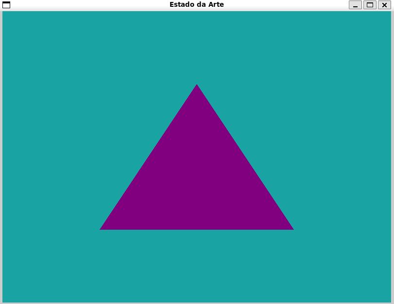

# Triângulo

Olá, de volta! Se você sobreviveu ao capítulo anterior e conseguiu criar aquela janela turquesa, parabéns! Você já tem o **palco**. 

Agora, está na hora de colocarmos o primeiro ator nesse palco. E não, não vai ser um modelo 3D do *Tralalero Tralala* (apesar de ser um ótima ideia). Vamos começar com o *Hello World* da computação gráfica: **O Triângulo**.


> Ops, não era esse...

Neste capítulo, vamos entender como a informação sai do seu código C++ e chega na sua placa de vídeo (GPU). O OpenGL é meio fresco com isso e exige que a gente siga um protocolo rígido. Aperte os cintos: estamos prestes a transformar bytes brutos em pixels, navegando pela memória e pelas engrenagens do **Pipeline Gráfico**.

O que vamos cobrir nesse capítulo:

1. O que é o Pipeline Gráfico?
2. Vértices: muito mais que apenas pontos  
3. VBO: O balde de dados  
4. VAO: O manual de instruções  
5. O triângulo finalmente aparece!

## O que é o Pipeline Gráfico?

Antes de sairmos digitando código, você precisa entender o conceito de *Pipeline*. Imagine uma fábrica de carros: de um lado entra metal bruto e pneus, e do outro sai um possante brilhando. Na computação gráfica, o "metal bruto" são os seus vértices e o "carro pronto" são os pixels na sua tela.

O OpenGL pega seus dados e os passa por várias "estações" de processamento. Algumas dessas estações nós podemos programar (usando os *Shaders*, que basicamente são pequenos programas gráficos que rodam na GPU para calcular efeitos visuais, mas falaremos deles com mais calma no próximo capítulo), outras são fixas e automáticas.

### As paradas do Pipeline:

Para não ficar perdido, aqui está o percuso dessa "fábrica":

- **Vertex Data (Dados de Vértice)**: É a lista de coordenadas e atributos (como cores ou coordenadas de textura) que você envia da CPU. É o "metal bruto" estocado na memória da GPU através dos buffers que veremos daqui a pouco.
  
- **Vertex Shader (Programável)**: A primeira parada e uma das mais importantes. Este pequeno programa roda para cada vértice individualmente. Aqui você pode transformar a posição dos pontos (mover, rotacionar, escalar) ou projetá-los de um mundo 3D para a sua tela 2D. É como se você estivesse posicionando as quinas de uma moldura no papel.

- **Primitive Assembly (Montagem de Primitivas)**: Agora que os pontos estão posicionados, a GPU precisa saber o que eles formam. Ela agrupa os vértices e os conecta para formar formas geométricas básicas chamadas de primitivas (como, o nosso favorito, o triângulo).

- **Rasterização**: É aqui que a mágica acontece. A GPU converte o seu triângulo geométrico em uma grade de fragmentos (um fragmento é quase um pixel, mas ele ainda carrega muitas informações extras e pode ser descartado antes de chegar na tela).

- **Fragment Shader (Programável)**: Este programa roda para cada fragmento gerado na rasterização. Sua missão principal é decidir a cor final daquele ponto. É aqui que a mágica visual acontece: calculamos iluminação, sombras, reflexos e aplicamos as texturas. Se o seu triângulo é degradê ou tem a cara do Mario, é aqui que isso é decidido.

- **Tests & Blending**: A última checagem. O OpenGL verifica se o pixel está atrás de outro objeto ou se é transparente antes de pintá-lo definitivamente na tela.

> Vale ressaltar que não existe uma divisão única e universal para as etapas do pipeline; a literatura varia conforme a precisão adotada por cada autor para definir os limites de cada fase.

Lembrando que como o OpenGL é uma 'Máquina de Estado', nós não "enviamos um triângulo", por exemplo. Nós configuramos o estado da máquina, jogamos os dados em um buffer e damos a ordem: "Ei, robô artista, use essas configurações e desenhe o que estiver nesse balde!".

Let's go construir nosso primeiro triângulo agora? 

Todas as alterações abaixo serão feitas em cima do código **main.cpp** feito no último capítulo.

## Vértices: muito mais que apenas pontos

No ensino médio, você aprendeu que um vértice é um ponto no espaço $(x, y, z)$. No OpenGL, um vértice é um pacote de informações. Sim, ele tem posição, mas ele também pode carregar cor, coordenadas de textura, e quaisquer outros atributos customizados que o seu sistema de renderização exigir.

Como você ainda é um pequeno gafanhoto no OpenGL, vamos definir um triângulo simples usando apenas coordenadas. No OpenGL, como vimos, a tela "visível" vai de `-1.0` a `1.0` em todos os eixos.

Então, para desenhar um triângulo que fique centralizado, vamos definir três vértices dentro desse limite:

```cpp
float vertices[] = {
    -0.5f, -0.5f, 0.0f, // Esquerda 
     0.5f, -0.5f, 0.0f, // Direita
     0.0f,  0.5f, 0.0f  // Topo
};
```

## VBO: O balde de dados

Agora que temos os dados dos vértices definidos, precisamos mandá-la para a memória da GPU. O objeto que faz isso é o **VBO (Vertex Buffer Object)**. Lembra da "Máquina de Estados" e das "gavetas" do capítulo 00? O VBO é basicamente uma gaveta onde jogamos um monte de dados brutos de uma vez só para a GPU processar em alta velocidade.

Com isso, a vantagem de usar o VBO para gerenciarmos a memória é que como podemos enviar grandes lotes de dados de uma só vez para a placa gráfica, nós não gastamos tempo enviando dados em poucas quantidades quando o envio da CPU para a GPU é relativamente lento.

O processo para gerar o VBO segue aquele padrão do OpenGL que agora você já conhece:

```cpp
unsigned int VBO;
glGenBuffers(1, &VBO); // Gera o ID
```

O OpenGL possui vários tipos de buffers. Para armazenar vértices, utilizamos o tipo específico chamado GL_ARRAY_BUFFER. Podemos vincular o buffer recém-criado ao alvo GL_ARRAY_BUFFER com a seguinte função:

```cpp
glBindBuffer(GL_ARRAY_BUFFER, VBO);
```
A partir desse ponto, qualquer chamada de buffer que fizermos (no alvo GL_ARRAY_BUFFER ) será usada para configurar o buffer atualmente vinculado, que é o VBO. Em seguida, podemos fazer uma chamada para a função `glBufferData`. 

Função que copia os dados de vértice previamente definidos para a memória do buffer:

```cpp
glBufferData(GL_ARRAY_BUFFER, sizeof(vertices), vertices, GL_STATIC_DRAW); 
```

Seu primeiro argumento é o tipo do buffer para o qual queremos copiar os dados: o objeto de buffer de vértices atualmente vinculado ao alvo GL_ARRAY_BUFFER . O segundo argumento especifica o tamanho dos dados (em bytes) que queremos passar para o buffer; um valor simples *sizeof* dos dados de vértices é suficiente. O terceiro parâmetro são os dados propriamente ditos que queremos enviar.

O quarto parâmetro especifica como queremos que a placa gráfica gerencie os dados fornecidos. Isso pode assumir 3 formas:

- **GL_STREAM_DRAW**: os dados são definidos apenas uma vez e usados ​​pela GPU no máximo algumas vezes.
- **GL_STATIC_DRAW**: os dados são definidos apenas uma vez e usados ​​várias vezes.
- **GL_DYNAMIC_DRAW**: os dados são alterados com frequência e usados ​​muitas vezes.

Os dados de posição do triângulo não mudam, são muito utilizados e permanecem os mesmos em todas as chamadas de renderização, portanto, seu tipo de uso mais adequado seria GL_STATIC_DRAW.

## VAO: O manual de instruções

O VBO é só um amontoado de bytes. A GPU é rápida, mas não é vidente; ela não sabe se aqueles números são posições, cores ou o código da Matrix.

É aqui que entra o **VAO (Vertex Array Object)**. Pense nele como um **gerente de estado ou um gravador**. Ele armazena toda a configuração necessária para interpretar os dados dos seus buffers. Uma vez que você configura um VAO, você não precisa mais repetir todo o processo de explicar o layout dos dados para a GPU a cada quadro; basta "dar o play" vinculando o VAO correspondente.

O fluxo de configuração do VAO começa gerando o ID do objeto, assim como fizemos com o VBO:

```cpp
unsigned int VAO;
glGenVertexArrays(1, &VAO);
```

A mágica acontece quando chamamos `glBindVertexArray(VAO)`. A partir desse instante, o OpenGL entra em "modo de gravação". Tudo o que você configurar em seguida — qual VBO usar, como os dados estão organizados e quais atributos estão ativos — ficará carimbado dentro desse VAO específico.

No código abaixo você verá como isso é feito e se atente à ordem:

```cpp
// Código acumulado do que vimos até agora de VBO e VAO

unsigned int VBO, VAO;

// Geramos e vinculamos o VAO primeiro para "gravar" as configurações que virão abaixo
glGenVertexArrays(1, &VAO);
glBindVertexArray(VAO);

// Configuramos o VBO (o balde de dados)
glGenBuffers(1, &VBO);
glBindBuffer(GL_ARRAY_BUFFER, VBO);
glBufferData(GL_ARRAY_BUFFER, sizeof(vertices), vertices, GL_STATIC_DRAW);

// Ensinamos a GPU como ler os dados
glVertexAttribPointer(0, 3, GL_FLOAT, GL_FALSE, 3 * sizeof(float), (void*)0);
// Ativa o atributo no índice 0 (que corresponde ao "layout (location = 0)" do vertex shader)
glEnableVertexAttribArray(0);

// Desvinculamos para evitar bagunça (opcional, mas boa prática)
glBindBuffer(GL_ARRAY_BUFFER, 0);
glBindVertexArray(0);
```
Note que colocamos `glBindVertexArray(VAO)` antes de "ensinar a GPU como ler os dados", pois sem esse comando inicial, o OpenGL não saberia a qual "manual de instruções" associar os dados, impedindo que você resgate essas configurações na hora de desenhar.

Além disso, nós utilizamos a função `glVertexAttribPointer`, que tem o papel fundamental de "falar para a GPU" como ler os bytes brutos e os seus parâmetros significam:

- Index (0): O índice do atributo genérico de vértice.

- Size (3): O número de componentes por atributo.

- Type (GL_FLOAT): Tipo de dado de cada componente na array.

- Normalized (GL_FALSE): Se os dados devem ser normalizados.

- Stride (3 * sizeof(float)): O deslocamento em bytes entre o início de um atributo e o início do mesmo atributo no próximo vértice.

- Pointer / Offset ((void*)0): Onde o dado começa dentro do buffer.

Portanto, a grande vantagem de encapsular tudo isso em um VAO é que, na hora de desenhar, seu código fica limpo e performático. Em vez de reconfigurar tudo, você apenas diz: "Ei GPU, use o manual de instruções XXX"

Isso reduz o trabalho da CPU e permite que a GPU desenhe o objeto instantaneamente com as configurações guardadas.

## O triângulo finalmente aparece!

Para desenhar os objetos que desejamos, o OpenGL nos fornece `glDrawArrays`, função que desenha primitivas usando o shader atualmente ativo, a configuração de atributos de vértice previamente definida e os dados de vértice do VBO (vinculados indiretamente via VAO).

```cpp
// Dentro do Loop de Renderização:

// Ativamos o shader e o manual de instruções (VAO)
glUseProgram(shaderProgram);
glBindVertexArray(VAO);       // Resgata todo o estado configurado
        
// O triângulo finalmente aparece!
glDrawArrays(GL_TRIANGLES, 0, 3);
```

O `glDrawArrays` diz ao OpenGL: "Pegue o que estiver configurado, use o modo de triângulos, comece no índice 0 e processe 3 vértices".

Como o VAO já está vinculado, o OpenGL já sabe de qual VBO ler e como interpretar os bytes.

E, por fim, em OpenGL, quando você cria objetos como VAOs, VBOs e Shaders, eles não ficam guardados na memória RAM comum do seu PC, mas sim na memória dedicada da GPU (Placa de Vídeo).

Se você fechar o programa sem deletar esses objetos, pode causar o que chamamos de *memory leak* (vazamento de memória), onde a placa de vídeo continua achando que aquele espaço está ocupado.

Por isso nós liberamos essa memória depois do laço principal de renderização `(while (!glfwWindowShouldClose))`, logo antes de encerrar o programa.

```cpp
glDeleteVertexArrays(1, &VAO);
glDeleteBuffers(1, &VBO);
glDeleteProgram(shaderProgram);
````

Como sempre, o código utilizado está disponível na parte de "codigos", então se tudo tiver dado certo 🤞, aparecerá a seguinte imagem quando rodar o código:



> Dá-lhe DASI!!!

## Conclusão

Inicialmente, pode parecer "muito código para pouco desenho", mas entenda o que você fez hoje: você não apenas desenhou uma forma; você construiu a infraestrutura fundamental de comunicação entre a sua CPU e a GPU.

Para garantir que tudo ficou claro, vamos recapitular o que nós vimos:

- Pipeline: A linha de montagem que transforma números em pixels.

- VBO (O Balde): Onde jogamos os dados brutos para que a GPU tenha acesso rápido.

- VAO (O Gerente): Quem guarda as configurações de como ler esses dados brutos. 

*"Mas pera aí... por que o triângulo é roxo?"*

Você deve ter notado que colocamos um código "mágico" (os **Shaders**) no início do programa e não falamos muito sobre ele. Por que roxo? Como mudar o tom? Como fazer um degradê?

É exatamente isso que vamos descobrir no próximo capítulo. Vamos deixar de pensar nos Shaders como uma magia obscura e iremos ver como usar a linguagem GLSL para dar vida, cor e movimento a esse triângulo.

```
         _\|/_
         (o o)
 +----oOO-{_}-OOo-------------------------------+
 |                                              |
 | Você é oficialmente um artesão de triângulos!|
 |              Até a próxima!                  |
 |                                              |
 +----------------------------------------------+
```
 
## Exercícios propostos

1. Pesquise e substitua o parâmetro GL_TRIANGLES dentro da função glDrawArrays por outras opções de primitivas. Observe como a ordem dos seus vértices no array muda completamente o desenho dependendo do modo escolhido.
2. Pesquise sobre a função glPolygonMode. Adicione essa linha no seu código para fazer com que o triângulo seja desenhado apenas com linhas de contorno, sem preenchimento.

Divirta-se!


