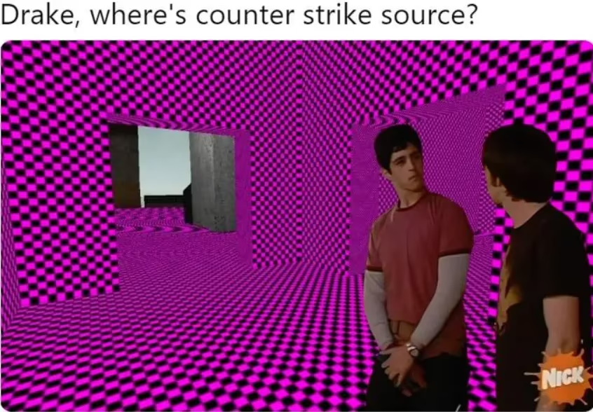
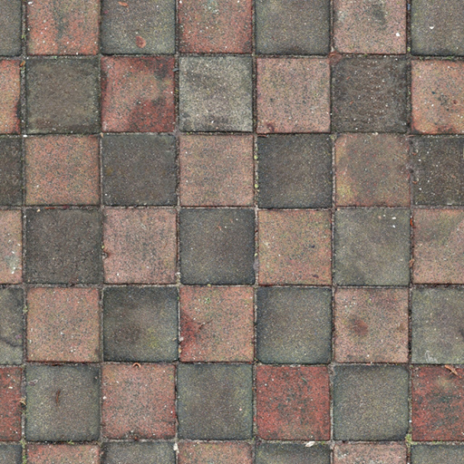
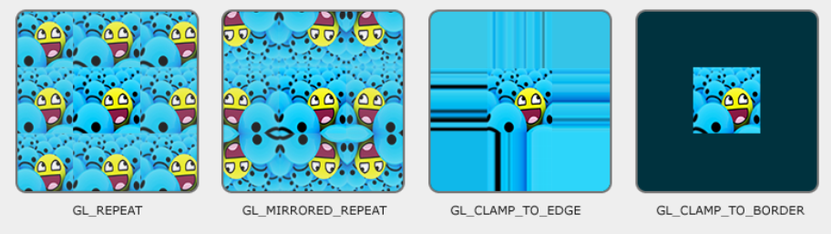
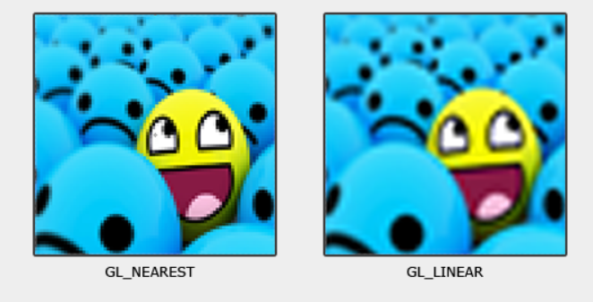
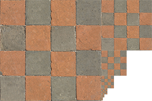
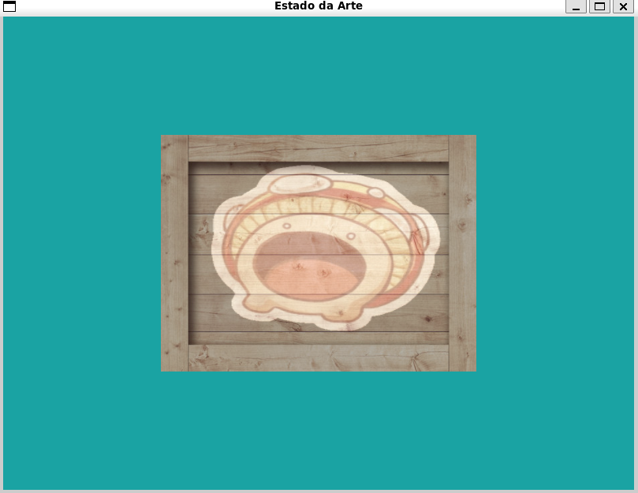

# Texturas

Se você já jogou algum jogo antigo ou um título indie em desenvolvimento, provavelmente já se deparou com o famoso "quadrado roxo e preto" (o pesadelo de todo jogador de Garry's Mod ou Counter-Strike). Isso acontece quando o motor gráfico tenta aplicar uma **textura** e não a encontra. Até agora, nós pintamos nossos triângulos com cores sólidas ou degradês básicos, mas para dar realismo e detalhes (como madeira, pedra ou o rosto de um personagem), precisamos das **texturas**.



Neste capítulo, vamos transformar nossos triângulos sem graça em objetos que realmente pareçam ter uma superfície.

Aqui está o que vamos ver:

1. O que é uma Textura
2. Coordenadas de Textura (UVs)
3. Texture Wrapping (O que acontece nas bordas)
4. Texture Filtering (Pixels vs. Suavização)
5. Mipmaps
6. Carregando imagens com `stb_image`
7. Criando e configurando Objetos de Textura
8. Usando Texturas nos Shaders
9. Texture Units (Usando mais de uma imagem)

Para melhor compreensão, tente acompanhar o capítulo com o [código](https://github.com/ConwayUSP/Estado-da-Arte/tree/main/codigos/capitulo03) do capítulo 3 aberto também.

## O que é uma Textura

Uma **textura** é basicamente uma imagem que você "cola" em cima de uma geometria. Pense assim: você tem uma caixa de papelão, e quer que ela pareça uma caixa de madeira. Em vez de modelar cada veio e nó da madeira com vértices (o que seria uma loucura), você simplesmente imprime uma foto de madeira e cola por fora. É exatamente isso que o OpenGL faz com texturas.

Além de imagens visuais, texturas também podem armazenar dados arbitrários para serem enviados aos shaders: normal maps, height maps, e outros recursos que veremos mais para frente.

Abaixo está a textura de parede de tijolos que usaremos de exemplo:

<div align="center">
  
</div>

## Coordenadas de Textura

Para o OpenGL saber qual parte da imagem vai em qual parte do triângulo, usamos as **coordenadas de textura**, também **chamadas de coordenadas UV**. Elas variam de $0.0$ a $1.0$ nos eixos $x$ e $y$ (que no contexto de OpenGL chamamos de $s$ e $t$).

O ponto $(0,0)$ é o canto inferior esquerdo da imagem, e $(1,1)$ é o canto superior direito. Se você tem um triângulo e quer que ele exiba a imagem inteira, você atribui $(0,0)$ ao vértice inferior esquerdo, $(1,0)$ ao inferior direito e $(0.5, 1.0)$ ao topo.

<div align="center">
  
</div>

No capítulo anterior, cada vértice tinha posição (3 floats) + cor (4 floats) = 7 floats. A partir de agora, como as cores virão da textura, vamos trocar o atributo de cor pelas **coordenadas UV** (2 floats). Cada linha do array de vértices passa a ter 5 floats.

Além disso, em vez de um triângulo, vamos usar um retângulo para que a textura caiba sem distorção. 

Um retângulo é formado por dois triângulos, e esses triângulos compartilham dois vértices. Sem nenhuma otimização, você teria que repetir esses vértices no array, desperdiçando memória.

Então, para resolver esse problema, usaremos um **EBO** (*Element Buffer Object*), um buffer que armazena índices que apontam para os vértices que compõem cada triângulo. Pense que o **EBO** diz ao OpenGl o modo de como "ligar os pontos" para ter os triângulos, como verá mais abaixo.

Com isso, em outras palavras, em vez de repetir os vértices compartilhados pelos dois triângulos, você define cada vértice uma única vez e armazena no EBO apenas os índices que indicam ao OpenGL quais vértices usar, e em que ordem, para formar cada triângulo:

```cpp
float vertices[] = {
    // posicoes          // coords de textura
     0.5f,  0.5f, 0.0f,  1.0f, 1.0f,  // superior direito
     0.5f, -0.5f, 0.0f,  1.0f, 0.0f,  // inferior direito
    -0.5f, -0.5f, 0.0f,  0.0f, 0.0f,  // inferior esquerdo
    -0.5f,  0.5f, 0.0f,  0.0f, 1.0f   // superior esquerdo
};

unsigned int indices[] = {
    0, 1, 3, // primeiro triângulo  (superior dir → inferior dir → superior esq)
    1, 2, 3  // segundo triângulo   (inferior dir → inferior esq → superior esq)
};
```

Para registrar o EBO, criamos e vinculamos ele da mesma forma que o VBO, mas com o tipo `GL_ELEMENT_ARRAY_BUFFER`. O VAO automaticamente guarda o EBO vinculado enquanto ele estiver ativo, então basta fazer isso uma vez na configuração:

```cpp
unsigned int VBO, VAO, EBO;
glGenVertexArrays(1, &VAO);
glGenBuffers(1, &VBO);
glGenBuffers(1, &EBO);

glBindVertexArray(VAO);

// Envia os vértices (Dados)
glBindBuffer(GL_ARRAY_BUFFER, VBO);
glBufferData(GL_ARRAY_BUFFER, sizeof(vertices), vertices, GL_STATIC_DRAW);

// Envia os índices (Ordem de desenho)
glBindBuffer(GL_ELEMENT_ARRAY_BUFFER, EBO);
glBufferData(GL_ELEMENT_ARRAY_BUFFER, sizeof(indices), indices, GL_STATIC_DRAW);
```

E na hora de desenhar, trocamos o `glDrawArrays` pelo `glDrawElements`, passando o número total de índices (6, pois são dois triângulos de 3 vértices cada):

```cpp
// Dentro do loop de renderização:
glDrawElements(GL_TRIANGLES, 6, GL_UNSIGNED_INT, 0);
```

### Atualizando o `glVertexAttribPointer`:

Como mudamos a estrutura dos vértices, precisamos atualizar as chamadas ao glVertexAttribPointer. O stride agora é 5 * sizeof(float) e removemos o atributo de cor (location 1), substituindo-o pelo de coordenada de textura:

```cpp
// Atributo de posição (location = 0) — sem mudança na lógica, só no stride
glVertexAttribPointer(0, 3, GL_FLOAT, GL_FALSE, 5 * sizeof(float), (void*)0);
glEnableVertexAttribArray(0);

// Atributo de coordenada de textura (location = 1)
// -> 2 componentes (s e t)
// -> stride de 5 * sizeof(float) = 20 bytes
// -> offset de 3 * sizeof(float) = 12 bytes (pula os 3 floats de posição)
glVertexAttribPointer(1, 2, GL_FLOAT, GL_FALSE, 5 * sizeof(float), (void*)(3 * sizeof(float)));
glEnableVertexAttribArray(1);
```

### Atualizando os Shaders:

Com a mudança nos atributos, os shaders também precisam ser atualizados. No Vertex Shader, trocamos o aCor pelo aTexCoord e passamos as coordenadas adiante para o Fragment Shader:

```GLSL
// shaders/vertex.vert
#version 430 core
layout (location = 0) in vec3 aPos;
layout (location = 1) in vec2 aTexCoord; // <-- era aCor vec4, agora é UV vec2

out vec2 TexCoord; // passa para o fragment shader

void main() {
    gl_Position = vec4(aPos, 1.0);
    TexCoord = aTexCoord;
}
```

No Fragment Shader, recebemos as coordenadas e... por enquanto, deixamos ele parado, pois precisamos entender mais algumas coisas antes de usar uma textura de verdade:

```GLSL
// shaders/fragment.frag
#version 430 core
in vec2 TexCoord;

out vec4 FragColor;

uniform sampler2D textura1; // veremos isso em breve!

void main() {
    FragColor = texture(textura1, TexCoord);
}
```
O tipo `sampler2D` e a função `texture()` vão fazer sentido nas próximas seções. Por enquanto, só registre que é assim que o Fragment Shader acessa uma textura.

## Texture Wrapping

O que acontece se a gente definir uma coordenada como $(2.0, 2.0)$? O OpenGL precisa de uma regra para saber o que desenhar fora do intervalo $[0, 1]$. As opções mais comuns são:

- `GL_REPEAT`: A textura se repete indefinidamente (padrão).
- `GL_MIRRORED_REPEAT`:  Repete, mas espelha a imagem a cada repetição.
- `GL_CLAMP_TO_EDGE`: Qualquer valor fora de [0,1] é travado na cor da borda. O pixel da borda se estica até o infinito.
- `GL_CLAMP_TO_BORDER`: O que estiver fora ganha uma cor sólida definida por você.



Você configura isso por eixo separadamente, usando `glTexParameteri`:

```cpp
// Exemplo:
glTexParameteri(GL_TEXTURE_2D, GL_TEXTURE_WRAP_S, GL_MIRRORED_REPEAT);
glTexParameteri(GL_TEXTURE_2D, GL_TEXTURE_WRAP_T, GL_MIRRORED_REPEAT);
```

O primeiro parâmetro especifica o alvo da textura; estamos trabalhando com texturas 2D, então o alvo da textura é `GL_TEXTURE_2D`. O segundo parâmetro exige que especifiquemos qual opção queremos definir e para qual eixo da textura; queremos configurá-la para os eixos S e T. 

O último parâmetro exige que informemos o modo de repetição de textura desejado e, neste caso, o OpenGL definirá sua opção de repetição de textura na textura atualmente ativa com `GL_MIRRORED_REPEAT`.

Se você escolher `GL_CLAMP_TO_BORDER`, pode definir a cor da borda assim:

```cpp
// Exemplo:
float corDaBorda[] = { 1.0f, 0.5f, 0.0f, 1.0f }; // laranja
glTexParameterfv(GL_TEXTURE_2D, GL_TEXTURE_BORDER_COLOR, corDaBorda);
```

## Texture Filtering

As texturas têm uma resolução fixa, mas os triângulos na tela podem ter qualquer tamanho. O Texture Filtering decide como o OpenGL calcula a cor de um pixel quando a textura precisar ser ampliada (*magnification*) ou reduzida (*minification*).

1. `GL_NEAREST` (Nearest Neighbor): Escolhe o pixel da textura mais próximo da coordenada UV. O resultado é um visual pixelado e nítido. É o preferido para jogos de Pixel Art e é mais rápido computacionalmente.

2. `GL_LINEAR` (Bilinear): Faz uma média ponderada entre os 4 pixels mais próximos. O resultado é um visual mais suave, mas pode parecer levemente embaçado de perto.



Você configura o filtering separadamente para cada situação:

```cpp
// Exemplo:
glTexParameteri(GL_TEXTURE_2D, GL_TEXTURE_MIN_FILTER, GL_NEAREST); // ao reduzir
glTexParameteri(GL_TEXTURE_2D, GL_TEXTURE_MAG_FILTER, GL_LINEAR);  // ao ampliar
```

## Mipmaps

Imagine um plano com uma textura de alta resolução muito longe da câmera. Tentar renderizar isso causa o efeito de *aliasing* (aqueles pontinhos brancos que ficam "sambando" na tela). Para resolver isso, o OpenGL usa **Mipmaps**.

**Mipmaps** são basicamente versões menores da sua textura (metade do tamanho, depois um quarto, e assim por diante) que o OpenGL gera para usar quando o objeto está longe.

<div align="center">
  
</div>

> Exemplo de como uma textura fica.

A boa notícia é que você não precisa criar essas versões manualmente:

```cpp
// A seguinte função gera mipmaps para um objeto de textura especificado.
glGenerateMipmap(GL_TEXTURE_2D);
```

Ao alternar entre níveis de mipmap durante a renderização, o OpenGL pode exibir alguns artefatos, como bordas nítidas visíveis entre as duas camadas de mipmap. 

Assim como na filtragem de textura normal, também é possível filtrar entre níveis de mipmap usando os métodos *NEAREST* e *LINEAR* para alternar entre eles. Para especificar o método de filtragem entre os níveis de mipmap, podemos substituir os métodos de filtragem originais por uma das quatro opções a seguir:

- `GL_NEAREST_MIPMAP_NEAREST`: seleciona o mipmap mais próximo que corresponda ao tamanho do pixel e usa interpolação do vizinho mais próximo para amostragem de textura.

- `GL_LINEAR_MIPMAP_NEAREST`: seleciona o nível de mipmap mais próximo e realiza uma amostragem desse nível usando interpolação linear.

- `GL_NEAREST_MIPMAP_LINEAR`: interpola linearmente entre os dois mipmaps que mais se aproximam do tamanho de um pixel e amostra o nível interpolado por meio de interpolação do vizinho mais próximo.
  
- `GL_LINEAR_MIPMAP_LINEAR`: interpola linearmente entre os dois mipmaps mais próximos e amostra o nível interpolado por meio de interpolação linear.

Assim como na filtragem de textura, podemos definir o método de filtragem para um dos 4 métodos mencionados anteriormente, usando `glTexParameteri`:

```cpp
// Exemplos
glTexParameteri(GL_TEXTURE_2D, GL_TEXTURE_MIN_FILTER, GL_LINEAR_MIPMAP_LINEAR);
glTexParameteri(GL_TEXTURE_2D, GL_TEXTURE_MAG_FILTER, GL_LINEAR);
```

## Carregando imagens com `stb_image`

O OpenGL não sabe ler arquivos `.jpg` ou `.png`. Ele espera um array de bytes com os dados brutos de cor de cada pixel. Para não escrever um decodificador de imagens na mão (o que é um convite a um colapso nervoso), usamos a biblioteca `stb_image`

Ela é uma biblioteca header-only: basta baixar o arquivo [stb_image.h](https://github.com/nothings/stb/blob/master/stb_image.h) e colocá-lo na nossa pasta `src/modules/`. Depois, crie um arquivo `src/modules/stb_image.cpp` com apenas essas duas linhas:

```cpp
// src/modules/stb_image.cpp
#define STB_IMAGE_IMPLEMENTATION
#include "stb_image.h"
```

O #define diz para a biblioteca incluir sua implementação neste arquivo. Nos demais arquivos do projeto (como o `main.cpp`), basta incluir o header normalmente, sem o `define`.

Para as seguintes seções de textura, vamos usar uma imagem de um [container de madeira](https://github.com/ConwayUSP/Estado-da-Arte/blob/main/imagens/03_container.jpg). Para carregar uma imagem usando `stb_image.h`, utilizamos sua função `stbi_load`.

Depois, carregar uma imagem é moleza:

```cpp
int largura, altura, nCanais;
unsigned char *dados = stbi_load("textures/container.jpg", &largura, &altura, &nCanais, 0);
```

> O OpenGL espera que o pixel (0,0) esteja no canto inferior esquerdo, mas a maioria dos formatos de imagem começa pelo canto superior esquerdo. Sem correção, sua textura aparecerá de cabeça para baixo. Antes de qualquer `stbi_load`, chame: `stbi_set_flip_vertically_on_load(true);`.

A função usada retorna um ponteiro para os pixels e preenche as variáveis com a largura, altura e número de canais (3 para RGB, 4 para RGBA com transparência).

## Criando e configurando Objetos de Textura

O processo de criação de uma textura segue o padrão clássico do OpenGL que você já conhece: gerar → vincular → configurar → enviar dados. Vamos adicionar esse bloco no `main.cpp`, logo após a configuração do VAO e antes do loop de renderização.

- Passo 1 — Gerar e vincular:
  
```cpp
unsigned int textura;
glGenTextures(1, &textura);  // recebe como entrada a quantidade de texturas que queremos gerar e as armazena em um 'unsigned int array' fornecido como segundo argumento
glBindTexture(GL_TEXTURE_2D, textura);  // vincula a textura
```

- Passo 2 — Configurar wrapping e filtering:
  
```cpp
glTexParameteri(GL_TEXTURE_2D, GL_TEXTURE_WRAP_S, GL_REPEAT);
glTexParameteri(GL_TEXTURE_2D, GL_TEXTURE_WRAP_T, GL_REPEAT);
glTexParameteri(GL_TEXTURE_2D, GL_TEXTURE_MIN_FILTER, GL_LINEAR_MIPMAP_LINEAR);
glTexParameteri(GL_TEXTURE_2D, GL_TEXTURE_MAG_FILTER, GL_LINEAR);
```

- Passo 3 — Carregar a imagem e enviar para a GPU:

```cpp
stbi_set_flip_vertically_on_load(true);  // Inverte a imagem verticalmente ao carregar
int largura, altura, nCanais;
unsigned char *dados = stbi_load("textures/container.jpg", &largura, &altura, &nCanais, 0);

if (dados) {
    glTexImage2D(GL_TEXTURE_2D, 0, GL_RGB, largura, altura, 0, GL_RGB, GL_UNSIGNED_BYTE, dados);
    glGenerateMipmap(GL_TEXTURE_2D);
} else {
    std::cout << "Falha ao carregar a textura!" << std::endl;
}

stbi_image_free(dados); // Libera da RAM (boa prática) — os dados já estão na GPU 
````

Vamos entender os parâmetros do `glTexImage2D`, que costumam confundir na primeira vez:

- `GL_TEXTURE_2D`: Tipo de textura que estamos enviando.
- `0`: Nível de mipmap base (resolução máxima).
- `GL_RGB`: Como a GPU deve armazenar os dados internamente.
- `largura, altura`: Dimensões da imagem carregada.
- `0`: Sempre zero (ignorado pelo OpenGL moderno).
- `GL_RGB`: Formato dos dados que estamos enviando.
- `GL_UNSIGNED_BYTE`: Tipo de cada valor (cada canal é um unsigned char, de 0 a 255).
- `dados`: Ponteiro para os pixels carregados pelo stbi_load.

Caso ainda reste dúvidas ou queira aprofundar mais, consulte este [site](https://docs.gl/gl4/glTexImage2D) que contém a documentação das funções de OpenGL.

## Usando Texturas nos Shaders

No GLSL, texturas são acessadas por um tipo especial de uniforme chamado sampler. Para texturas 2D, usamos sampler2D, como já escrevemos no nosso fragment shader lá atrás:

```GLSL
uniform sampler2D textura1;

void main() {
    FragColor = texture(textura1, TexCoord);
}
```

A função `texture()` recebe o sampler e as coordenadas UV e devolve a cor interpolada daquele ponto da imagem, já levando em conta o filtering configurado.

## Texture Units

Mas como o OpenGL sabe qual textura o sampler2D deve usar? Através das Texture Units — slots de textura disponíveis simultaneamente. O OpenGL garante pelo menos 16 deles, numerados de `GL_TEXTURE0` a `GL_TEXTURE15`.

Para conectar uma textura a um sampler, precisamos fazer duas coisas em momentos diferentes. Primeiro, informamos ao sampler qual slot ele deve usar — isso é feito uma única vez, antes do loop, pois os samplers não mudam entre frames:

```cpp
// Fora do loop, após criar as texturas:
meuShaderInsano.use();
meuShaderInsano.setInt("textura1", 0); // o sampler 'textura1' usará o slot 0
```

Note que estamos usando o setInt da nossa classe Shader — o sampler recebe um inteiro que indica o índice do slot, não um ponteiro ou ID direto.

Já a vinculação das texturas aos slots precisa acontecer dentro do loop, antes do draw call, pois é aí que o OpenGL precisa saber quais texturas usar no frame atual:

```cpp
// Dentro do loop, antes do glDrawElements:
glActiveTexture(GL_TEXTURE0);          // Ativa o slot 0
glBindTexture(GL_TEXTURE_2D, textura); // Vincula nossa textura ao slot ativo
```

### Usando duas texturas ao mesmo tempo

Um caso muito comum: você tem a textura de um caixote e quer sobrepor outra imagem por cima. Para isso, basta usar dois slots diferentes e dois samplers no shader.

No C++, vincule cada textura ao seu respectivo slot:

```cpp
// Fora do loop — configura os samplers uma única vez com vimos acima:
meuShaderInsano.use();
meuShaderInsano.setInt("textura1", 0);
meuShaderInsano.setInt("textura2", 1);

// Dentro do loop, antes do glDrawElements — vincula as texturas aos slots como tínhamos visto acima:
glActiveTexture(GL_TEXTURE0);
glBindTexture(GL_TEXTURE_2D, textura1);
glActiveTexture(GL_TEXTURE1);
glBindTexture(GL_TEXTURE_2D, textura2);
```

E no Fragment Shader, combine as duas com a função mix():

```GLSL
uniform sampler2D textura1;
uniform sampler2D textura2;

void main() {
    // 0.2 = 80% da textura1 + 20% da textura2
    FragColor = mix(texture(textura1, TexCoord), texture(textura2, TexCoord), 0.2);
}
```

A função mix(a, b, t) interpola linearmente entre a e b: quando t = 0.0 você tem 100% de a; quando t = 1.0, 100% de b.

Abaixo está um resultado da mistura de texturas:

<div align="center">
  
</div>

## Conclusão

Texturas dão vida ao cenário. Sem elas, estaríamos presos a um mundo de cores sólidas e matemáticas. O segredo aqui é entender o mapeamento UV e como o OpenGL lida com a memória da GPU. 

Se sua textura aparecer preta, 90% das vezes é porque você esqueceu o `glBindTexture` ou o caminho do arquivo estava errado.

```
(0,1) T _______________________ (1,1)
      ^ |                     |
      | |        _\|/_        |
      | |        (o o)        |
      | |  ---oOO-{_}-OOo---  |
      | | A vida é muito curta|
      | | para usar GL_NEAREST|
      | |---------------------|
      +-----------------------> S
(0,0)                          (1,0)
```

## Exercícios propostos

1. Substitua o atributo de cor do triângulo por coordenadas UV e aplique uma textura à sua escolha sobre ele. Atualize a estrutura do VAO, os shaders e carregue a imagem com `stb_image`. A imagem deve cobrir o triângulo inteiro sem distorções 
2. Usando um quadrado com coordenadas UV que ultrapassem o intervalo [0, 1] (por exemplo, de 0.0 até 2.0), experimente os quatro modos de wrapping: `GL_REPEAT, GL_MIRRORED_REPEAT, GL_CLAMP_TO_EDGE e GL_CLAMP_TO_BORDER`. Para o último, defina uma cor de borda que não seja preto nem branco.
3. Use uma textura com padrão bem definido (xadrez, tijolos) com repetição alta (10.0 ou mais) e compare visualmente três configurações de filtering: `GL_NEAREST/GL_NEAREST, GL_LINEAR/GL_LINEAR e GL_LINEAR_MIPMAP_LINEAR/GL_LINEAR` (com mipmaps gerados apenas nessa última). Analise qual configuração produziu o resultado mais estável e sem ruído.
