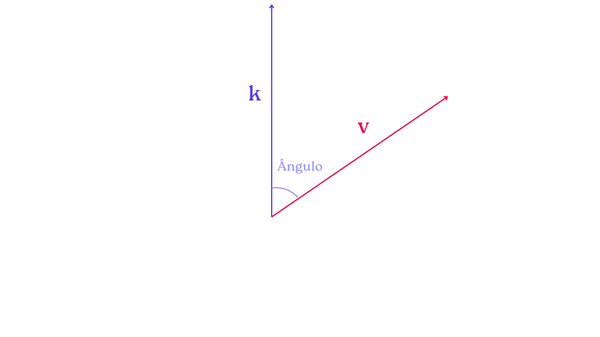
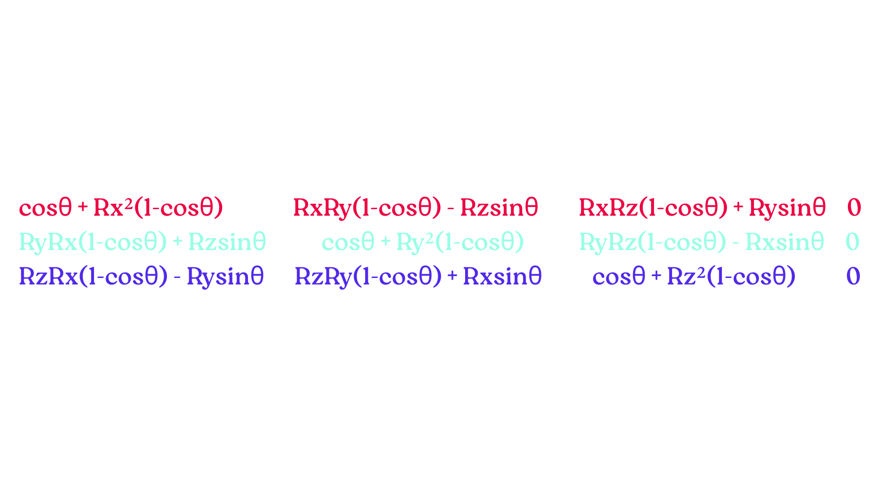
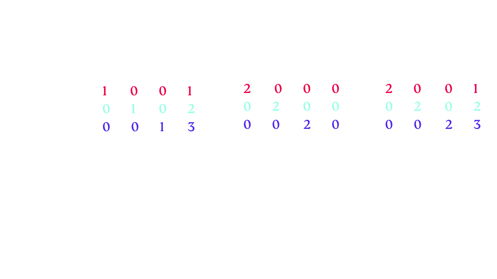
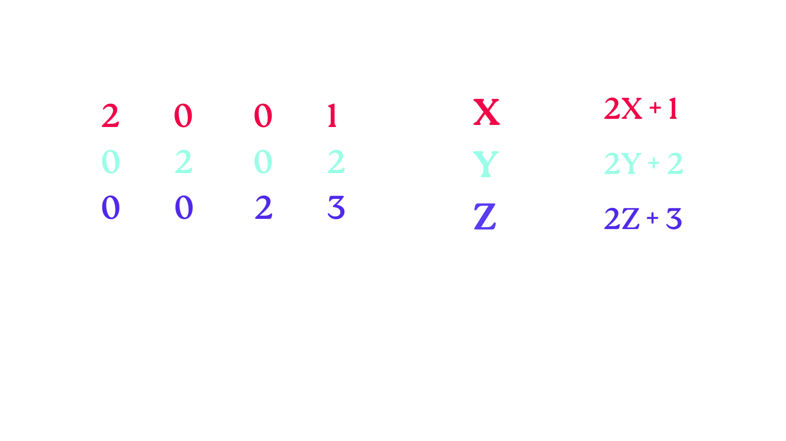
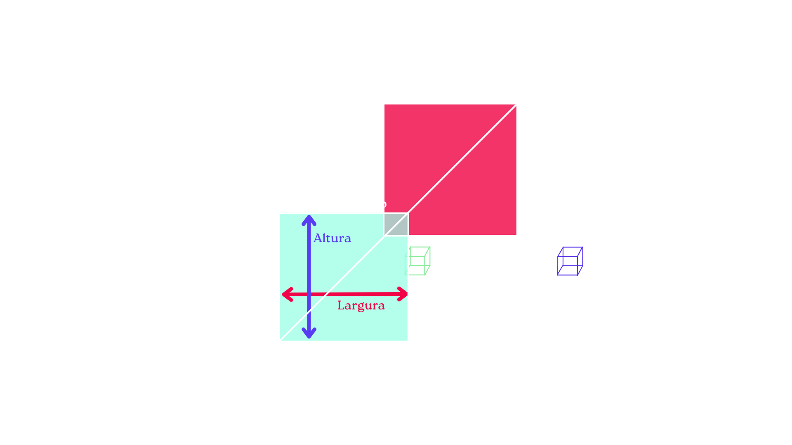

# Transformações e Espaços

Ainda na pegada do capítulo anterior, vamos apresentar para vocês aplicações matemáticas que são essenciais para o desenvolvimento de um projeto não apenas no OpenGL, mas na computação gráfica como um todo. 

Aqui, mostraremos matrizes utilizadas para as seguintes transformações:

1. Redimensionamento;
2. Translação;
3. Rotação.

Além, é claro, das suas composições e do uso de GLM para a criação delas. Também, apresentaremos os seguintes espaços e como mover entre eles na prática:

1. Local Space;
2. World Space;
3. View Space;
4. Clip Space.

Por fim, demonstraremos projeções ortográficas e de perspectiva e teste de profundidade. Sem mais delongas. Vamos lá:


## Redimensionamento

Imagine que você, ao final desta trilha, está modelando uma simulação onde existe uma árvore e um prédio de 30 andares.

Se a árvore não estiver anabolizada, é natural supor que o prédio terá um tamanho consideravelmente maior, não? 

Ou, melhor, vamos mudar de exemplo: imagine que você está fazendo uma simulação onde uma formiga terá o tamanho de um elefante (por algum motivo). Como seremos capazes de fazer isso no nosso computador?

Visualizando a nossa formiga enquanto objeto computacional com suas devidas componentes _(x, y, z, 1)_, representando suas dimensões na simulação, apresentaremos nossa primeira matriz de transformação e faremos um exemplo de sua aplicação!

Vamos lá. Observe a matriz _4x1_ abaixo:


Ela é o vetor que representa o nosso objeto. Aqui, não tem mistério:

1. A componente X representa a largura;
2. A componente Y representa a altura;
3. A componente Z representa a profundidade.

Ok! Mas e aquele número 1 na quarta linha da nossa matriz? Se estamos tratando aqui de um modelo 3D, por que o nosso vetor teria quatro componentes?

Ora, aquele valor serve unicamente para facilitar o processo de transformação. Para redimencionar um objeto, alteraremos o valor das componentes através de multiplicações em cada uma. 
Ao invés de multiplicarmos nosso vetor de maneira sucessiva por escalares, vamos "compactar" toda a nossa transformação em uma única nova matriz e realizar apenas uma multiplicação de matrizes. Isso facilita bastante o processo, além de reduzir a complexidade computacional. (Por quê?)

Inclusive, segue abaixo a nossa querida matriz de redimensionamento:


Ela é uma matriz _4x4_ e possui uma formatação um tanto quanto familiar, não? Perceba que ela é, basicamente, uma matriz identidade com os valores nas três primeiras linhas alterados de maneira arbitrária. No caso, _(S1, S2, S3)_ são nossas variáveis de redimensionamento.

Ao realizar a multiplicação dessa matriz pela outra que representa nosso objeto, teremos o seguinte:


>Caso você tenha ficado na dúvida do porquê de chegarmos neste resultado, verifique o capítulo anterior na parte de multiplicação de matrizes.

Mavilha! Repare que essa alteração provocaria uma distorção das dimensões do nosso objeto a partir do que estivesse definido para _(S1, S2, S3)_. Assim, é possível fazer uma formiga ficar com as mesmas proporções que um elefante!


## Translação

No que diz respeito à translação, estamos falando literalmente de mover (transladar) o nosso objeto pela nossa simulação ao alterar sua posição. Para isso, fazemos uma adição entre dois vetores, retornando um novo vetor com uma posição diferente baseada em um vetor de translação.

Se representarmos o nosso vetor de translação como sendo _(Tx, Ty, Tz)_, podemos definir a nossa matriz de translação da seguinte maneira:


E, assim como fizemos na aplicação de redimensionamento, iremos multiplicar as nossas matrizes para obter um novo resultado, isto é, o nosso vetor com posição atualizada!


> _Um breve trecho adaptado do livro Learn OpenGL sobre Coordenadas homogêneas:_ A componente w (a quarta linha, no nosso caso 4x1 acima) de um vetor também é conhecida como coordenada homogênea. Para obter o vetor 3D a partir de um vetor homogêneo, dividimos as coordenadas x, y e z pela sua coordenada w. Normalmente não percebemos isso, pois a componente w é 1,0 na maioria das vezes. O uso de coordenadas homogêneas tem várias vantagens: permite
realizar translações matriciais em vetores 3D (sem uma componente w não podemos transladar
vetores) e usar o valor de w para criar perspectiva 3D. Além disso,
sempre que a coordenada homogênea for igual a 0, o vetor é especificamente conhecido como um
vetor de direção, pois um vetor com coordenada w igual a 0 não pode ser transladado.

Logo, com a matriz de translação no nosso arsenal, podemos mover objetos em qualquer um dos três eixos _(X, Y, Z)_, o que é essencial para nós.

## Rotação



Quando falamos de rotação, é possível perceber que aqui as coisas ficam um pouco mais complexas do que as duas aplicações que acabamos de apresentar. Isso, pois, elas são mais intuitivas. Tentaremos manter a simplicidade aqui o máximo possível. 

Podemos rotacionar no nosso objeto em torno de cada um dos eixos. Para cada um, temos uma matriz de rotação diferente que se baseia em um ângulo theta (Θ), que é baseado em graus ou radianos e é recebido pelas funções trigonométricas _seno_ e _cosseno_. Explicar detalhadamente o funcionamento delas acaba saindo um pouco do escopo da nossa trilha. Se você quiser se aprofundar, pesquise vídeos no youtube ou livros voltados para isso.

A seguir, temos cada uma das matrizes de rotação. Novamente, realizaremos multiplicação com cada uma:
### _Rotação em torno do eixo X_:


### _Rotação em torno do eixo Y_:


### _Rotação em torno do eixo Z_:


Repare que, para cada um dos casos acima, o eixo o qual rotacionaremos em torno fica "travado", isto é, a componente específica no nosso vetor resultante não é dada por operações que envolvam funções trigonométricas baseadas no ângulo theta.

### _Matriz para rotação em torno de eixo arbitrário_:
Para rotacionar em torno de um eixo 3D arbitrário, nós podemos combinar todas as três que acabamos de apresentar ao primeiro rotacionar em torno do eixo X, depois Y e então Z, por exemplo. Entretanto, isso rapidamente gera um problema chamado [_Gimbal lock_](https://pt.wikipedia.org/wiki/Gimbal_lock). 

Não discutiremos os detalhes, mas uma solução melhor é rotacionar em torno de um eixo unitário arbitrário, por exemplo, (0,662, 0,2, 0,722) (observe que este é um vetor unitário), diretamente em vez de combinar as
matrizes de rotação. Tal matriz existe e é dada abaixo com _(Rx, Ry, Rz)_ como o eixo de rotação arbitrário (que coisinha linda...):



Ainda assim, essa matriz não previne completamente o _Gimbal lock_. Para realmente evitar, precisamos representar as rotações usando [quatérnios](https://pt.wikipedia.org/wiki/Quaterni%C3%A3o), que não são apenas mais seguros, mas também mais amigáveis computacionalmente. No entanto, uma discussão sobre quatérnios está fora do escopo deste capítulo.

## Combinando Matrizes

O verdadeiro poder de usar matrizes para transformações é que podemos combinar múltiplas transformações em uma única matriz graças à multiplicação de matrizes. Observe a seguinte combinação entre uma matriz para translocação e outra para redimensionamento:



Agora, em termos de complexidade computacional, imagine que você fosse aplicar aquela translocação e aquele redimensionamento em, talvez, milhares ou milhões de objetos em uma simulação de computação gráfica. O fato de "empacotarmos" essas duas transformações em uma única matriz reduz pela metade o nosso custo computacional, o que é extremamente valioso em simulações que exigem bastante desempenho.

Lembrando que a multiplicação entre matrizes não é comutativa! O que significa que a ordem importa, interfere no resultado final.

Ao multiplicar matrizes, a matriz mais à direita é multiplicada primeiro pelo vetor, portanto, você deve ler as multiplicações da direita para a esquerda. Recomenda-se realizar primeiro as operações de escala, depois as rotações e, por último, as translações ao combinar matrizes; caso contrário, elas podem afetar-se (negativamente).

Aplicando a nossa matriz acima no nosso vetor _(x, y, z, 1)_, temos:

Maravilha! O vetor é primeiro escalado por dois e depois transladado por (1,2,3).

Agora que falamos um pouco sobre as transformações, podemos ir para a parte do código e ver como que funciona na prática. O OpenGL não possui nenhuma forma de conhecimento ou funcionalidades de matrizes ou vetores, então precisamos definir nossas próprias classes e funções. Felizmente, existe uma biblioteca matemática fácil de usar e feita sob medida para OpenGL chamada GLM. Acompanhe!

## GLM

GLM significa OpenGL Mathematics e é uma biblioteca composta apenas por arquivos de cabeçalho, o que significa que basta incluir os arquivos de cabeçalho apropriados e pronto; não é necessário vincular nem compilar.

### Instalação

Para instalar no Linux (saia do Windows imediatamente), temos duas formas comuns de fazer:

#### 1. Usando o Gerenciador de Pacotes (Recomendado)

A maioria das distribuições Linux possui o GLM nos repositórios oficiais. Essa é a melhor opção porque facilita as atualizações e a gestão de dependências.

_Ubuntu / Debian / Linux Mint:_
```sh
sudo apt update
sudo apt install libglm-dev
```
_Fedora:_
```sh
sudo dnf install glm-devel
```
_Arch Linux:_
```sh
sudo pacman -S glm
```

#### 2. Instalação Manual (Via GitHub)

Se você precisa de uma versão específica ou quer a mais recente que ainda não chegou nos repositórios, pode baixar direto do código-fonte.

Clone o repositório:
```sh
git clone https://github.com/g-truc/glm.git
```
Mova para o diretório de inclusão local (opcional, mas útil para acesso global):
```sh
sudo cp -r glm/glm /usr/local/include/
```

## Espaços

O OpenGL espera que todos os vértices que queremos tornar visíveis estejam em coordenadas normalizadas após cada execução do _vertex shader_. Ou seja, as coordenadas x, y e z de cada vértice devem estar entre -1,0 e 1,0; coordenadas fora desse intervalo não serão visíveis.

O que normalmente fazemos é especificar as coordenadas em um intervalo (ou espaço) que determinamos e, no shader de vértices, transformar essas coordenadas em coordenadas de dispositivo normalizadas (normalized device coordinates - NDC). Esses NDC são, então, fornecidos ao rasterizador para transformá-los em coordenadas/pixels 2D na sua tela.

A transformação de coordenadas para NDC geralmente é realizada passo a passo, onde transformamos os vértices de um objeto em vários sistemas de coordenadas antes de finalmente transformá-los em NDC.

### Local Space

O Local Space (ou Espaço Local) é o espaço de coordenadas que "parte" do seu objeto, que é local para ele, i.e. onde seu objeto começa.
Imagine que você está construindo um modelo 3D de uma casa. O espaço local da casa seria o espaço onde você começa a construir a casa, onde a origem (0,0,0) está no chão do primeiro andar, e os eixos X e Z são paralelos ao chão. Isso significa que qualquer ponto dentro da casa pode ser descrito em relação a essa origem, a partir de suas coordenadas locais. 
Todos os vértices do seu modelo estão no espaço local: todos são locais para o seu objeto.

### World Space

Se nós importássemos todos os nossos objetos diretamente na nossa aplicação, eles provavelmente ficariam se sobrepondo no centro do nosso mundo, com origem em (0, 0, 0), o que não é o que queremos. Geralmente, é preferível definir uma posição específica para cada um dos nossos modelos dentro da nossa simulação.
As coordenadas no World Space (ou Espaço do Mundo) são exatamente o que parecem ser: as coordenadas de todos os seus vértices em relação ao mundo simulado.
As coordenadas do seu objeto são transformados do Local para o World Space; isso acontece através da _Matriz de Modelo_.

A Matriz de Modelo é uma matriz de transformação que translada, redimensiona e/ou rotaciona seu objeto para um lugar no mundo para uma localização/orientação a qual ele pertence. Você pode pensar na matriz do capítulo anterior para posicionar o contêiner em toda a cena como uma espécie de matriz de modelo também; transformamos as coordenadas locais do contêiner para algum lugar diferente na cena/mundo.

### View Space

O View Space (Espaço de Vista) é o que as pessoas normalmente se referem como sendo a câmera do _OpenGL_ (às vezes, também é conhecido como _Camera Space_ ou _Eye Space_).
O View Space é o resultado da transformação das coordenadas de seu World Space para coordenadas as quais estão na frente da perspectiva do usuário. No caso, o View Space é, então, o espaço visto a partir da perspectiva da câmera. Isso é, normalmente, realizado com a combinação de translações e rotações para que certos itens sejam transformados para frente da câmera. Essa combinação normalmente é guardada dentro de uma _Matriz de Visão_, que transforma coordenadas do mundo para o View Space.

### Clip Space

No fim da rodagem de cada vertex shader, o _OpenGL_ espera que as coordenadas estejam em um intervalo específico e que cada uma que não esteja seja cortada (clipada, ou "clipped" do inglês). Coordenadas cortadas são descartadas para que as remanescentes se tornem fragmentos visíveis na sua tela. É daí que o _Clip Space_ recebe seu nome.

Para transformar coordendas de vértices de _View_ para _Clip Space_, nós definimos a _Matriz de Projeção_, que especifica um intervalo de coordenadas, e.g. -1000 e 1000 para cada dimensão. A matriz de projeção
transforma então as coordenadas dentro desse intervalo especificado em coordenadas de dispositivo normalizadas
(-1.0, 1.0). Todas as coordenadas fora desse intervalo serão cortadas. Com este intervalo que especificamos na matriz de projeção, uma coordenada de (1250, 500, 750) não seria visível, uma vez que a coordenada x está fora do intervalo e, portanto, é convertida para uma coordenada maior que 1,0 em NDC e, consequentemente, é cortada.

#### Projeção Ortográfica


