# Transformações e Espaços

Ainda na pegada do capítulo anterior, vamos apresentar para vocês aplicações matemáticas que são essenciais para o desenvolvimento de um projeto não apenas no OpenGL, mas na computação gráfica como um todo. 

Aqui, mostraremos matrizes utilizadas para as seguintes transformações:

1. Redimensionamento;
2. Translação;
3. Rotação.

Além, é claro, das suas composições e do uso de GLM para a criação delas. Também, apresentaremos os seguintes espaços e como mover entre eles na prática:

1. Local Space;
2. World Space;
3. View Space;
4. Clip Space.

Por fim, demonstraremos projeções ortográficas e de perspectiva e teste de profundidade. Sem mais delongas. Vamos lá:

## Redimensionamento

Imagine que você, ao final desta trilha, está modelando uma simulação onde existe uma árvore e um prédio de 30 andares.

Se a árvore não estiver anabolizada, é natural supor que o prédio terá um tamanho consideravelmente maior, não? 

Ou, melhor, vamos mudar de exemplo: imagine que você está fazendo uma simulação onde uma formiga terá o tamanho de um elefante (por algum motivo). Como seremos capazes de fazer isso no nosso computador?

Visualizando a nossa formiga enquanto objeto computacional com suas devidas componentes _(x, y, z, 1)_, representando suas dimensões na simulação, apresentaremos nossa primeira matriz de transformação e faremos um exemplo de sua aplicação!

Vamos lá. Observe a matriz _4x1_ abaixo:

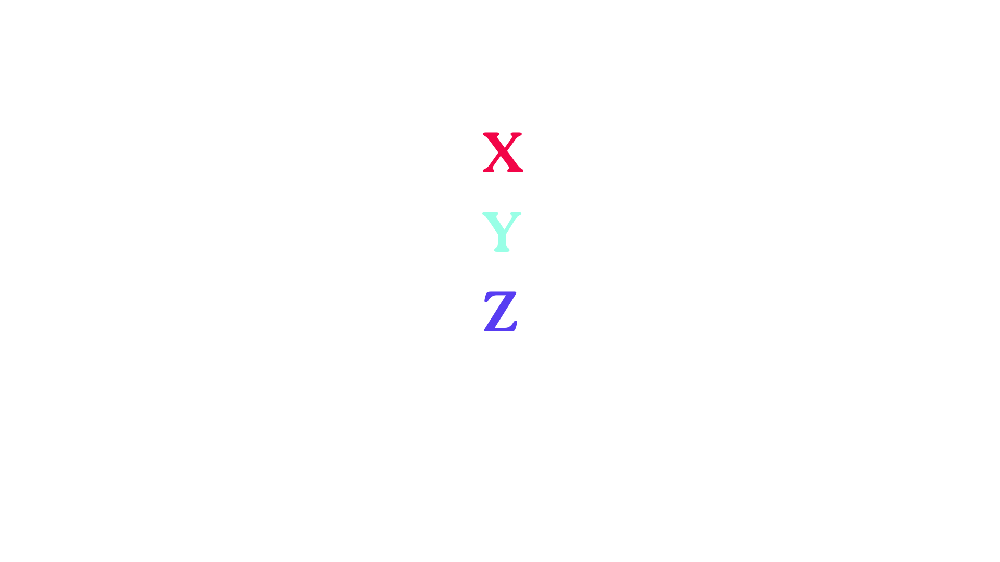

Ela é o vetor que representa o nosso objeto. Aqui, não tem mistério:

1. A componente X representa a largura;
2. A componente Y representa a altura;
3. A componente Z representa a profundidade.

Ok! Mas e aquele número 1 na quarta linha da nossa matriz? Se estamos tratando aqui de um modelo 3D, por que o nosso vetor teria quatro componentes?

Ora, aquele valor serve unicamente para facilitar o processo de transformação. Para redimencionar um objeto, alteraremos o valor das componentes através de multiplicações em cada uma. 
Ao invés de multiplicarmos nosso vetor de maneira sucessiva por escalares, vamos "compactar" toda a nossa transformação em uma única nova matriz e realizar apenas uma multiplicação de matrizes. Isso facilita bastante o processo, além de reduzir a complexidade computacional. (Por quê?)

Inclusive, segue abaixo a nossa querida matriz de redimensionamento:

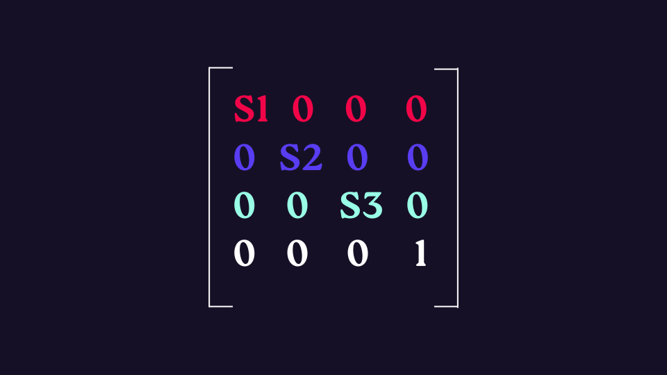

Ela é uma matriz _4x4_ e possui uma formatação um tanto quanto familiar, não? Perceba que ela é, basicamente, uma matriz identidade com os valores nas três primeiras linhas alterados de maneira arbitrária. No caso, _(S1, S2, S3)_ são nossas variáveis de redimensionamento.

Ao realizar a multiplicação dessa matriz pela outra que representa nosso objeto, teremos o seguinte:

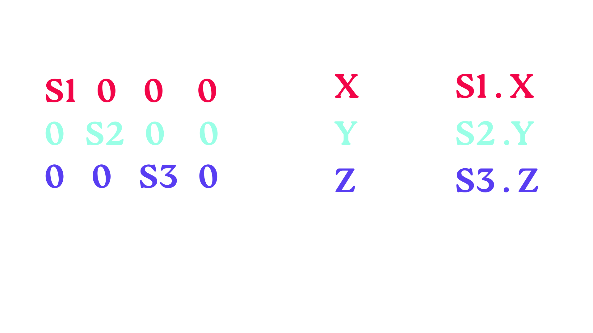
>Caso você tenha ficado na dúvida do porquê de chegarmos neste resultado, verifique o capítulo anterior na parte de multiplicação de matrizes.

Mavilha! Repare que essa alteração provocaria uma distorção das dimensões do nosso objeto a partir do que estivesse definido para _(S1, S2, S3)_. Assim, é possível fazer uma formiga ficar com as mesmas proporções que um elefante!

## Translação

No que diz respeito à translação, estamos falando literalmente de mover (transladar) o nosso objeto pela nossa simulação ao alterar sua posição. Para isso, fazemos uma adição entre dois vetores, retornando um novo vetor com uma posição diferente baseada em um vetor de translação.

Se representarmos o nosso vetor de translação como sendo _(Tx, Ty, Tz)_, podemos definir a nossa matriz de translação da seguinte maneira:
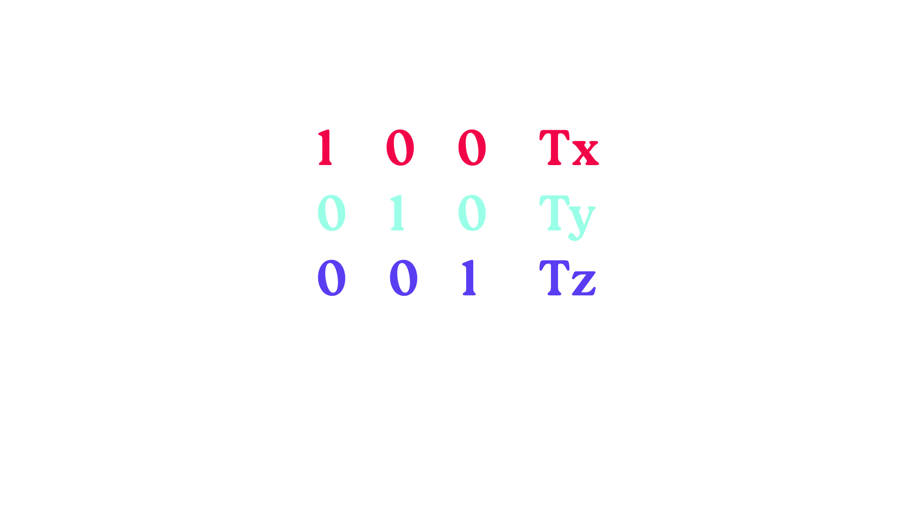

E, assim como fizemos na aplicação de redimensionamento, iremos multiplicar as nossas matrizes para obter um novo resultado, isto é, o nosso vetor com posição atualizada!

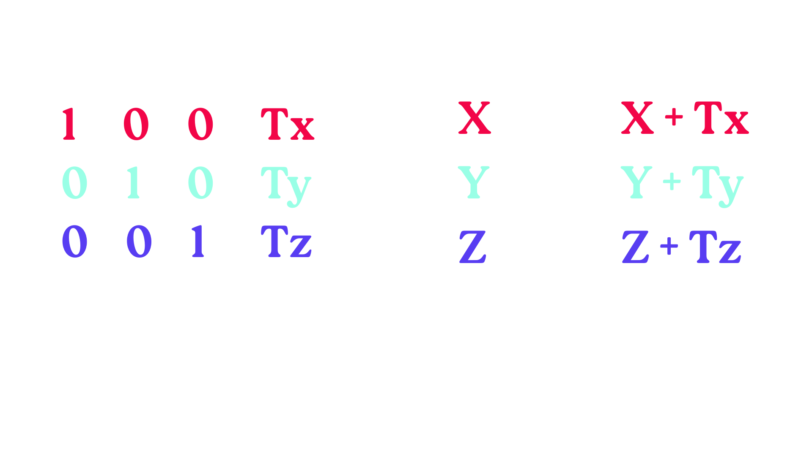

> _Um breve trecho adaptado do livro Learn OpenGL sobre Coordenadas homogêneas:_ A componente w (a quarta linha, no nosso caso 4x1 acima) de um vetor também é conhecida como coordenada homogênea. Para obter o vetor 3D a partir de um vetor homogêneo, dividimos as coordenadas x, y e z pela sua coordenada w. Normalmente não percebemos isso, pois a componente w é 1,0 na maioria das vezes. O uso de coordenadas homogêneas tem várias vantagens: permite
realizar translações matriciais em vetores 3D (sem uma componente w não podemos transladar
vetores) e usar o valor de w para criar perspectiva 3D. Além disso,
sempre que a coordenada homogênea for igual a 0, o vetor é especificamente conhecido como um
vetor de direção, pois um vetor com coordenada w igual a 0 não pode ser transladado.

Logo, com a matriz de translação no nosso arsenal, podemos mover objetos em qualquer um dos três eixos _(X, Y, Z)_, o que é essencial para nós.

## Rotação

### Rotação em torno do eixo x

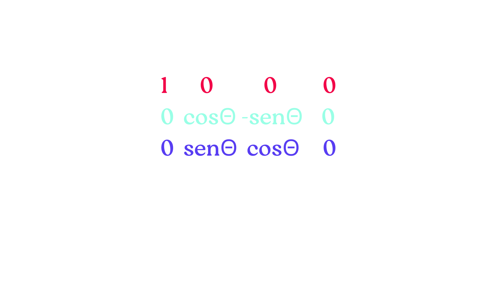
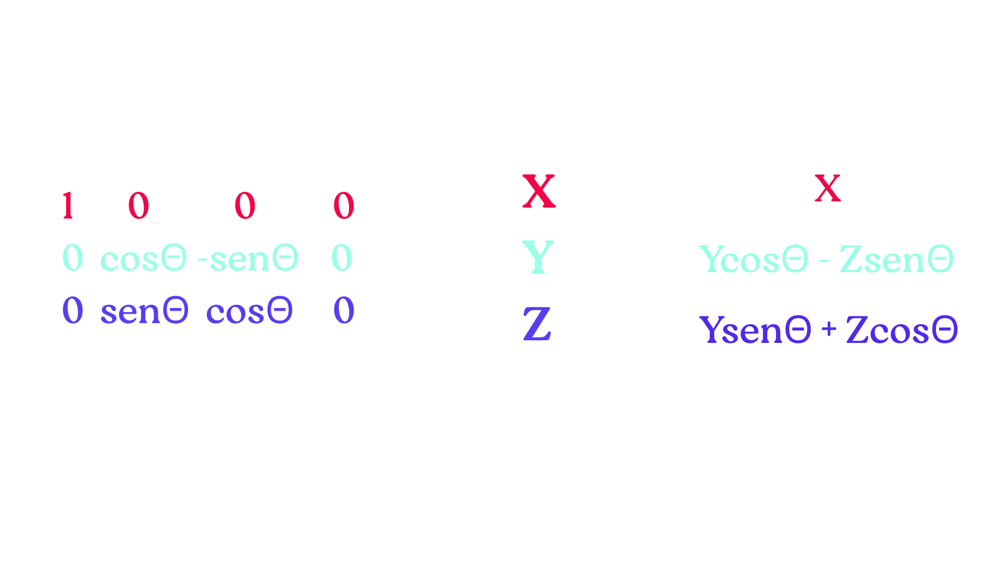

### Rotação em torno do eixo y

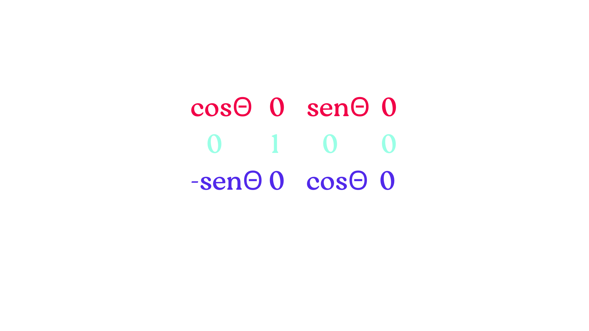
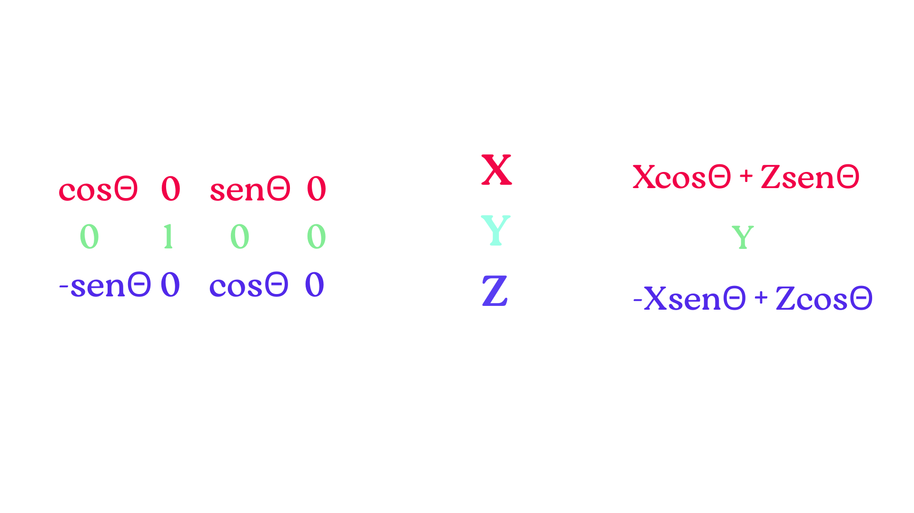

### Rotação em torno do eixo z

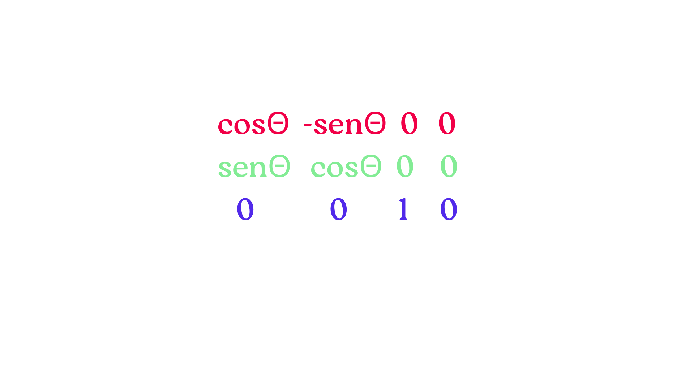
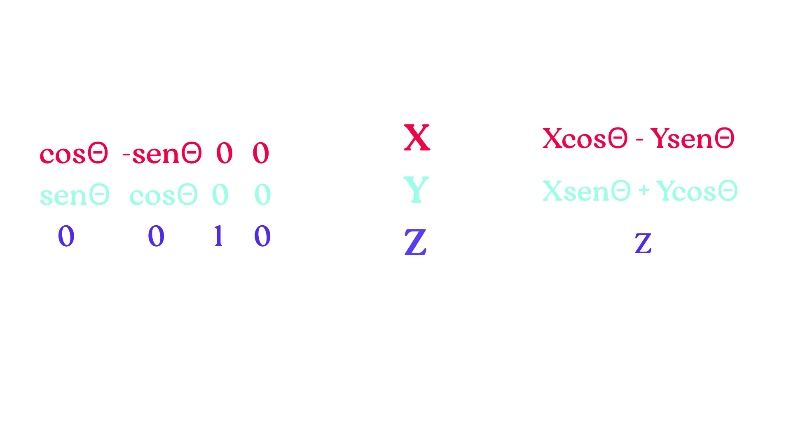
