# Transformações e Espaços

Ainda na pegada do capítulo anterior, vamos apresentar para vocês aplicações matemáticas que são essenciais para o desenvolvimento de um projeto não apenas no OpenGL, mas na computação gráfica como um todo.

Aqui, mostraremos matrizes utilizadas para as seguintes transformações:

1. Redimensionamento;
2. Translação;
3. Rotação.

Além, é claro, das suas composições e do uso de GLM para a criação delas. Também, apresentaremos os seguintes espaços e como mover entre eles na prática:

1. Local Space;
2. World Space;
3. View Space;
4. Clip Space.

Por fim, demonstraremos projeções ortográficas e de perspectiva e teste de profundidade. Sem mais delongas. Vamos lá:

## Redimensionamento

Imagine que você, ao final desta trilha, está modelando uma simulação onde existe uma árvore e um prédio de 30 andares.

Se a árvore não estiver anabolizada, é natural supor que o prédio terá um tamanho consideravelmente maior, não?

Ou, melhor, vamos mudar de exemplo: imagine que você está fazendo uma simulação onde uma formiga terá o tamanho de um elefante (por algum motivo). Como seremos capazes de fazer isso no nosso computador?

Visualizando a nossa formiga enquanto objeto computacional com suas devidas componentes _(x, y, z, 1)_, representando suas dimensões na simulação, apresentaremos nossa primeira matriz de transformação e faremos um exemplo de sua aplicação!

Vamos lá. Observe a matriz _4x1_ abaixo:

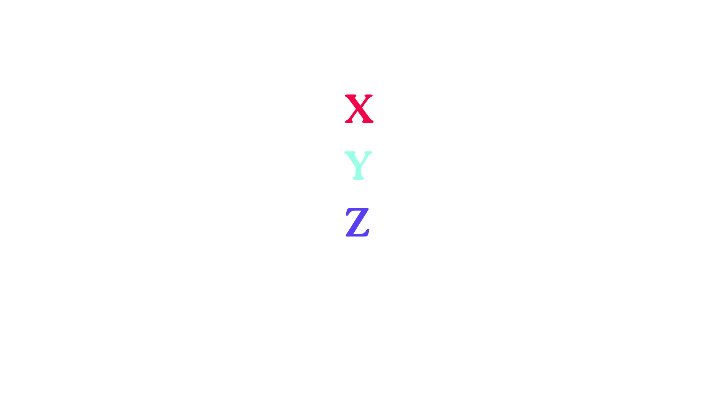

Ela é o vetor que representa o nosso objeto. Aqui, não tem mistério:

1. A componente X representa a largura;
2. A componente Y representa a altura;
3. A componente Z representa a profundidade.

Ok! Mas e aquele número 1 na quarta linha da nossa matriz? Se estamos tratando aqui de um modelo 3D, por que o nosso vetor teria quatro componentes?

Por enquanto, tente ignorar a existência dele.

Para redimencionar um objeto, alteraremos o valor das componentes através de multiplicações em cada uma.
Ao invés de multiplicarmos nosso vetor de maneira sucessiva por escalares, vamos "compactar" toda a nossa transformação em uma única nova matriz e realizar apenas uma multiplicação de matrizes. Isso facilita bastante o processo, além de reduzir a complexidade computacional. (Por quê?)

Inclusive, segue abaixo a nossa querida matriz de redimensionamento:

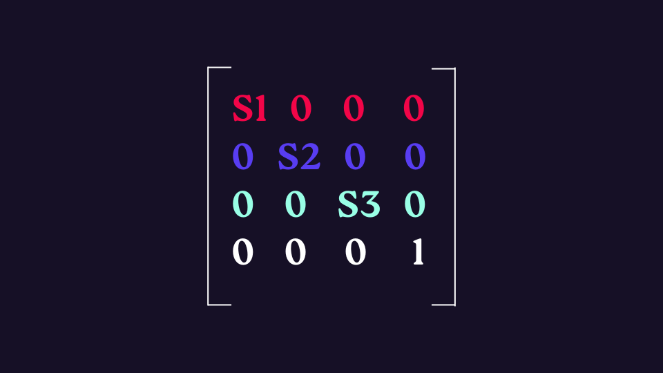

Ela é uma matriz _4x4_ e possui uma formatação um tanto quanto familiar, não? Perceba que ela é, basicamente, uma matriz identidade com os valores nas três primeiras linhas alterados de maneira arbitrária. No caso, _(S1, S2, S3)_ são nossas variáveis de redimensionamento.

Ao realizar a multiplicação dessa matriz pela outra que representa nosso objeto, teremos o seguinte:

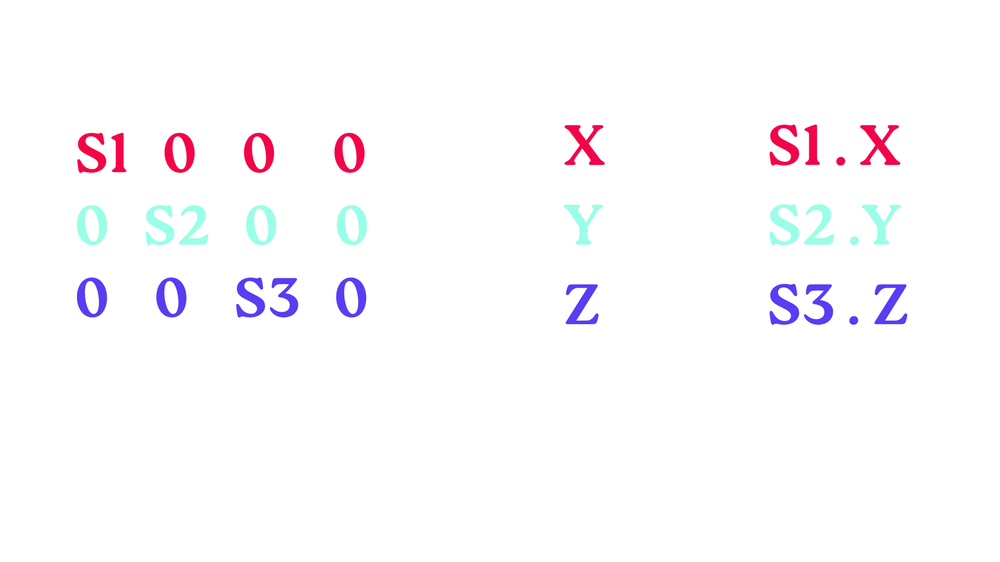

> Caso você tenha ficado na dúvida do porquê de chegarmos neste resultado, verifique o capítulo anterior na parte de multiplicação de matrizes.

Mavilha! Repare que essa alteração provocaria uma distorção das dimensões do nosso objeto a partir do que estivesse definido para _(S1, S2, S3)_. Assim, é possível fazer uma formiga ficar com as mesmas proporções que um elefante!

## Translação

No que diz respeito à translação, estamos falando literalmente de mover (transladar) o nosso objeto pela nossa simulação ao alterar sua posição. Para isso, fazemos uma adição entre dois vetores, retornando um novo vetor com uma posição diferente baseada em um vetor de translação.

Se representarmos o nosso vetor de translação como sendo _(Tx, Ty, Tz)_, podemos definir a nossa matriz de translação da seguinte maneira:

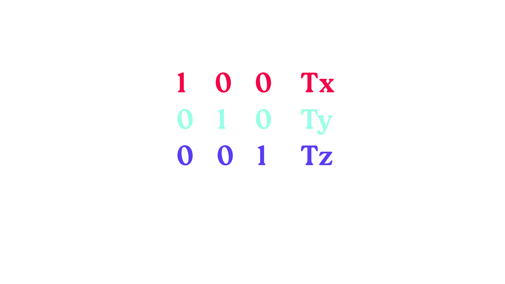

E, assim como fizemos na aplicação de redimensionamento, iremos multiplicar as nossas matrizes para obter um novo resultado, isto é, o nosso vetor com posição atualizada!

A partir daqui, aquela quarta componente começa a ganhar grande utilidade para nós. A sua existência facilita o processo de transformação. Isso, pois, caso utilizássemos matrizes `3x3`, não conseguiríamos acessar as componentes corretamente na hora da multiplicação. Convidamos você a fazer o exercício mental e/ou com papel e lápis: tente realizar a multiplicação de matrizes na versão `3x3` para a translação na mão e você perceberá uma das funcionalidades da quarta componente com o valor 1.

Enfim, quando realizamos a transformação, temos o seguinte:

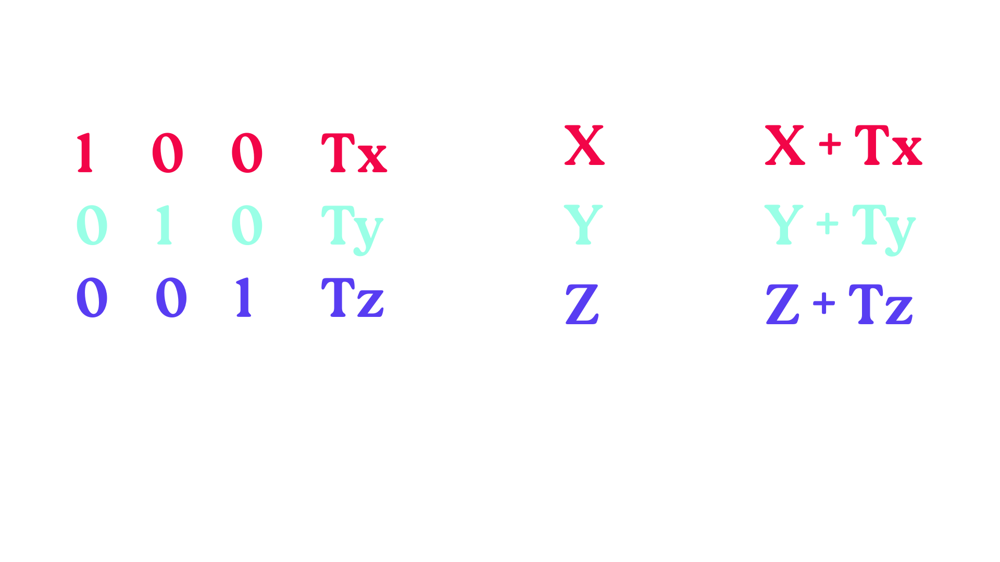

> _Um breve trecho adaptado do livro Learn OpenGL sobre Coordenadas homogêneas:_ A componente w (a quarta linha, no nosso caso 4x1 acima) de um vetor também é conhecida como coordenada homogênea. Para obter o vetor 3D a partir de um vetor homogêneo, dividimos as coordenadas x, y e z pela sua coordenada w. Normalmente não percebemos isso, pois a componente w é 1,0 na maioria das vezes. O uso de coordenadas homogêneas tem várias vantagens: permite
> realizar translações matriciais em vetores 3D (sem uma componente w não podemos transladar
> vetores) e usar o valor de w para criar perspectiva 3D. Além disso,
> sempre que a coordenada homogênea for igual a 0, o vetor é especificamente conhecido como um
> vetor de direção, pois um vetor com coordenada w igual a 0 não pode ser transladado.

Logo, com a matriz de translação no nosso arsenal, podemos mover objetos em qualquer um dos três eixos _(X, Y, Z)_, o que é essencial para nós.

## Rotação

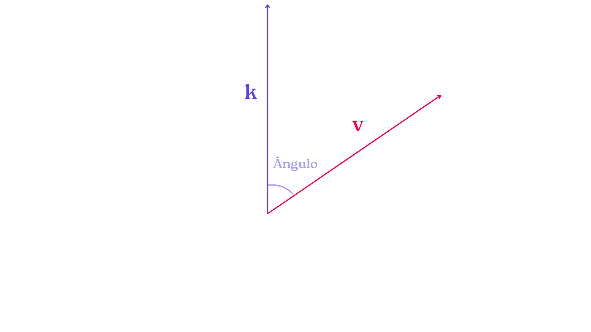

Quando falamos de rotação, é possível perceber que aqui as coisas ficam um pouco mais complexas do que as duas aplicações que acabamos de apresentar. Isso, pois, elas são mais intuitivas. Tentaremos manter a simplicidade aqui o máximo possível.

Podemos rotacionar no nosso objeto em torno de cada um dos eixos. Para cada um, temos uma matriz de rotação diferente que se baseia em um ângulo theta (Θ), que é baseado em graus ou radianos e é recebido pelas funções trigonométricas _seno_ e _cosseno_. Explicar detalhadamente o funcionamento delas acaba saindo um pouco do escopo da nossa trilha. Se você quiser se aprofundar, pesquise vídeos no youtube ou livros voltados para isso.

A seguir, temos cada uma das matrizes de rotação. Novamente, realizaremos multiplicação com cada uma:

### _Rotação em torno do eixo X_:

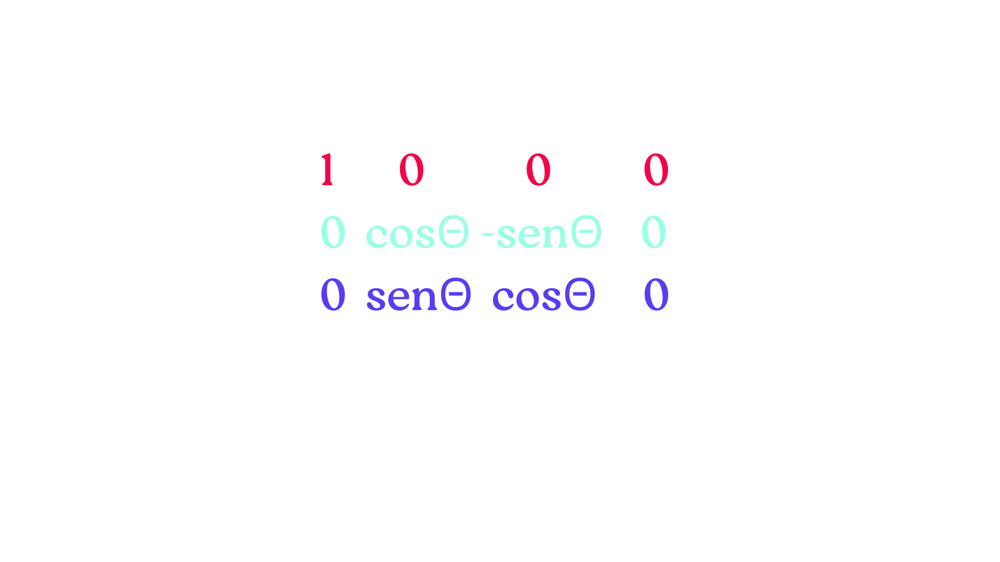

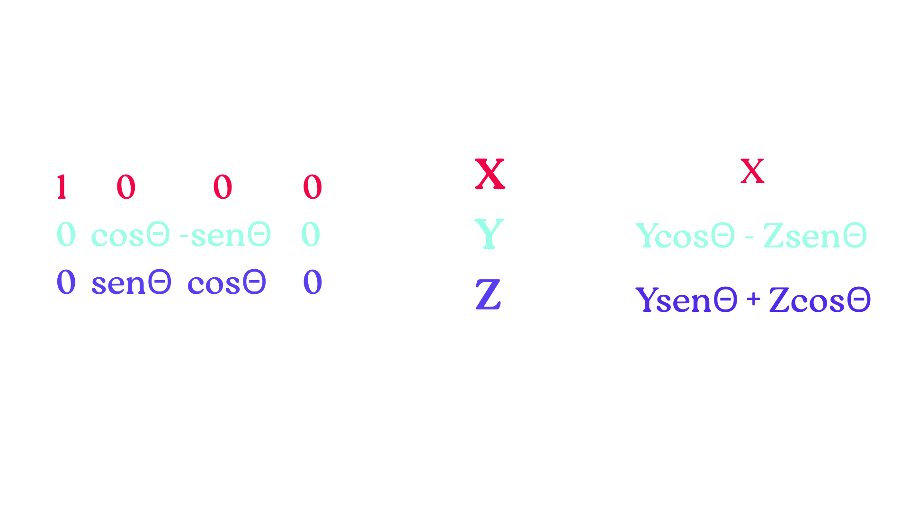

### _Rotação em torno do eixo Y_:

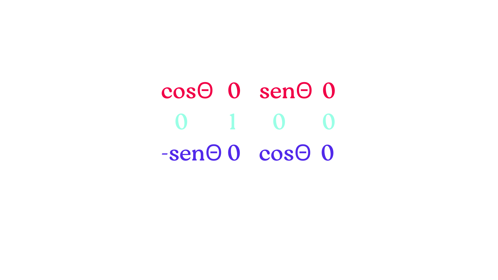

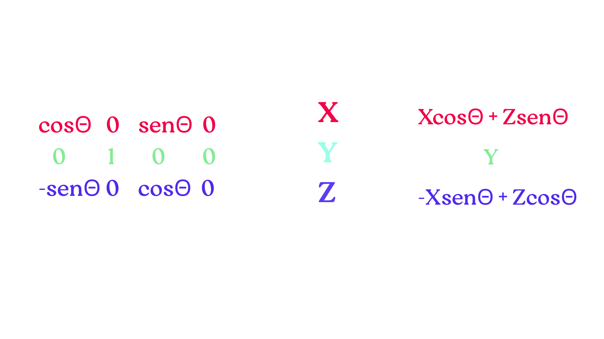

### _Rotação em torno do eixo Z_:

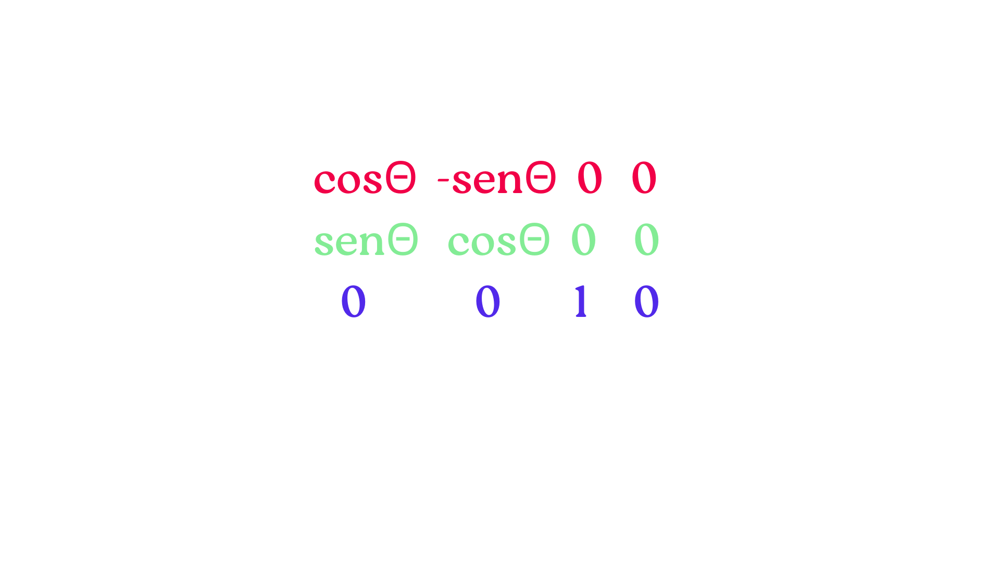

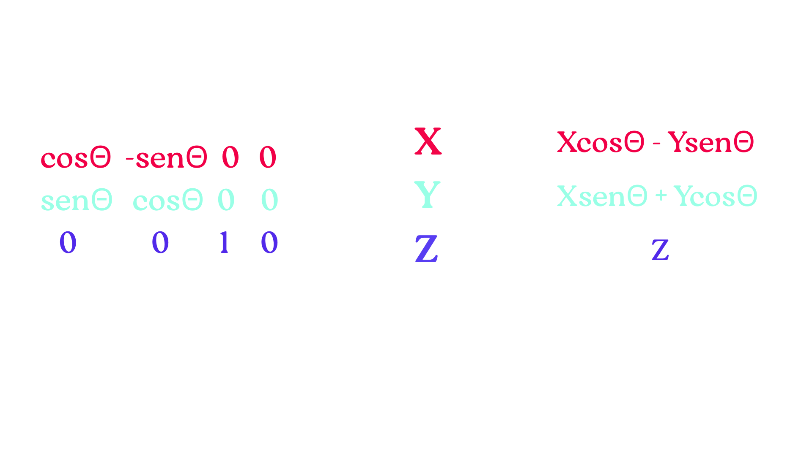

Repare que, para cada um dos casos acima, o eixo o qual rotacionaremos em torno fica "travado", isto é, a componente específica no nosso vetor resultante não é dada por operações que envolvam funções trigonométricas baseadas no ângulo theta.

### _Matriz para rotação em torno de eixo arbitrário_:

Para rotacionar em torno de um eixo 3D arbitrário, nós podemos combinar todas as três que acabamos de apresentar ao primeiro rotacionar em torno do eixo X, depois Y e então Z, por exemplo. Entretanto, isso rapidamente gera um problema chamado [_Gimbal lock_](https://pt.wikipedia.org/wiki/Gimbal_lock).

Não discutiremos os detalhes, mas uma solução melhor é rotacionar em torno de um eixo unitário arbitrário, por exemplo, (0,662, 0,2, 0,722) (observe que este é um vetor unitário), diretamente em vez de combinar as
matrizes de rotação. Tal matriz existe e é dada abaixo com _(Rx, Ry, Rz)_ como o eixo de rotação arbitrário (que coisinha linda...):

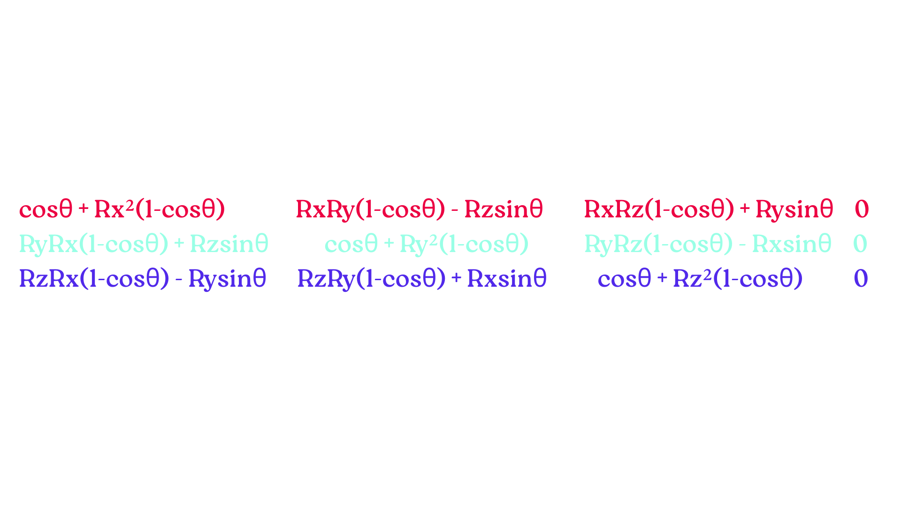

Ainda assim, essa matriz não previne completamente o _Gimbal lock_. Para realmente evitar, precisamos representar as rotações usando [quatérnios](https://pt.wikipedia.org/wiki/Quaterni%C3%A3o), que não são apenas mais seguros, mas também mais amigáveis computacionalmente. No entanto, uma discussão sobre quatérnios está fora do escopo deste capítulo.

## Combinando Matrizes

O verdadeiro poder de usar matrizes para transformações é que podemos combinar múltiplas transformações em uma única matriz graças à multiplicação de matrizes. Observe a seguinte combinação entre uma matriz para translocação e outra para redimensionamento:

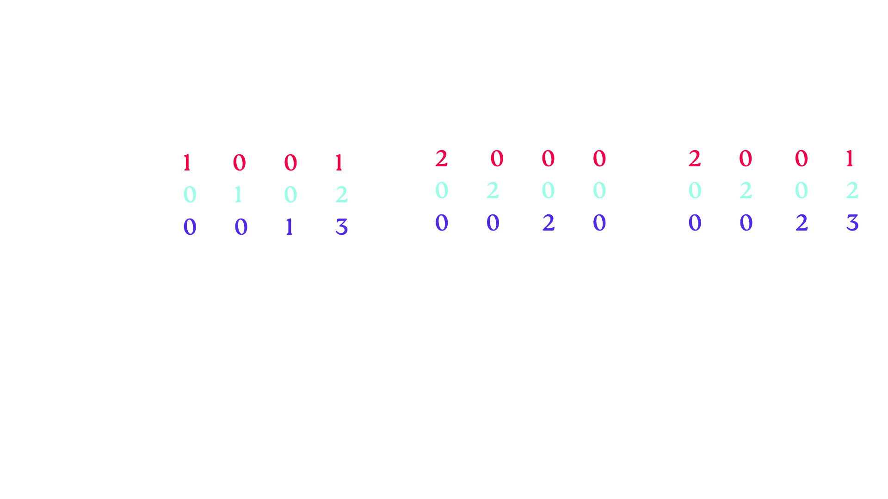

Agora, em termos de complexidade computacional, imagine que você fosse aplicar aquela translocação e aquele redimensionamento em, talvez, milhares ou milhões de objetos em uma simulação de computação gráfica. O fato de "empacotarmos" essas duas transformações em uma única matriz reduz pela metade o nosso custo computacional, o que é extremamente valioso em simulações que exigem bastante desempenho.

Lembrando que a multiplicação entre matrizes não é comutativa! O que significa que a ordem importa, interfere no resultado final.

Ao multiplicar matrizes, a matriz mais à direita é multiplicada primeiro pelo vetor, portanto, você deve ler as multiplicações da direita para a esquerda. Recomenda-se realizar primeiro as operações de escala, depois as rotações e, por último, as translações ao combinar matrizes; caso contrário, elas podem afetar-se (negativamente).

Aplicando a nossa matriz acima no nosso vetor _(x, y, z, 1)_, temos:

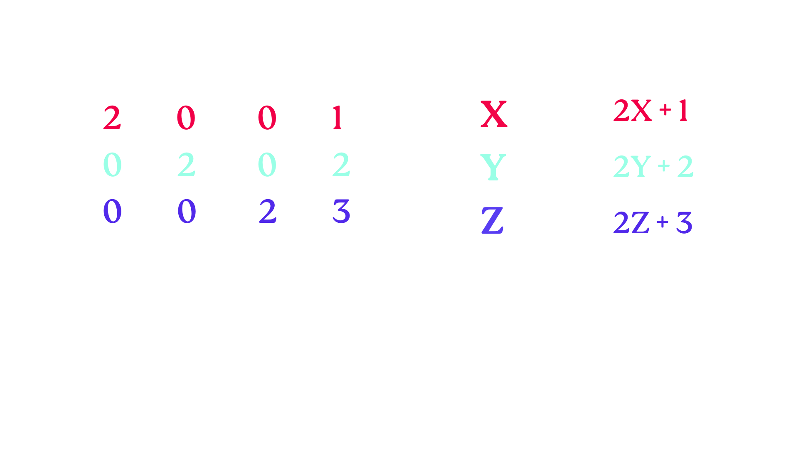

Maravilha! O vetor é primeiro escalado por dois e depois transladado por (1,2,3).

Agora que falamos um pouco sobre as transformações, podemos ir para a parte do código e ver como que funciona na prática. O OpenGL não possui nenhuma forma de conhecimento ou funcionalidades de matrizes ou vetores, então precisamos definir nossas próprias classes e funções. Felizmente, existe uma biblioteca matemática fácil de usar e feita sob medida para OpenGL chamada GLM. Acompanhe!

## GLM

GLM significa OpenGL Mathematics e é uma biblioteca composta apenas por arquivos de cabeçalho, o que significa que basta incluir os arquivos de cabeçalho apropriados e pronto; não é necessário vincular nem compilar.

### Instalação

Para instalar no Linux (saia do Windows imediatamente), temos duas formas comuns de fazer:

#### 1. Usando o Gerenciador de Pacotes (Recomendado)

A maioria das distribuições Linux possui o GLM nos repositórios oficiais. Essa é a melhor opção porque facilita as atualizações e a gestão de dependências.

_Ubuntu / Debian / Linux Mint:_

```sh
sudo apt update
sudo apt install libglm-dev
```

_Fedora:_

```sh
sudo dnf install glm-devel
```

_Arch Linux:_

```sh
sudo pacman -S glm
```

#### 2. Instalação Manual (Via GitHub)

Se você precisa de uma versão específica ou quer a mais recente que ainda não chegou nos repositórios, pode baixar direto do código-fonte.

Clone o repositório:

```sh
git clone https://github.com/g-truc/glm.git
```

Mova para o diretório de inclusão local (opcional, mas útil para acesso global):

```sh
sudo cp -r glm/glm /usr/local/include/
```

### Mão na Massa

Agora, que você já fez a instalação, podemos começar a brincar um pouco com as nossas ferramentas. Vamos começar fazendo os includes genéricos necessários:

```cpp
#include <glm/glm.hpp>
#include <glm/gtc/matrix_transform.hpp>
#include <glm/gtc/type_ptr.hpp>
```

A maioria das funcionalidades que precisamos é encontrada nos headers acima.

(i) O primeiro include `<glm/glm.hpp>` fornece os tipos e funções básicas do GLM, como vetores e matrizes.

(ii) O segundo include `<glm/gtc/matrix_transform.hpp>` fornece funções para criar matrizes de transformação, como translação, rotação e escala.

(iii) O terceiro include `<glm/gtc/type_ptr.hpp>` fornece funções para obter ponteiros para os dados das matrizes, o que é útil para passar para funções OpenGL.

Caso você queira se aprofundar na documentação do GLM, ela possui uma [referência de API](https://glm.g-truc.net/0.9.9/api/index.html) e um [manual](https://github.com/g-truc/glm/blob/master/manual.md).

Que tal fazer um código simples para ver o que aprendemos com o capítulo anterior e este até agora? Vamos aplicar uma translação.

Para começar, vamos declarar os nossos vetores:

```cpp
glm::vec4 vec(1.0f, 0.0f, 0.0f, 1.0f);
glm::mat4 trans = glm::mat4(1.0f);
```

No caso, para representar a posição de um determinado objeto no nosso mundo, declaramos um vetor com quatro dimensiões (o que aquela quarta componente representa, mesmo?) e os valores para cada uma.

Também, nós definimos uma matriz de transformação como uma matriz identidade (1.0f em todas as diagonais).

Agora, vamos aplicar uma translação à matriz de transformação:

```cpp
trans = glm::translate(trans, glm::vec3(1.0f, 1.0f, 0.0f));
```

Essa linha de código aplica uma translação à matriz `trans`, deslocando o objeto em 1.0 unidades no eixo x e 1.0 unidades no eixo y.

Finalmente, vamos multiplicar o vetor pelo vetor de transformação:

```cpp
vec = trans * vec;
```

Isso transforma o vetor `vec` aplicando a matriz de transformação `trans`.

```cpp
std::cout << vec.x << vec.y << vec.z << std::endl;
```

E finalmente, imprimimos os valores do vetor transformado.

O código completo fica assim:

```cpp
#include <iostream>
#include <glm/glm.hpp>
#include <glm/gtc/matrix_transform.hpp>
#include <glm/gtc/type_ptr.hpp>

int main(){
    glm::vec4 vec(1.0f, 0.0f, 0.0f, 1.0f);
    glm::mat4 trans = glm::mat4(1.0f);
    trans = glm::translate(trans, glm::vec3(1.0f, 1.0f, 0.0f));
    vec = trans * vec;
    std::cout << vec.x << vec.y << vec.z << std::endl;
}
```

Ao compilar e rodar, vamos ter a saída:

```sh
210
```

O vetor resultante daquela multiplicação é _(1+1, 0+1, 0+0)_, gerando _(2, 1, 0)_. Então, aquela nossa saída felizmente está correta.

Agora, vamos fazer algo um pouco mais legal e visual: escalar e rotacionar um objeto dos capítulos anteriores. Vamos adicionar as seguintes linhas dentro do loop de renderização:

```cpp
glm::mat4 trans = glm::mat4(1.0f);
trans = glm::rotate(trans, glm::radians(90.0f), glm::vec3(0.0, 0.0, 1.0));
trans = glm::scale(trans, glm::vec3(0.5, 0.5, 0.5));
return 0;
```

No código acima, começamos declarando uma matriz de transformação `trans` com valores padrão (identidade) e, em seguida, aplicamos uma rotação de 90 graus no eixo Z e uma escala de 0.5 em todos os eixos.

A função `glm::radians()` é usada para converter graus em radianos, uma vez que o GLM trabalha com radianos.

A `glm::rotate` e `glm::scale`, seguindo a intuição dos nomes, são funções do GLM que retornam uma matriz de transformação para rotação e escala, respectivamente.

Agora, como passamos a matriz de transformação para os shaders? Vamos adaptar o vertex shader no GLSL:

```glsl
#version 430 core
layout(location = 0) in vec3 aPos;
layout(location = 1) in vec2 aTexCoord;

out vec2 TexCoord;
uniform mat4 transform;

void main() {
    gl_Position = transform * vec4(aPos, 1.0);
    TexCoord = aTexCoord;
}
```

Basicamente, o que fizemos foi adicionar uma variável uniforme `transform` que recebe uma matriz 4x4 e a multiplicamos pelo vetor de posição do vértice para obter as coordenadas normalizadas finais.

O nosso container agora deve ser duas vezes menor e rotacionado em 90 graus.

Nós ainda precisamos passar a matriz de transformação para o shader. Vamos lá:

```cpp
unsigned int transformLoc = glGetUniformLocation(meuShaderInsano.ID, "transform");
    glUniformMatrix4fv(transformLoc, 1, GL_FALSE, glm::value_ptr(trans));
```

O código acima, basicamente, é enviar os dados da matriz para os shaders através da `glUniform` com `Matrix4fv` como posfixo.

O primeiro argumento de `glUniformMatrix4fv` é o local da variável uniforme no shader, obtido com `glGetUniformLocation`. O segundo argumento é o número de matrizes a serem enviadas (1, neste caso). O terceiro argumento é um booleano que indica se a matriz deve ser transposta antes de ser enviada. O quarto argumento é um ponteiro para os dados da matriz.

Assim, teremos como resultado:

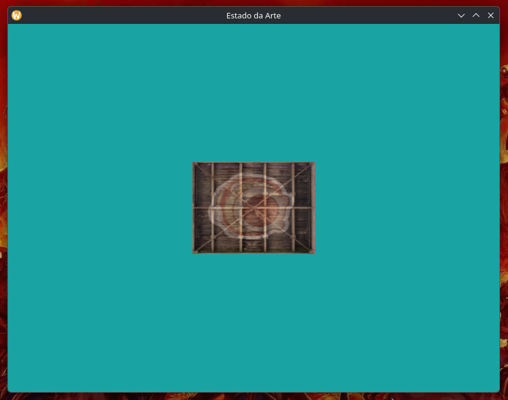

Simples, mas bacana, né?

Podemos pirar o cabeção, também, e fazer uma translação junto com rotação. No caso, ele vai rotacionar com a passagem do tempo. Substitua as linhas anteriores das atribuições em `trans` para:

```cpp
trans = glm::translate(trans, glm::vec3(0.5f, -0.5f, 0.0f));
trans = glm::rotate(trans, (float)glfwGetTime(),glm::vec3(0.0f,0.0f, 1.0f));
```

O que fizemos foi aplicar duas funções: uma de translação e uma de rotação à matriz de transformação. A translação move o objeto para a direita e para baixo, enquanto a rotação faz o objeto girar ao redor do eixo z.

Resultado:

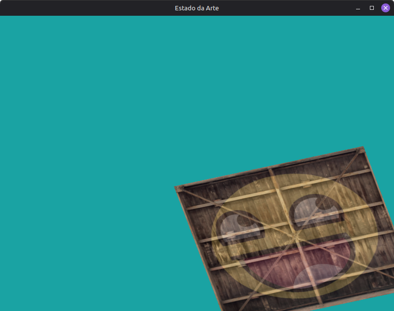

Bem daora, né? Não deixe de verficar o código completo na nossa pasta de códigos. Para ver o quadrado girando, basta compilar e rodar o código.

## Espaços

O OpenGL espera que todos os vértices que queremos tornar visíveis estejam em coordenadas normalizadas após cada execução do _vertex shader_. Ou seja, as coordenadas x, y e z de cada vértice devem estar entre -1,0 e 1,0; coordenadas fora desse intervalo não serão visíveis.

O que normalmente fazemos é especificar as coordenadas em um intervalo (ou espaço) que determinamos e, no shader de vértices, transformar essas coordenadas em coordenadas de dispositivo normalizadas (normalized device coordinates - NDC). Esses NDC são, então, fornecidos ao rasterizador para transformá-los em coordenadas/pixels 2D na sua tela.

A transformação de coordenadas para NDC geralmente é realizada passo a passo, onde transformamos os vértices de um objeto em vários sistemas de coordenadas antes de finalmente transformá-los em NDC.

### Local Space

O Local Space (ou Espaço Local) é o espaço de coordenadas que "parte" do seu objeto, que é local para ele, i.e. onde seu objeto começa.
Imagine que você está construindo um modelo 3D de uma casa. O espaço local da casa seria o espaço onde você começa a construir a casa, onde a origem (0,0,0) está no chão do primeiro andar, e os eixos X e Z são paralelos ao chão. Isso significa que qualquer ponto dentro da casa pode ser descrito em relação a essa origem, a partir de suas coordenadas locais.
Todos os vértices do seu modelo estão no espaço local: todos são locais para o seu objeto.

### World Space

Se nós importássemos todos os nossos objetos diretamente na nossa aplicação, eles provavelmente ficariam se sobrepondo no centro do nosso mundo, com origem em (0, 0, 0), o que não é o que queremos. Geralmente, é preferível definir uma posição específica para cada um dos nossos modelos dentro da nossa simulação.
As coordenadas no World Space (ou Espaço do Mundo) são exatamente o que parecem ser: as coordenadas de todos os seus vértices em relação ao mundo simulado.
As coordenadas do seu objeto são transformados do Local para o World Space; isso acontece através da _Matriz de Modelo_.

A Matriz de Modelo é uma matriz de transformação que translada, redimensiona e/ou rotaciona seu objeto para um lugar no mundo para uma localização/orientação a qual ele pertence. Você pode pensar na matriz do capítulo anterior para posicionar o contêiner em toda a cena como uma espécie de matriz de modelo também; transformamos as coordenadas locais do contêiner para algum lugar diferente na cena/mundo.

### View Space

O View Space (Espaço de Vista) é o que as pessoas normalmente se referem como sendo a câmera do _OpenGL_ (às vezes, também é conhecido como _Camera Space_ ou _Eye Space_).
O View Space é o resultado da transformação das coordenadas de seu World Space para coordenadas as quais estão na frente da perspectiva do usuário. No caso, o View Space é, então, o espaço visto a partir da perspectiva da câmera. Isso é, normalmente, realizado com a combinação de translações e rotações para que certos itens sejam transformados para frente da câmera. Essa combinação normalmente é guardada dentro de uma _Matriz de Visão_, que transforma coordenadas do mundo para o View Space.

### Clip Space

No fim da rodagem de cada vertex shader, o _OpenGL_ espera que as coordenadas estejam em um intervalo específico e que cada uma que não esteja seja cortada (clipada, ou "clipped" do inglês). Coordenadas cortadas são descartadas para que as remanescentes se tornem fragmentos visíveis na sua tela. É daí que o _Clip Space_ recebe seu nome.

Para transformar coordendas de vértices de _View_ para _Clip Space_, nós definimos a _Matriz de Projeção_, que especifica um intervalo de coordenadas, e.g. -1000 e 1000 para cada dimensão. A matriz de projeção
transforma então as coordenadas dentro desse intervalo especificado em coordenadas de dispositivo normalizadas
(-1.0, 1.0). Todas as coordenadas fora desse intervalo serão cortadas. Com este intervalo que especificamos na matriz de projeção, uma coordenada de (1250, 500, 750) não seria visível, uma vez que a coordenada x está fora do intervalo e, portanto, é convertida para uma coordenada maior que 1,0 em NDC e, consequentemente, é cortada.

> Observe que se apenas uma parte de uma primitiva, por exemplo, um triângulo, estiver fora do volume de recorte,
> o OpenGL reconstruirá o triângulo como um ou mais triângulos para caber dentro do intervalo.

A caixa de visualização que uma matriz de projeção cria é chamada de _frustrum_ (ou tronco de cone) e cada coordenada dentro desse _frustrum_ vai aparecer na tela do usuário.

O processo completo de conversão de coordenadas dentro de um intervalo específico para NDC, que podem ser facilmente mapeadas para coordenadas 2D de _View Space_, é chamado de _projeção_, visto que a matriz projeta coordendas 3D para 2D normalizadas.

Uma vez que todos os vértices são transformados para clip space, ocorre a _divisão de perspectiva_. No caso, as componentes _(x, y, z)_ dos vetores de posição são divididas pela componente homogênea _w_; essa divisão faz a transformação de coordenadas 4D do _Clip Space_ para coordenadas 3D normalizadas. Esse último passo é feito automaticamente ao fim da etapa do _vertex shader_.

_É após esta etapa que as coordenadas resultantes são mapeadas para coordenadas de tela (usando as
configurações do glViewport) e transformadas em fragmentos._

A matriz de projeção para transformar coordenadas de visualização em coordenadas de recorte geralmente assume duas formas diferentes, onde cada forma define seu próprio tronco de cone exclusivo: projeção ortográfica ou projeção em perspectiva.

#### Projeção Ortográfica

Uma matriz de _Projeção Ortográfica_ define um espaço de visualização em pixels e não distorce as proporções. Além disso, ela não projeta objetos em perspectiva, mantendo suas dimensões constantes ao longo da profundidade. Por fim, ela define uma caixa de frustrum em forma de paralelepípedo, onde os objetos são projetados diretamente. Observe:

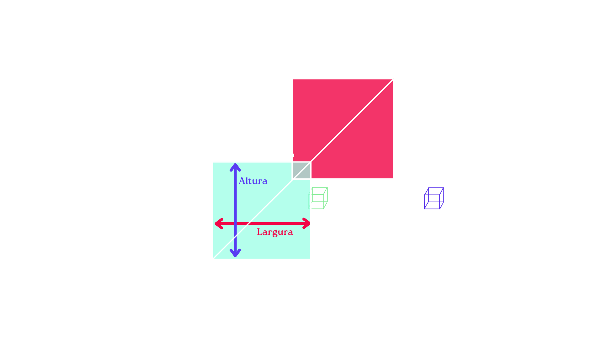

O tronco de cone define as coordenadas visíveis e é especificado por uma largura, uma altura e um plano próximo e distante. Qualquer coordenada à frente do plano próximo é cortada e o mesmo se aplica às coordenadas
atrás do plano distante.

Uma matriz de _Projeção Ortográfica_ pode ser criada com GLM da seguinte maneira:

```cpp
glm::ortho(0.0f, 800.0f, 0.0f, 600.0f, 0.1f, 100.0f);
```

Os primeiros quatro parâmetros definem o espaço de visualização em pixels (esquerda, direita, baixo, topo), enquanto os últimos dois definem o intervalo de profundidade (near, far).

Uma matriz de _Projeção Ortográfica_ faz um mapeamento para o plano 2D que é a sua tela, mas essa projeção direta produz resultados não realistas, visto que a perspectiva não é considerada. Por isso, é comum usar uma matriz de projeção em perspectiva em vez disso.

### Projeção em Perspectiva

Você sabe (eu espero) que na vida real objetos mais distantes aparecem menores do que objetos mais próximos. Isso é chamado de perspectiva e é uma das características que tornam a visão humana tão poderosa.


> Imagem do jogo Shadow x Sonic Generations: observe como todos aqueles elementos na paisagem aparentam estar distantes e menores do que o Shadow. Isso é um exemplo de perpectiva em jogos.

A matriz de projeção em perspectiva manipula o valor _w_ de cada coordenada homogênea dos vértices, fazendo com que objetos mais distantes sejam projetados com menor profundidade na tela. A divisão por _w_ é o que dá a ilusão de perspectiva:

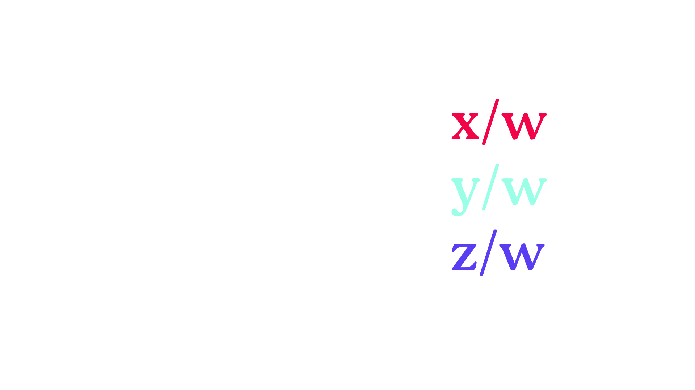

> A divisão por _w_ faz os objetos mais distantes aparecerem menores na tela, criando a ilusão de perspectiva.

Uma matriz de projeção em perspectiva pode ser criada com GLM da seguinte maneira:

```cpp
glm::mat4 proj = glm::perspective(glm::radians(45.0f), (float)width/(float)height, 0.1f, 100.0f);
```

No caso, o primeiro parâmetro é o ângulo de campo de visão em graus, o segundo é o aspect ratio (largura dividido por altura), o terceiro é a distância do plano de corte próximo e o quarto é a distância do plano de corte distante.

O que o glm::perspective faz no exemplo acima é definir uma projeção em perspectiva com um campo de visão de 45 graus, aspect ratio igual à proporção da tela, e distâncias de corte de 0.1 a 100 unidades. Os valores exatos dependem do cenário e podem ser ajustados conforme necessário.

A imagem de um tronco de cone (_frustrum_) em perspectiva pode ser vista abaixo:

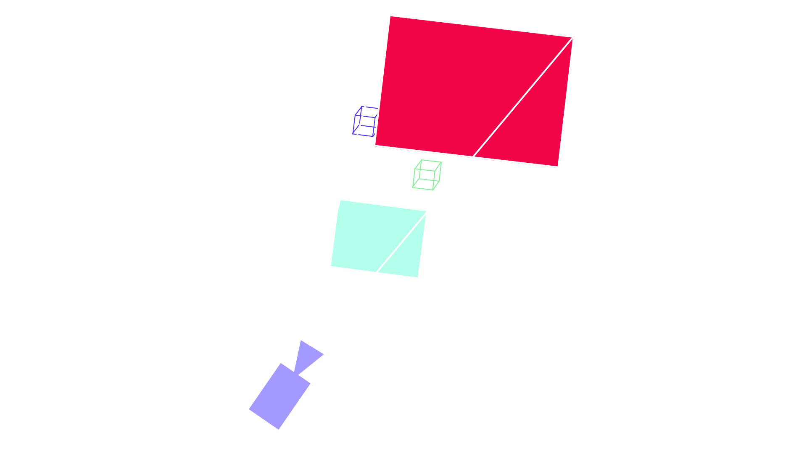

> Sempre que o valor do plano próximo da sua matriz de perspectiva for definido muito alto (como 10,0), o OpenGL cortará todas as coordenadas próximas à câmera (entre 0,0 e 10,0), o que pode dar um
> resultado visual que você talvez já tenha visto em videogames, onde era possível ver através
> de certos objetos ao se aproximar desconfortavelmente deles.

### Unificando tudo

Nós criamos uma matriz de transformação para: modelagem, vista e projeção. Uma coordenada de vértice é, então, transformada pela matriz de modelagem para colocá-la no espaço do modelo, pela matriz de vista para colocá-la no espaço da câmera, e pela matriz de projeção para colocá-la no espaço da tela. A transformação é dada da seguinte forma:

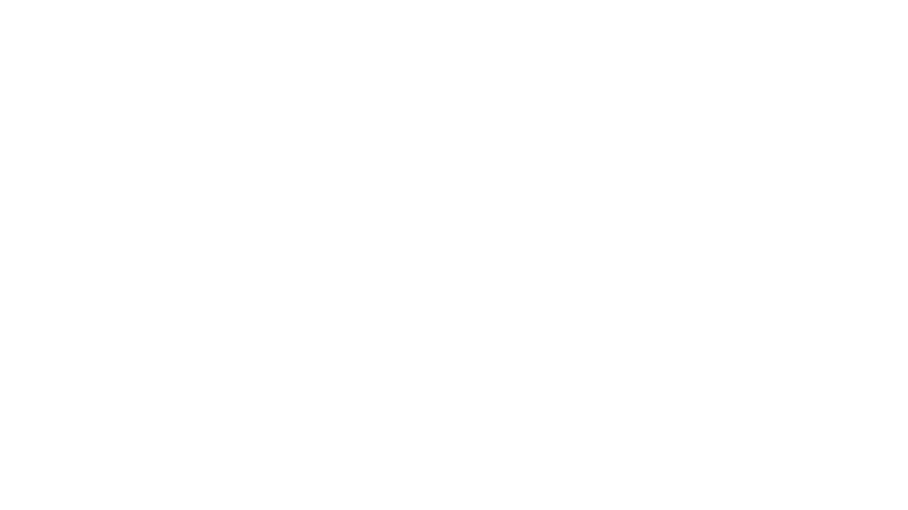

Perceba que a ordem da multiplicação de matrizes está invertida em relação à ordem das transformações (por quê?).

Esse tópico é um pouco difícil de entender, mas é essencial para a renderização 3D. Porém, não se preocupe se não entender completamente — o importante é saber como usar essas transformações corretamente. Vamos colocar a mão na massa com código!

### Mais Mão na Massa

Agora, temos as ferramentas e o conhecimento necessário para romper a barreira da segunda dimensão e entrar no mundo tridimensional!

Primeiro, vamos criar uma matriz de modelagem para nossa geometria. A matriz de modelagem define a posição, escala e orientação do objeto no espaço do mundo.

Vamos transformar o nosso plano um pouco ao rotacionar ele em torno do eixo X:

```cpp
glm::mat4 model = glm::mat4(1.0f);
model = glm::rotate(model, glm::radians(-55.0f), glm::vec3(1.0f, 0.0f, 0.0f));
```

Também, vamos fazer uma matriz de vista (View-Space):

```cpp
glm::mat4 view = glm::mat4(1.0f);
view = glm::translate(view, glm::vec3(0.0f, 0.0f, -3.0f));
```

Além disso, vamos criar uma matriz de projeção:

```cpp
glm::mat4 projection = glm::perspective(glm::radians(45.0f), 800.0f / 600.0f, 0.1f, 100.0f);
```

Então, vamos passar tudo para o nosso shader:

```cpp
unsigned int modelLoc = glGetUniformLocation(meuShaderInsano.ID, "model");
glUniformMatrix4fv(modelLoc, 1, GL_FALSE, glm::value_ptr(model));

unsigned int viewLoc = glGetUniformLocation(meuShaderInsano.ID, "view");
glUniformMatrix4fv(viewLoc, 1, GL_FALSE, glm::value_ptr(view));

unsigned int projectionLoc = glGetUniformLocation(meuShaderInsano.ID, "projection");
glUniformMatrix4fv(projectionLoc, 1, GL_FALSE, glm::value_ptr(projection));
```

Finalmente, vamos configurar o shader no GLSL:

```glsl
// shaders/vertex.vert
#version 430 core
layout(location = 0) in vec3 aPos;
layout(location = 1) in vec2 aTexCoord;

out vec2 TexCoord;
uniform mat4 model;
uniform mat4 view;
uniform mat4 projection;

void main() {
    //Repare na ordem de multiplicação abaixo
    gl_Position = projection * view * model * vec4(aPos, 1.0);
    TexCoord = aTexCoord;
}
```

E, voilá:

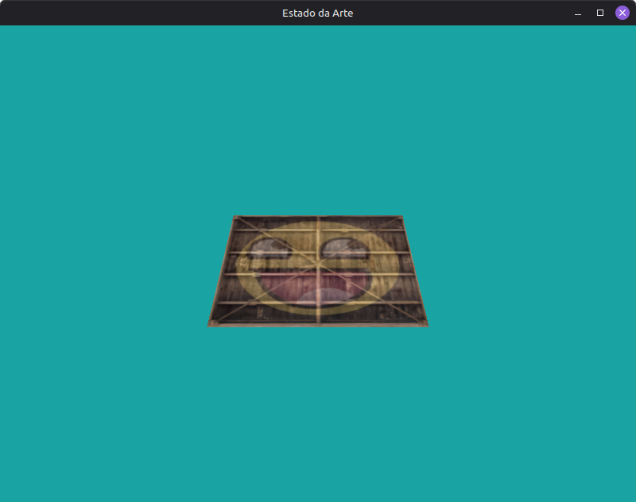

Um dever de casa para você é experimentar alterar a ordem de multiplicação das matrizes (`projection * view * model`) e ver como isso afeta o resultado final. Além disso, você pode tentar alterar os parâmetros das matrizes de vista e projeção para ver como eles afetam a imagem final.

Uma coisa (talvez) engraçada que dá pra fazer é adicionar as seguintes linhas no seu loop de renderização:

```cpp
model = glm::rotate(model, glm::radians(-55.0f), glm::vec3(1.0f, 0.0f, 0.0f));
unsigned int modelLoc = glGetUniformLocation(meuShaderInsano.ID, "model");
glUniformMatrix4fv(modelLoc, 1, GL_FALSE, glm::value_ptr(model));
```

Tente fazer isso e veja o que acontece!

Podemos, também, criar um cubo!

Para renderizar um cubo, precisamos de um total de 36 vertices (6 faces X 2 triângulos X 3 vértices).

Vamos fazer isso no código. Comecemos apagando o array de vertices atual e o array de indices. Vamos colocar esse novo array, não se assuste:

```cpp
float vertices[] = {
    // posições          // coords de textura
    -0.5f, -0.5f, -0.5f,  0.0f, 0.0f,
     0.5f, -0.5f, -0.5f,  1.0f, 0.0f,
     0.5f,  0.5f, -0.5f,  1.0f, 1.0f,
     0.5f,  0.5f, -0.5f,  1.0f, 1.0f,
    -0.5f,  0.5f, -0.5f,  0.0f, 1.0f,
    -0.5f, -0.5f, -0.5f,  0.0f, 0.0f,

    -0.5f, -0.5f,  0.5f,  0.0f, 0.0f,
     0.5f, -0.5f,  0.5f,  1.0f, 0.0f,
     0.5f,  0.5f,  0.5f,  1.0f, 1.0f,
     0.5f,  0.5f,  0.5f,  1.0f, 1.0f,
    -0.5f,  0.5f,  0.5f,  0.0f, 1.0f,
    -0.5f, -0.5f,  0.5f,  0.0f, 0.0f,

    -0.5f,  0.5f,  0.5f,  1.0f, 0.0f,
    -0.5f,  0.5f, -0.5f,  1.0f, 1.0f,
    -0.5f, -0.5f, -0.5f,  0.0f, 1.0f,
    -0.5f, -0.5f, -0.5f,  0.0f, 1.0f,
    -0.5f, -0.5f,  0.5f,  0.0f, 0.0f,
    -0.5f,  0.5f,  0.5f,  1.0f, 0.0f,

     0.5f,  0.5f,  0.5f,  1.0f, 0.0f,
     0.5f,  0.5f, -0.5f,  1.0f, 1.0f,
     0.5f, -0.5f, -0.5f,  0.0f, 1.0f,
     0.5f, -0.5f, -0.5f,  0.0f, 1.0f,
     0.5f, -0.5f,  0.5f,  0.0f, 0.0f,
     0.5f,  0.5f,  0.5f,  1.0f, 0.0f,

    -0.5f, -0.5f, -0.5f,  0.0f, 1.0f,
     0.5f, -0.5f, -0.5f,  1.0f, 1.0f,
     0.5f, -0.5f,  0.5f,  1.0f, 0.0f,
     0.5f, -0.5f,  0.5f,  1.0f, 0.0f,
    -0.5f, -0.5f,  0.5f,  0.0f, 0.0f,
    -0.5f, -0.5f, -0.5f,  0.0f, 1.0f,

    -0.5f,  0.5f, -0.5f,  0.0f, 1.0f,
     0.5f,  0.5f, -0.5f,  1.0f, 1.0f,
     0.5f,  0.5f,  0.5f,  1.0f, 0.0f,
     0.5f,  0.5f,  0.5f,  1.0f, 0.0f,
    -0.5f,  0.5f,  0.5f,  0.0f, 0.0f,
    -0.5f,  0.5f, -0.5f,  0.0f, 1.0f
};
```

Ele já contém as posições 3D e as coordenadas de textura para cada face do cubo.

Além disso, vamos atualizar o `glBufferData` para usar os 36 vértices:

```cpp
glBindBuffer(GL_ARRAY_BUFFER, VBO);
glBufferData(GL_ARRAY_BUFFER, sizeof(vertices), vertices, GL_STATIC_DRAW);
```

E que tal se o cubo também rodasse com o passar do tempo? Coloque isso aqui dentro do loop de renderização:

```cpp
model = glm::rotate(model, (float)glfwGetTime() * glm::radians(50.0f),
glm::vec3(0.5f, 1.0f, 0.0f));
```

Perceba o uso da função `glfwGetTime()` acima.

Também, vamos desenhar o cubo com `glDrawArrays`, só que com 36 vertices. Substitua `glDrawElements` por `glDrawArrays`:

```cpp
glDrawArrays(GL_TRIANGLES, 0, 36);
```

É isso. Resultado:

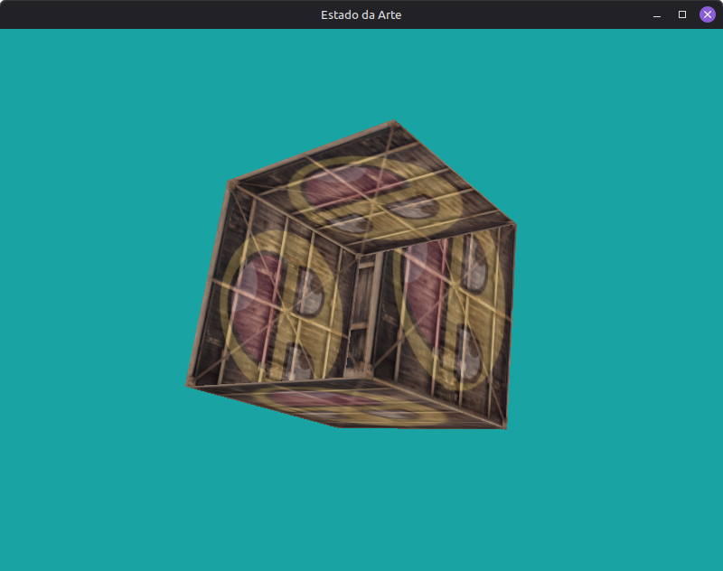

Estamos no caminho para fazer um cubo. Mas, perceba que ainda não temos exatamente um. Alguns lados dele estão sendo desenhados sobre outros lados, o que não é o esperado.

Para resolver isso, vamos utilizar o `z-buffer` do OpenGL, que serve para guardar a profundidade de cada pixel.

Para habilitar o `z-buffer`, adicione isso antes do loop de renderização:

```cpp
glEnable(GL_DEPTH_TEST);
```

E precisaremos limpar o `z-buffer` antes de cada iteração do loop. Então, vamos substituir `glClear(GL_COLOR_BUFFER_BIT)` por:

```cpp
glClear(GL_COLOR_BUFFER_BIT | GL_DEPTH_BUFFER_BIT);
```

Com isso, o OpenGL irá desenhar os pixels na ordem correta, evitando que os lados do cubo sejam desenhados sobre outros.

Veja:

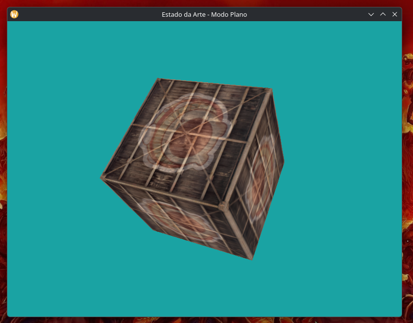

E se a gente quiser pirar o cabeção mais ainda e colocar 10 cubos rodando simultaneamente? Vejamos:

Primeiro, definir um vetor para armazenar as posições dos cubos. Façamos a seguinte declaração antes do loop de renderização:

```cpp
glm::vec3 cubePositions[] = {
    glm::vec3( 0.0f, 0.0f, 0.0f),
    glm::vec3( 2.0f, 5.0f, -15.0f),
    glm::vec3(-1.5f, -2.2f, -2.5f),
    glm::vec3(-3.8f, -2.0f, -12.3f),
    glm::vec3( 2.4f, -0.4f, -3.5f),
    glm::vec3(-1.7f, 3.0f, -7.5f),
    glm::vec3( 1.3f, -2.0f, -2.5f),
    glm::vec3( 1.5f, 2.0f, -2.5f),
    glm::vec3( 1.5f, 0.2f, -1.5f),
    glm::vec3(-1.3f, 1.0f, -1.5f)
};
```

Agora, dentro do loop de renderização, vamos iterar sobre os cubos e aplicar a transformação de rotação:

```cpp
(...)
glBindVertexArray(VAO);

for (int i = 0; i < 10; i++) {

    // Cria uma matriz de modelo e aplica a rotação com base no tempo e no índice do cubo

    glm::mat4 model = glm::mat4(1.0f);
    model = glm::translate(model, cubePositions[i]);

    float angle = 20.0f * i;
    float timeAngle = (float)glfwGetTime() * 50.0f;

    // Aplica a rotação ao modelo, somando o ângulo do cubo e o ângulo do tempo
    model = glm::rotate(model, (glm::radians(angle) + timeAngle), glm::vec3(1.0f, 0.3f, 0.5f));
    modelLoc = glGetUniformLocation(meuShaderInsano.ID, "model");

    glUniformMatrix4fv(modelLoc, 1, GL_FALSE, glm::value_ptr(model));
    glDrawArrays(GL_TRIANGLES, 0, 36);
}
```

Temos, então, o nosso resultado final:

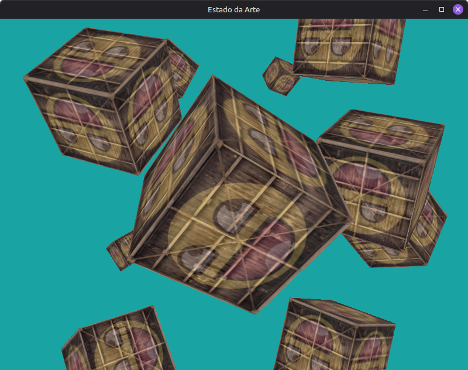

Catapimbas, 10 cubos girando com o tempo!

## Conclusão

Neste capítulo, fizemos um passeio por todas as transformações e espaços que o OpenGL nos oferece. Essas ferramentas são muito importantes para criar e animar objetos 3D em um ambiente gráfico. Elas vão nos acompanhar a partir de agora na estruturação dos nossos objetos em projetos.

Você sabe: obrigado por ler até aqui :)

```
         _\|/_
         (o o)
 +----oOO-{_}-OOo---------------------------+
 |                                          |
 | Se necessário, leia o capítulo novamente |
 |       ou tire dúvidas com alguém.        |
 |       Não precisa ter vergonha ;^]       |
 |                                          |
 +------------------------------------------+
```
