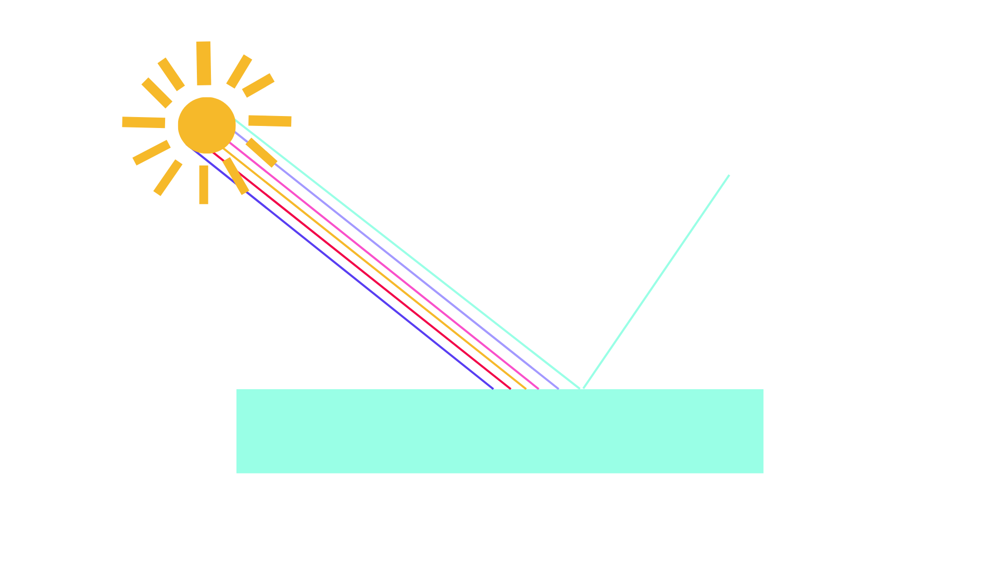
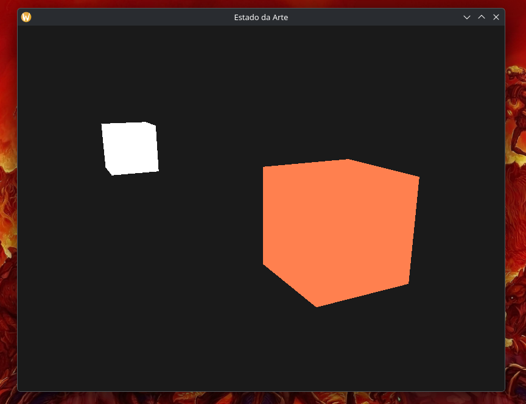
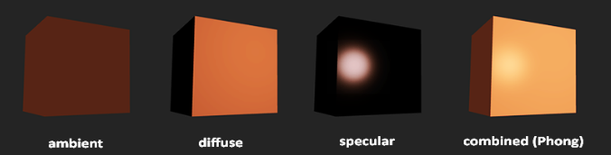
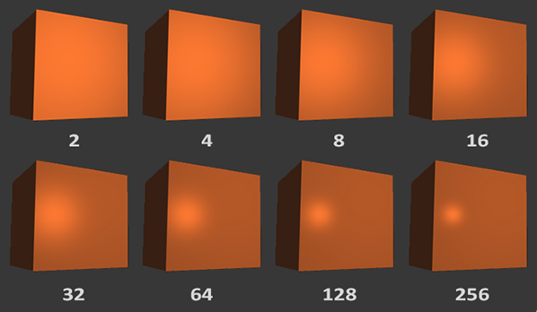
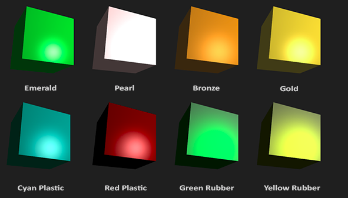

# Iluminação Básica

Uma das coisas que mais possuem potencial para alterar a maneira a qual compreendemos um projeto de computação gráfica é, justamente, a iluminação da cena em questão. A percepção individual de todos os objetos ali presentes gira em torno disso, refletindo como interpretaremos o mundo.

Tendo em vista esse ponto, neste capítulo nós veremos:

1. Armazenando e misturando cores
2. Criando um objeto fonte de luz
3. Descrição do modelo Blinn-Phong
4. Componente ambiente
5. Componente difuso
6. Componente especular e cuidados com vetores normais
7. Definindo materiais para o modelo Phong
8. Modificando as propriedades da fonte de luz

## Armazenando e Misturando Cores

Na sua infância (ou qualquer outra fase da sua vida), possivelmente você brincou com tintas. O que acontecia quando você misturava algumas? Uma "nova" cor surgia, certo? Além disso, dependendo da quantidade de cada tinta que você colocasse na mistura, a tonalidade da nova cor era alterada.

Então, eis aqui uma oportunidade de voltar a brincar com cores.

Como seria possível fazer isso no computador?

No mundo digital precisamos fazer o mapeamento de valores contínuos (infinitos) de cores para os discretos. Além disso, nós teremos três "tintas" básicas para chegar em praticamente qualquer outra cor. No caso, o vermelho (Red), o verde (Green) e o azul (Blue), os quais foram o famoso _RGB_. A "quantidade de cada tinta" que vamos usar fica dentro de um intervalo [0, 1]. Com base nisso, podemos definir um vetor de cores da seguinte maneira com GLM:

```cpp
glm::vec3 coral(1.0f, 0.5f, 0.31f);
```

Na vida real, a cor de um objeto o qual visualizamos nada mais é do que a cor que ele reflete. Parte do espectro de cores é absorvida e o resto é refletido.



> PS: nós sabemos que a disposição do espectro de cores não é assim. Mas, para fins de didática e de preguiça de fazer algo completamente acurado, resolvemos simplificar. Na prática, isso não interfere no conceito que estamos apresentando aqui, certo?

Como o espectro de cores que coincide no nosso objeto influencia diretamente na cor que percebemos dele, precisamos representar isso de alguma maneira no computador. Fazemos isso multiplicando componente por componente do vetor de luz e do vetor que representa a cor do objeto:

```cpp
glm::vec3 lightColor(1.0f, 1.0f, 1.0f);
glm::vec3 toyColor(1.0f, 0.5f, 0.31f);
glm::vec3 result = lightColor * toyColor; // resultado = (1.0f, 0.5f, 0.31f);
```

Acima, no vetor de luz, utilizamos as componentes que combinadas formam a luz branca. Ocorreu, então, uma reflexão fiel da cor do objeto. No caso, as componentes do vetor resultante possuem os mesmos valores vetor que representa a cor do brinquedo.

Agora, o que aconteceria se usássemos uma cor verde?

```cpp
glm::vec3 lightColor(0.0f, 1.0f, 0.0f); // Todas as componentes zeradas, exceto a verde
glm::vec3 toyColor(1.0f, 0.5f, 0.31f);
glm::vec3 result = lightColor * toyColor; // resultado = (0.0f, 0.5f, 0.0f);
```

No caso, não existiria cor vermelha ou azul para ser refletida, resultando apenas na reflexão da componente verde, que é inteiramente preservada.

Mas, e se nós usássemos alguma cor mais específica, como verde oliva:

```cpp
glm::vec3 lightColor(0.33f, 0.42f, 0.18f);
glm::vec3 toyColor(1.0f, 0.5f, 0.31f);
glm::vec3 result = lightColor * toyColor; // resultado = (0.33f, 0.21f, 0.06f);
```

Enfim. Podemos fazer um objeto refletir diferentes tonalidades de cor a partir do uso de diferentes iluminações. Na vida real, as coisas também não funcionam desta maneira? É assim que representamos no computador!

## Iluminando Uma Cena

Para criar a iluminação de uma cena, a primeira coisa que precisamos é de uma fonte de luz. Aqui, para fins de simplificação, ela será um cubo. Além disso, também usaremos um dos benditos contêiner de cubo.

Inicialmente, vamos precisar de um vertex shader para desenhar o contêiner. As posições dos vértices do contêiner devem continuar as mesmas, então nenhuma novidade por aqui.

```glsl
#version 430 core
layout (location = 0) in vec3 aPos;

uniform mat4 model;
uniform mat4 view;
uniform mat4 projection;

void main(){
    gl_Position = projection * view * model * vec4(aPos, 1.0);
}
```

Já que queremos renderizar uma fonte de luz na forma de um cubo, vamos querer gerar um novo VAO especificamente para a fonte de luz:

```cpp
unsigned int lightVAO;
glGenVertexArrays(1, &lightVAO);
glBindVertexArray(lightVAO);
// Precisamos apenas fazer o binding com o VBO, os dados do VBO do contêiner
// já contêm os dados.
glBindBuffer(GL_ARRAY_BUFFER, VBO);

// Definindo o atributo do vértice
glVertexAttribPointer(0, 3, GL_FLOAT, GL_FALSE, 3 * sizeof(float),(void*)0);
glEnableVertexAttribArray(0);
```

Ok! Agora que criamos os cubos, vamos definir o shader de fragmento para ambos:

```glsl
#version 430 core
out vec4 FragColor;
uniform vec3 objectColor;
uniform vec3 lightColor;
void main(){
    FragColor = vec4(lightColor * objectColor, 1.0);
}
```

O shader de fragmento aceita uma cor de objeto e de luz de uma variável uniforme. Aqui, novamente, nós multiplicamos a cor da luz com a do objeto.

Vamos definir a cor do objeto como sendo a mesma do coral e da luz como sendo branca

```cpp
lightningShader.use();
lightningShader.setVec3("objectColor", 1.0f, 0.5f, 0.31f);
lightningShader.setVec3("lightColor", 1.0f, 1.00f, 1.00f);
```

Em um projeto real, conforme formos ajustando os shaders de iluminação no avanço do nosso código, o nosso querido cubo luminoso seria afetado, e isso não é algo que queremos. Aqui, queremos que ele mantenha uma cor e um brilho constante.

Para isso, vamos criar um outro conjunto de shaders que usaremos para desenhar a nossa fonte de luz e manter ela segura de eventuais mudanças nos shaders de iluminação.

O vertex shader que vamos criar é o mesmo que o vertex shader de iluminação, então é só dar copy-paste do código:

```glsl
#version 430 core
out vec4 FragColor;

void main(){
    FragColor = vec4(1.0);
}
```

Quando quisermos renderizar, vamos querer rederizar o objeto contêiner usando o shader de iluminação que acabamos de definir. Quando quisermos desenhar a fonte de luz, usaremos os shaders da fonte de luz em si.

A ideia do cubo é só mostrar de onde a luz da cena vem. Por isso, renderizamos ele na mesma posição que a fonte de luz.

Então, vamos declarar um `vec3` global para representar a localização da fonte de luz nas coordenadas do word-space:

```c++
glm::vec3 lightPos(1.2f, 1.0f, 2.0f);
```

E, depois, transladar o cubo de fonte de luz para a posição da fonte de luz em si e encolhê-lo antes de renderizar:

```c++
model = glm::mat4(1.0f);
model = glm::translate(model, lightPos);
model = glm::scale(model, glm::vec3(0.2f);
```

O código de renderização final deve ficar mais ou menos assim:

```cpp
lightCubeShader.use();
// Nas próximas linhas, defina o modelo e a matriz de visão e de projeção
// (...)
// Desenhando o objeto "cubo luminoso"
glBindVertexArray(lightCubeVAO);
glDrawArrays(GL_TRIANGLES, 0, 36);
```

Enfim. Desenvolvendo o seu código em `C++` para OpenGL corretamente, compilando e rodando, teremos o seguinte:



Qualquer dúvida, não deixe de consultar o código completo na pasta de códigos da nossa trilha!

## Iluminação Básica

O funcionamento da luz no mundo real é extremamente complexo e existem diversos fatores que podem alterar a sua disposição e se alcance até nossas retinas. Obviamente, precisamos nos limitar a certas coisas específicas pois, normalmente, não possuímos poder computacional ilimitado ou algo nesse sentido.

A iluminação no OpenGL é baseada em modelos simplificados, mas que produzem resultados bem realistas e interessantes para nós.

Um desses modelos é o `Modelo de Iluminação de Phong` e a construção a partir desse pilar consiste em três componentes: _iluminação ambiente, difusa e especular_.



> Imagem retirada do livro Learn OpenGL. Nela, você consegue perceber como cada uma das componentes atua individualmente e como fica quando todas são combinadas.

i) Iluminação Ambiente: no mundo real, mesmo quando estamos em um local bem escuro, sempre existe algum resquício de iluminação, então os objetos nunca estão completamente escuros. Para simular isso, vamos usar uma _iluminação ambiente_ que sempre dê alguma cor para os objetos.

ii) Iluminação Difusa: simula o impacto direto da luz em um objeto.

iii) Iluminação Especular: simula o ponto de uma luz que aparece em objetos brilhantes.

### Luz Ambiente

Adicionar uma iluminação ambiente no nosso projeto é bem simples. Nós pegamos a cor da luz, multiplicamos ela por uma constante pequena de "fator ambiente", multiplicamos pela cor do objeto e usamos isso como a cor do fragmento no shader do cubo do objeto. Em outras palavras:

```glsl
void main(){
    float ambientStrength = 0.1;
    vec3 ambient = ambientStrength * lightColor;

    vec3 result = ambient * objectColor;
    FragColor = vec4(result, 1.0);
}
```

Ao rodar o programa, você vai perceber que já estará funcionando e terá mais ou menos algo nesse sentido:

(imagem)

> O objeto está meio escuro, mas não completamente. Além disso, o cubo de luz não foi afetado (por quê?).

### Luz Difusa

Se a primeira aplicação de iluminação não te animou tanto, é aqui que começamos a ter resultados mais interessantes.

A iluminação difusa dá ao objeto maior clareza conforme os fragmentos são mais alinhados com os raios da fonte de luz. Para você ter uma noção melhor, observe a seguinte imagem:

(imagem)

À esquerda, encontramos uma fonte de iluminação com um raio de luz coincidindo com um ponto específico do nosso objeto. No caso, é necessário estimar o ângulo de incidência para definir a iluminação final. Se o raio de luz é perpendicular, tal como um solzão de meio-dia, temos a maior quantidade de reflexão possível.

Para mensurar esse ângulo, utilizamos uma coisa chamada de _vetor normal_, que é um vetor perpendicular à superfície do fragmento. O ângulo entre os dois vetores pode ser calculado usando o produto escalar. Caso você não se lembre a respeito do produto escalar, nós abordamos ele no nosso [capítulo de revisão de conceitos matemáticos](https://github.com/ConwayUSP/Estado-da-Arte/blob/main/capitulos/04%20-%20Matematica.md). Vale à pena dar uma conferida.

> Perceba que, para conseguirmos o cosseno do ângulo entre dois vetores, trabalharemos com vetores unitários (vetores com comprimento igual a 1). Então, precisamos ter certeza de que todos os vetores estejam normalizados, se não o produto escalar vai retornar valores que vão além do cosseno.

O produto escalar resultante vai retornar que usaremos para calcular o impacto da luz na cor do fragmento, fazendo com que tenhamos resultados diferentes em função dos diferentes posicionamentos do objeto diante da fonte de luz.

Então, para calcular isso, vamos precisar do _vetor normal_ e do raio de luz direcionado. Para este último, um vetor de direção que é um vetor resultante da diferença a posição da luz e do fragmento.

### Vetores Normais

Conforme acabamos de falar, um vetor normal é um vetor (unitário neste caso) que é perpendicular à superfície de um vértice. Mas, ora, um vértice é só um ponto, então não tem uma "superfície", certo? Sim, por isso vamos pegar um vetor normal utilizando os vértices ao redor dele para definir essa superfície.

Podemos calcular os vetores normais para todos os vértices do cubo ao utilizar o produto vetorial (caso você não lembre, novamente indicamos o [Capítulo 4](https://github.com/ConwayUSP/Estado-da-Arte/blob/main/capitulos/04%20-%20Matematica.md) desta trilha).

Porém, já que um cubo não é uma forma muito complicada, podemos adicionar eles manualmente (ou não) nos dados do vertex. Observe (e não se assuste):

```cpp
// Dados dos vértices
float vertices[] = {
    // positions          // normals           // texture coords
    -0.5f, -0.5f, -0.5f,  0.0f,  0.0f, -1.0f,  0.0f,  0.0f,
     0.5f, -0.5f, -0.5f,  0.0f,  0.0f, -1.0f,  1.0f,  0.0f,
     0.5f,  0.5f, -0.5f,  0.0f,  0.0f, -1.0f,  1.0f,  1.0f,
     0.5f,  0.5f, -0.5f,  0.0f,  0.0f, -1.0f,  1.0f,  1.0f,
    -0.5f,  0.5f, -0.5f,  0.0f,  0.0f, -1.0f,  0.0f,  1.0f,
    -0.5f, -0.5f, -0.5f,  0.0f,  0.0f, -1.0f,  0.0f,  0.0f,

    -0.5f, -0.5f,  0.5f,  0.0f,  0.0f,  1.0f,  0.0f,  0.0f,
     0.5f, -0.5f,  0.5f,  0.0f,  0.0f,  1.0f,  1.0f,  0.0f,
     0.5f,  0.5f,  0.5f,  0.0f,  0.0f,  1.0f,  1.0f,  1.0f,
     0.5f,  0.5f,  0.5f,  0.0f,  0.0f,  1.0f,  1.0f,  1.0f,
    -0.5f,  0.5f,  0.5f,  0.0f,  0.0f,  1.0f,  0.0f,  1.0f,
    -0.5f, -0.5f,  0.5f,  0.0f,  0.0f,  1.0f,  0.0f,  0.0f,

    -0.5f,  0.5f,  0.5f, -1.0f,  0.0f,  0.0f,  1.0f,  0.0f,
    -0.5f,  0.5f, -0.5f, -1.0f,  0.0f,  0.0f,  1.0f,  1.0f,
    -0.5f, -0.5f, -0.5f, -1.0f,  0.0f,  0.0f,  0.0f,  1.0f,
    -0.5f, -0.5f, -0.5f, -1.0f,  0.0f,  0.0f,  0.0f,  1.0f,
    -0.5f, -0.5f,  0.5f, -1.0f,  0.0f,  0.0f,  0.0f,  0.0f,
    -0.5f,  0.5f,  0.5f, -1.0f,  0.0f,  0.0f,  1.0f,  0.0f,
};
```

```glsl
// Vertex Shader
out vec3 Normal;

void main()
{
    gl_Position = projection * view * model * vec4(aPos, 1.0);
    Normal = aNormal;
}
```

Assim, o que falta fazer é declarar a variável de entrada no fragment shader:

```glsl
in vec3 Normal;
```

### Calculando a Cor Difusa

Agora que temos o vetor normal para cada vértice, precisamos da posição da luz e do fragmento, ambas na forma de vetores.

Declarando a posição da luz como um uniform no fragment shader:

```glsl
uniform vec3 lightPos;
```

E, também, atualizar o uniform no loop de renderização (por quê?). Vamos utilizar o `lightPos` declarado no capítulo passado como sendo a fonte da luz difusa:

```cpp
lightningShader.setVec3("lightPos", lightPos);
```

Por fim, precisamos da posição atual do fragmento.

Os cálculos para iluminação serão feitos no _world space_, então precisaremos de uma posição de vértice que eseja, à princípio, no _world space_.

Dá para fazer isso ao multiplicar o atributo de posição do vértice apenas com a matriz modelo para transformar ele em coordenadas de _world space_. Isso é tranquilo de fazer no vertex shader, então vamos declarar uma variável de saída e calcular suas coordenadas:

```glsl
out vec3 FragPos;
out vec3 Normal;
void main(){
    gl_Position = projection * view * model * vec4(aPos, 1.0);
    FragPos = vec3(model * vec4(aPos, 1.0));
    Normal = aNormal;
}
```

E, por fim, vamos adicionar a variável de entrada para o nosso fragment shader:

```glsl
in vec3 FragPos;
```

Agora, podemos começar a fazer os cálculos para iluminação!

Primeiro, vamos pegar o vetor de direção, entre a fonte de luz e a posição do fragmento, que mencionamos anteriormente. Isso pode ser feito, simplesmente, a partir da subtração entre os vetores de cada um.

Além disso, é importante que todos os vetores relevantes se tornem unitários, então precisamos normalizar tanto o vetor normal quanto o de direção resultante:

```glsl
vec3 norm = normalize(Normal);
vec3 lightDir = normalize(lightPos - FragPos);
```

Depois, precisamos calcular o impacto difuso da luz no fragmento atual a partir do produto escalar entre o `norm` e o `lightDir`. O resultado vai ser mutiplicado com a cor da luz para que possamos obter a componente de difusão, resultando em uma componente de difusão mais escura na medida em que o ângulo entre os dois vetores aumenta:

```glsl
float diff = max(dot(norm, lightDir), 0.0);
vec3 diffuse = diff * lightColor;
```

Eventualmente, talvez o ângulo entre os dois acabe se tornando negativo. Por isso, utilizamos a função `max` entre o produto escalar e `0.0`. Não queremos trabalhar com ângulos negativos.

Agora, que temos um componente de ambiente e um difuso, nós adicionamos ambas as cores para cada um e, então, multiplicamos o resultado pela cor do objeto para obter a cor de saída:

```glsl
vec3 result = (ambient + diffuse) * objectColor;
FragColor = vec4(result, 1.0);
```

Se tudo der certo e você conseguir compilar o projeto (esperamos que sim), você vai ter algo assim:

(Imagem)

Temos um grande avanço em comparação ao ponto em que paramos anteriormente, não é?

### Um Detalhe a Mais

Vamos tratar aqui, em três tópicos, sobre alguns problemas que aparecem neste contexto e como podemos resolver utilizando um pouco mais de conceitos sobre vetores.

(Imagem aqui no futuro)

1. O Problema da Translação

Vetores normais representam direções, não posições. Como não possuem a coordenada homogênea (w), eles não devem ser afetados por translações. Para evitar isso, usa-se apenas a parte superior esquerda 3×3 da matriz de modelo.

2. O Problema da Escala Não-Uniforme

Se um objeto for redimensionado de forma desigual (ex: esticado apenas no eixo X), os vértices mudam de posição de tal forma que a normal original deixa de ser perpendicular à superfície. Isso causa distorções graves na iluminação.

3. A Solução: Matriz Normal

Para corrigir essa distorção, utiliza-se a Matriz Normal, que é calculada como: _A transposta da inversa da parte 3×3 superior esquerda da matriz de modelo._

Em código (GLSL), a aplicação no Vertex Shader ficaria assim:

```glsl
Normal = mat3(transpose(inverse(model))) * aNormal;
```

### Luz especular

Para começarmos a finalizar o modelo de iluminação de Phong, vamos adicionar a iluminação especular.

Ela é um pouco parecida com a iluminação difusa, é baseada na direção do vetor de direção da luz e dos vetores normais do objeto, mas também é baseada na direção da visão, tipo para qual direção um jogador está olhando para o fragmento no meio de uma simulação gráfica em um joguinho.

Se pensarmos na superfície do objeto como sendo um espelho, a luz especular é a mais forte onde quer que percebéssemos a luz refletida na superfície. Observe:

(Imagem)

Nós calculamos um vetor de reflexão ao refletir a direção da luz nos arredores do vetor normal. Então, calculamos a distância angular entre o seu vetor de reflexão e a direção da visão.

Quanto menor o ângulo entre eles, maior será o impacto da luz especular.

O vetor de visão é mais uma variável que precisaremos declarar, que podemos calcular usando a posição do "telespectador" no world space e a posição do fragmento. Então, calculamos a intensidade da luz especular, multiplicamos com a cor da luz e adicionamos para o ambiente e componentes de difusão.

Vamos, então, criar mais um uniform para o shader de fragmento e passar o vetor de posição da câmera para o shader:

```glsl
uniform vec3 viewPos;
lightingShader.setVec3("viewPos", camera.Position);
```

Precisamos definir uma intensidade para a iluminação especular. Será um brilho "médio" para que não haja exagero:

```glsl
float specularStrength = 0.5;
```

Calculando o vetor de direção para visão e o vetor de reflexão correspondente ao longo do eixo normal:

```glsl
vec3 viewDir = normalize(viewPos - FragPos);
vec3 reflectDir = reflect(-lightDir, norm);
```

> Note que negamos o vetor lightDir. A função reflect espera que o primeiro vetor aponte da fonte de luz em direção à posição do fragmento, mas o vetor lightDir está apontando na direção oposta: do fragmento em direção à fonte de luz (isso depende da ordem da subtração realizada anteriormente quando calculamos o vetor lightDir).

Finalmente, o que falta fazer é calcular a componente da luz especular. Faremos isso da seguinte maneira:

```glsl
float spec = pow(max(dot(viewDir, reflectDir), 0.0), 32);
vec3 specular = specularStrength * spec * lightColor;
```

Primeiro, calculamos o produto escalar entre `viewDir` e `reflectDir`, novamente aplicando a função max entre o valor retornado e `0.0` para não surgir um valor negativo inesperado. Depois, elevamos o resultado a 32. Esse número, no caso, é é o valor de brilho do destaque. Veja a imagem abaixo:



> Imagem retirada do livro Learn OpenGL. Quanto maior o valor de brilho de um objeto, mais ele reflete a luz de forma adequada, em vez de dispersá-la, e, portanto, menor se torna o reflexo. A imagem mostra o impacto visual de diferentes valores de brilho.

Não queremos que a componente especular chame tanta atenção, então manteremos em 32.

Vamos adicionar ao nosso ambiente, aos componentes de difusão e multiplicar os resultados combinados com a cor do objeto:

```glsl
vec3 result = (ambient + diffuse + specular) * objectColor;
FragColor = vec4(result, 1.0);
```

Você terá mais ou menos o seguinte resultado:

(imagem)

## Definindo materiais para o modelo Phong

No mundo real, cada material reage de maneira diferente à luz. Objetos metálicos geralmente emitem um brilho maior e característico, diferente de um filtro de barro ou algo nesse sentido.

Se quisermos simular isso em computação gráfica, precisamos definir propriedades materiais para cada superfície.
Ao realizar essa definição, podemos estabelecer uma cor material para cada um dos três componentes de iluminação: ambiente, difuso e especular. Ao fazer isso, teremos um bom controle a respeito da cor de saída da superfície.

Agora, adicione uma componente de `brilho` (shininess) para essas três cores e teremos todas as propriedades materiais que precisamos:

```glsl
struct Material {
    vec3 ambient;
    vec3 diffuse;
    vec3 specular;
    float shininess;
}

uniform Material material;
```

Para ficar mais fácil, criamos uma estrutura para abrigar essas componentes de propriedades da superfície.

Como você pode ver, definimos um vetor de cor para cada um dos componentes da iluminação Phong.

(i) O vetor de material ambiente define a cor que a superfície reflete sob iluminação ambiente; geralmente, essa cor é a mesma da superfície.
(ii) O vetor de material difuso define a cor da superfície sob iluminação difusa. A cor difusa (assim como a da iluminação ambiente) é definida para a cor desejada da superfície.
(iii) O vetor de material especular define a cor do brilho especular na superfície (ou pode até mesmo refletir uma cor específica da superfície).
(iv) Por fim, o brilho influencia a dispersão/raio do brilho especular.

Com essas quatro componentes, podemos simular muitos materiais do mundo real.

Existe uma tabela em [devernay.free.fr](http://devernay.free.fr/cours/opengl/materials.html) que mostra uma lista de propriedades que simulam materiais reais encontrados no mundo. A imagem a seguir, retirada do livro Learn OpenGL, mostra alguns exemplos:



Vamos, então, brincar um pouco com as implementações?

### Definindo materiais

Nós já criamos uma estrutura no fragment shader, então precisaremos mudar os cálculos de iluminação para manter a coerência com as propriedades do novo material. Veja o código a seguir:

```glsl
void main(){
    // ambient
    vec3 ambient = lightColor * material.ambient;

    // diffuse
    vec3 norm = normalize(Normal);
    vec3 lightDir = normalize(lightPos - FragPos);
    float diff = max(dot(norm, lightDir), 0.0);
    vec3 diffuse = lightColor * (diff * material.diffuse);

    // specular
    vec3 viewDir = normalize(viewPos - FragPos);
    vec3 reflectDir = reflect(-lightDir, norm);
    float spec = pow(max(dot(viewDir, reflectDir), 0.0), material.shininess);
    vec3 specular = lightColor * (spec * material.specular);

    vec3 result = ambient + diffuse + specular;
    FragColor = vec4(result, 1.0);
}
```

Como você pode ver, agora acessamos todas as propriedades da estrutura do material onde precisarmos e, desta vez, calculamos a cor de saída resultante com a ajuda das cores do material. Cada um dos atributos do material do objeto é multiplicado por seus respectivos componentes de iluminação.

Podemos definir o material do objeto no aplicativo configurando os uniforms apropriados. Uma estrutura em GLSL, no entanto, não é especial em nenhum aspecto ao configurar uniforms; no caso, uma estrutura funciona apenas como um namespace de variáveis uniform. Se quisermos preencher a estrutura, teremos que definir os uniforms individualmente, mas prefixados com o nome da estrutura:

```glsl
lightingShader.setVec3("material.ambient", 1.0f, 0.5f, 0.31f);
lightingShader.setVec3("material.diffuse", 1.0f, 0.5f, 0.31f);
lightingShader.setVec3("material.specular", 0.5f, 0.5f, 0.5f);
lightingShader.setFloat("material.shininess", 32.0f);
```

Definimos os componentes de luz ambiente e difusa para a cor desejada para o objeto e o componente especular para uma cor de brilho médio; novamente, como falamos anteriormente, não queremos que o componente especular seja muito forte. Também mantemos o brilho em 32, pela mesma razão.

Enfim, compilando e rodando, teremos o seguinte:

(Imagem)

O que achou? Ficou um pouco esquisito ainda, né?

## Modificando as propriedades da fonte de luz

O objeto tava brilhante demais. Isso aconteceu porque as cores ambiente, difusa e especular são refletidas com potência máxima de qualquer fonte de luz no estado em que deixamos a nossa programação.

Fontes de luz também exibem diferentes comportamentos/intensidades para as componentes ambientais, difusas e especulares respectivamente.

Anteriormente, resolvemos isso ao variar as intensidades de cada um com um valor para isso. Queremos fazer algo parecido, mas, dessa vez, especificando vetores de intensidade para cada uma das componentes.

Vamos visualizar `lightColor` como sendo um `vec3(1.0)`. O código, então, fica assim:

```glsl
vec3 ambient = vec3(1.0) * material.ambient;
vec3 diffuse = vec3(1.0) * (diff * material.diffuse);
vec3 specular = vec3(1.0) * (spec * material.specular);
```

Então, cada propriedade material do objeto é retornada com intensidade máxima para cada uma das componentes de luz.

A cor ambiente, por exemplo, não deveria ter muito impacto na cor final. Então, poderíamos reduzir a potência dela:

```glsl
vec3 ambient = vec3(0.1) * material.ambient;
```

E poderíamos fazer algo semelhante para a difusa e especular também.

Para facilitar, vamos criar uma estrutura parecida com a que criamos anteriomente, só que desta vez vai ser para as propriedades da luz:

```glsl
struct Light {
    vec3 position;

    vec3 ambient;
    vec3 diffuse;
    vec3 specular;
};
uniform Light light;
```

Uma fonte de luz possui intensidades diferentes para seus componentes ambiente, difuso e especular.

(i) A luz ambiente geralmente é configurada com baixa intensidade, pois não queremos que a cor ambiente seja muito dominante;
(ii) O componente difuso de uma fonte de luz geralmente é configurado com a cor exata que desejamos para a luz; frequentemente, um branco brilhante;
(iii) O componente especular geralmente é mantido em vec3(1.0), brilhando com intensidade máxima.

Observe que também adicionamos o vetor de posição da luz à estrutura.

Precisamos atualizar o fragment shader:

```glsl
vec3 ambient  = light.ambient * material.ambient;
vec3 diffuse  = light.diffuse * (diff * material.diffuse);
vec3 specular = light.specular * (spec * material.specular);
```

E, também, definir as intensidades da luz na aplicação:

```cpp
lightingShader.setVec3("light.ambient",  0.2f, 0.2f, 0.2f);
lightingShader.setVec3("light.diffuse",  0.5f, 0.5f, 0.5f);
lightingShader.setVec3("light.specular", 1.0f, 1.0f, 1.0f);
```

E, voilá:

(imagem aqui)

Agora, alterar os aspectos visuais dos objetos é relativamente mais simples!

Inclusive, nós também podemos alterar a cor da luz com o decorrer do tempo no nosso projeto! Já que deixamos tudo correto lá no fragment shader, fazer isso é tranquilo e gera uns efeitos bem massa:

Podemos utilizar `seno` e `glfwGetTime`:

```cpp
glm::vec3 lightColor;
lightColor.x = sin(glfwGetTime() * 2.0f);
lightColor.y = sin(glfwGetTime() * 0.7f);
lightColor.z = sin(glfwGetTime() * 1.3f);

glm::vec3 diffuseColor = lightColor   * glm::vec3(0.5f);
glm::vec3 ambientColor = diffuseColor * glm::vec3(0.2f);

lightingShader.setVec3("light.ambient", ambientColor);
lightingShader.setVec3("light.diffuse", diffuseColor);
```

Convidamos você a fazer essa implementação e tentar compilar e rodar. Temos a versão final na nossa pasta de códigos. Veja o resultado com seus olhos! Além disso, tente exercitar a criatividade mexendo no código com suas próprias ideias!

## Conclusão

Neste capítulo, tivemos uma abordagem relativamente extensa acerca de cores e iluminação. Ambas são fundamentais e alteram com muita nitidez o resultado final das nossas aplicações gráficas, aprimorando o realismo da computação e simulação.

No próximo, daremos continuidade a essa parte utilizando mapas de iluminação. Não deixe de conferir!

```
         _\|/_
         (o o)
 +----oOO-{_}-OOo--+
 |                 |
 | Hasta la vista, |
 |       baby.     |
 +-----------------+
```
