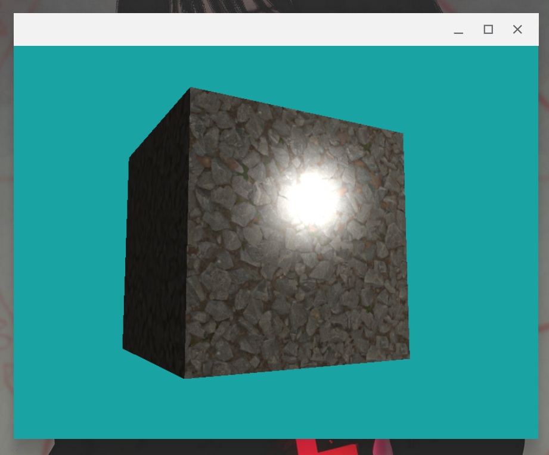
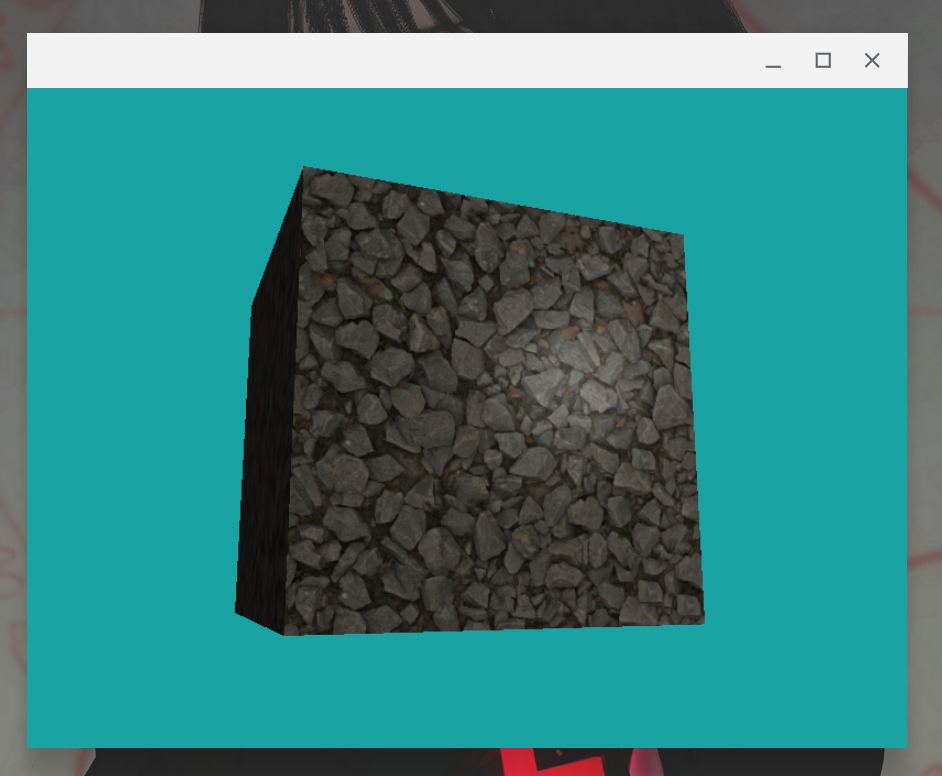

# Mapas de Iluminação

No último capítulo nós vimos um método simples de iluminar nossas cenas. Contudo, aquele modelo não é nem perto do ideal para renderizarmos algo mais realista. Para ir ao próximo nível, vamos ver uma técnica extremamente comum envolvendo mapas de iluminação.

A ideia geral é que vamos utilizar **texturas** para obter informações de iluminação em uma superfície. Texturas são ferramentas muito mais poderosas do que podem parecer à primeira vista. Se quisermos (e com certeza queremos), podemos armazenar basicamente qualquer tipo de informação em uma imagem - basta que codifiquemos elas nos valores RGB de cada pixel. Você já deve ter visto por aí imagens de mapas normais (normal maps), como este aqui:


Essas imagens/texturas codificam os vetores normais de uma superfície na cor de seus pixels. Isto possibilita que uma superfície simples (como um mero quadrado chapado) apresente relevos muito mais complexos do que deveriam, poupando enormemente o número de polígonos que precisariamos usar para representar este nível de detalhe sem mapas normais.

Neste capítulo veremos como usar este tipo de mapa para alcançar a renderização de objetos mais visualmente interessantes do que sólidos geométricos bobos e chatos. O conteúdo será mais curto dessa vez; veremos:

1. Mapas difusos
2. Mapas ARM

## Mapas difusos

Um mapa difuso é apenas uma textura que nos dá a cor base que será usada em nossa superfície. Isto significa que nós já usamos mapas difusos antes! Aquela textura que usamos no capítulo 03 era essencialmente um mapa difuso. O negócio deste tipo de mapa é que ele não trata verdadeiramente da iluminação em si, mas sim da cor do objeto que está sendo iluminado.

Para efeitos de demonstração, iremos usar como mapa difuso a imagem `rock_diffuse_map.png`, que você pode encontrar em `codigos/capitulo08/textures`. Já a cena que estaremos usando é a do cubo iluminado do capítulo anterior, mas com coordenadas de textura para cada vértice:

``` C
float vertices[] = {
    // posições           // normais           // coordenadas de textura
    -0.5f, -0.5f, -0.5f,  0.0f,  0.0f, -1.0f,  0.0f, 0.0f,
     0.5f, -0.5f, -0.5f,  0.0f,  0.0f, -1.0f,  1.0f, 0.0f,
     0.5f,  0.5f, -0.5f,  0.0f,  0.0f, -1.0f,  1.0f, 1.0f,
     0.5f,  0.5f, -0.5f,  0.0f,  0.0f, -1.0f,  1.0f, 1.0f,
    -0.5f,  0.5f, -0.5f,  0.0f,  0.0f, -1.0f,  0.0f, 1.0f,
    -0.5f, -0.5f, -0.5f,  0.0f,  0.0f, -1.0f,  0.0f, 0.0f,

    -0.5f, -0.5f,  0.5f,  0.0f,  0.0f, 1.0f,   0.0f, 0.0f,
     0.5f, -0.5f,  0.5f,  0.0f,  0.0f, 1.0f,   1.0f, 0.0f,
     0.5f,  0.5f,  0.5f,  0.0f,  0.0f, 1.0f,   1.0f, 1.0f,
     0.5f,  0.5f,  0.5f,  0.0f,  0.0f, 1.0f,   1.0f, 1.0f,
    -0.5f,  0.5f,  0.5f,  0.0f,  0.0f, 1.0f,   0.0f, 1.0f,
    -0.5f, -0.5f,  0.5f,  0.0f,  0.0f, 1.0f,   0.0f, 0.0f,

    -0.5f,  0.5f,  0.5f, -1.0f,  0.0f,  0.0f,  1.0f, 0.0f,
    -0.5f,  0.5f, -0.5f, -1.0f,  0.0f,  0.0f,  1.0f, 1.0f,
    -0.5f, -0.5f, -0.5f, -1.0f,  0.0f,  0.0f,  0.0f, 1.0f,
    -0.5f, -0.5f, -0.5f, -1.0f,  0.0f,  0.0f,  0.0f, 1.0f,
    -0.5f, -0.5f,  0.5f, -1.0f,  0.0f,  0.0f,  0.0f, 0.0f,
    -0.5f,  0.5f,  0.5f, -1.0f,  0.0f,  0.0f,  1.0f, 0.0f,

     0.5f,  0.5f,  0.5f,  1.0f,  0.0f,  0.0f,  1.0f, 0.0f,
     0.5f,  0.5f, -0.5f,  1.0f,  0.0f,  0.0f,  1.0f, 1.0f,
     0.5f, -0.5f, -0.5f,  1.0f,  0.0f,  0.0f,  0.0f, 1.0f,
     0.5f, -0.5f, -0.5f,  1.0f,  0.0f,  0.0f,  0.0f, 1.0f,
     0.5f, -0.5f,  0.5f,  1.0f,  0.0f,  0.0f,  0.0f, 0.0f,
     0.5f,  0.5f,  0.5f,  1.0f,  0.0f,  0.0f,  1.0f, 0.0f,

    -0.5f, -0.5f, -0.5f,  0.0f, -1.0f,  0.0f,  0.0f, 1.0f,
     0.5f, -0.5f, -0.5f,  0.0f, -1.0f,  0.0f,  1.0f, 1.0f,
     0.5f, -0.5f,  0.5f,  0.0f, -1.0f,  0.0f,  1.0f, 0.0f,
     0.5f, -0.5f,  0.5f,  0.0f, -1.0f,  0.0f,  1.0f, 0.0f,
    -0.5f, -0.5f,  0.5f,  0.0f, -1.0f,  0.0f,  0.0f, 0.0f,
    -0.5f, -0.5f, -0.5f,  0.0f, -1.0f,  0.0f,  0.0f, 1.0f,

    -0.5f,  0.5f, -0.5f,  0.0f,  1.0f,  0.0f,  0.0f, 1.0f,
     0.5f,  0.5f, -0.5f,  0.0f,  1.0f,  0.0f,  1.0f, 1.0f,
     0.5f,  0.5f,  0.5f,  0.0f,  1.0f,  0.0f,  1.0f, 0.0f,
     0.5f,  0.5f,  0.5f,  0.0f,  1.0f,  0.0f,  1.0f, 0.0f,
    -0.5f,  0.5f,  0.5f,  0.0f,  1.0f,  0.0f,  0.0f, 0.0f,
    -0.5f,  0.5f, -0.5f,  0.0f,  1.0f,  0.0f,  0.0f, 1.0f
};
```

Sendo assim, o nosso VAO e nosso shader de vértice têm que acompanhar a mudança. Precisamos aumentar o stride para ter o tamanho de 8 floats e incluir o atributo de coordenada de textura:

``` C
// no main.cpp
glVertexAttribPointer(0, 3, GL_FLOAT, GL_FALSE, 8 * sizeof(float), (void *)0);
glEnableVertexAttribArray(0);
glVertexAttribPointer(1, 3, GL_FLOAT, GL_FALSE, 8 * sizeof(float), (void *)(3 * sizeof(float)));
glEnableVertexAttribArray(1);
glVertexAttribPointer(2, 2, GL_FLOAT, GL_FALSE, 8 * sizeof(float), (void *)(6 * sizeof(float)));
glEnableVertexAttribArray(2);

// no shader de vértice
layout(location = 0) in vec3 aPos;
layout(location = 1) in vec3 aNormal;
layout(location = 2) in vec2 aTexCoords;

out vec3 fragPos;
out vec3 normal;
out vec2 texCoords;
```

O output `texCoords` deve simplesmente repassar o valor de `aTexCoords` para frente. Já no shader de fragmento, iremos colocar colocar uma das entradas como sendo uma struct chamada `Material`, dessa forma:

``` glsl
struct Material {
    sampler2D difuso;
    sampler2D ARM;
    float brilhosidade;
};

uniform Material material;
```

Essa struct possui dois samplers 2D (texturas 2D) e um float. As texturas `difuso` e `ARM` serão usadas para nossos mapas de iluminação, enquanto a `brilhosidade` será apenas um novo nome para o componente especular que vimos no modelo Phong - ou seja, quanto maior a "brilhosidade", mais focado/concentrado será o reflexo da fonte de luz.

Por enquanto, vamos ignorar o mapa `ARM` e utilizar apenas o difuso. Para carregar a textura, iremos (fora do loop de renderização) usar as funções `loadTexture` e `setInt`, assim como já vimos no passado:

``` cpp
unsigned int mapaDifuso = loadTexture("textures/rock_diffuse_map.png");

meuShaderInsano.use();
meuShaderInsano.setInt("material.difuso", 0);
```

E, dessa vez dentro do loop de renderização, iremos "bindar" nosso `mapaDifuso` com a unidade de texturas 2D 0, e também definir a brilhosidade do nosso _Cubo_:

``` cpp
meuShaderInsano.setFloat("material.brilhosidade", 60.0f);

glActiveTexture(GL_TEXTURE0);
glBindTexture(GL_TEXTURE_2D, mapaDifuso);
```

Feito isso, nós temos finalmente acesso à textura de **PEDRA** no nosso shader de fragmento. Para utilizá-la, iremos basear os componentes difuso e ambiente da nossa cor final na textura, da seguinte forma:

``` glsl
// componente ambiente
vec3 ambiente = luz.ambiente * texture(material.difuso, texCoords).rgb;

// componenete difuso
vec3 normal = normalize(normal);
vec3 luzDir = normalize(luz.posicao - fragPos);
float dif = max(dot(normal, luzDir), 0.0);
vec3 difuso = luz.difuso * dif * texture(material.difuso, texCoords).rgb;

// componente especular
vec3 visaoDir = normalize(visaoPos - fragPos);
vec3 reflexoDir = reflect(-luzDir, normal);
float espec = pow(max(dot(visaoDir, reflexoDir), 0.0), material.brilhosidade);
vec3 especular = luz.especular * espec;

// cor final
vec3 cor = ambiente + difuso + especular;
FragColor = vec4(cor, 1.0);
```

> Sendo a `luz` aquele cubo-lâmpada daora que definimos no capítulo anterior.

O que temos aqui é basicamente o de sempre, com a excessão de que ao invés de multiplicarmos os coeficientes difuso e ambiente por uma cor sólida padrão, multiplicamos por uma amostra da textura (`texuture(material.difuso, texCoords)`). O resultado é o seguinte:



Ainda não está muito realista né? Essa luz branca sendo jogada em cima do cubo quebra muito qualquer ilusão de profundidade que estejamos tentando criar. Obviamente, para resolver isso, teremos que brincar com o componente especular, que nessa versão do shader ainda não é afetada pela textura ( • ᴖ • ｡)

## Mapas ARM

Entre: mapas ARM. Também conhecidos como mapas ORM, esse tipo de mapa armazena **3** informações em seus texels:

- **A** -> significa "Ambient Occlusion" (Oclusão Ambiente, em pôrtúgueis), é codificado no componente vermelho (R) do texel. Oclusão ambiente indica basicamente o quão dificilmente uma região é alcançada pela luz. Uma quina interna de uma sala, por exemplo, geralmente é alcançada menos pela luz do que o centro de uma parede, sendo portanto um pouco mais escura. Se o componente R for 0, aquela região deveria ficar em sombra, e se for 1, deve ficar mais iluminada.
- **R** -> significa "Roughness" (Aspereza/Rugosidade) e é codificado no componente verde (G). Este componente está mais ligado ao componente especular: uma alta rugosidade indica que o material não reflete a luz muito bem, ficando com um aspecto meio fosco de giz, já uma baixa rugosidade é melhor representativa de um material polido e liso, como vidro ou papel aluminínio.
- **M** -> significa "Metallic" (Metal) e é codificado no componente azul (B). O componente metálico também diz respeito ao quão reflexivo é o material, contudo de uma forma mais complicada. Na prática, pense que um valor metálico baixo significa que a cor difusa é prevalente e que a reflexão de luz é baixa - enquanto um valor metálico alto significa que a cor difusa é pouco perceptível e que o material reflete a maior parte da luz que o atinge.

Utilizar mapas ARM é uma das técnicas básicas de PBR (Physically Based Rendering); uma abordagem de renderização que tenta simular os princípios físicos e ópticos por trás da formação de uma imagem.

Para começar com o mapa ARM vamos carregar a textura e fazer o ritual todo (o mapa ARM da pedra está em `codigos/capitulo08/textures/rock_ARM_map.png` para você baixar).

``` cpp
unsigned int mapaARM = loadTexture("textures/rock_ARM_map.png");
meuShaderInsano.use();
meuShaderInsano.setInt("material.ARM", 1);

// ...

glActiveTexture(GL_TEXTURE1);
glBindTexture(GL_TEXTURE_2D, mapaARM);
```

Agora, com base no que a gente entende dos componentes ARM, vamos modificar nosso shader de fragmentos:

``` cpp
vec3 arm = texture(material.ARM, texCoords).rgb;
float ao = arm.r;
float roughness = arm.g;
float metal = arm.b;

// componente ambiente
vec3 ambiente = luz.ambiente * texture(material.difuso, texCoords).rgb * ao;

// componente difuso
// ...
vec3 difuso = luz.difuso * dif * texture(material.difuso, texCoords).rgb * ao * (1 - metal);

// componente especular
// ...
vec3 especular = luz.especular * espec * (1 - roughness);

vec3 cor = ambiente + difuso + especular;
FragColor = vec4(cor, 1.0);
```

O que mudou foi:

- Usamos a oclusão ambiente (`ao`) como um dos coeficientes da iluminação ambiente e difusa;
- Definimos a contribuição do componente especular como sendo inversamente proporcional à rugosidade do material (`roughness`); e
- Definimos o componente difuso como sendo também inversamente proporcional ao `metal`

O resultado é uma superfície com muito mais profundidade e sem aquele componente especular tenebroso de antes:



Bem mais bonito e formoso né? E tudo isso alcançado com uma técnica bem tranquila de ser implementada - a parte mais difícil chega a ser encontrar ou fazer os mapas.

## Conclusão

Essa aqui foi uma palinha do poder das texturas na iluminação e no PBR. Não adentramos no contexto de mapas normais por este ser um material mais introdutório (mapas normais são um tanto mais complicados do que mapas ARM), mas caso você tenha gostado do que viu aqui, vá aprender mais sobre eles que vale a pena. No mais, é isso aí, obrigado por ler até aqui e até a próxima!

         _\|/_
         (o o)
 +----oOO-{_}-OOo--+
 |                 |
 | Sayonara, baby. |
 |                 |
 +-----------------+

## Exercícios propostos

1. Mexa com os parâmetros de iluminação, os valores do mapa ARM e as fórmulas dos componentes de iluminação para deixar o cubo de pedras o mais bonito que você conseguir.
2. Procure outros mapas difusos e ARM na internet e substitua os que utilizamos neste capítulo por eles para ver o resultado. Uma sugestão de site onde você pode encontrar texturas de graça é o [PolyHaven](https://polyhaven.com/textures).

