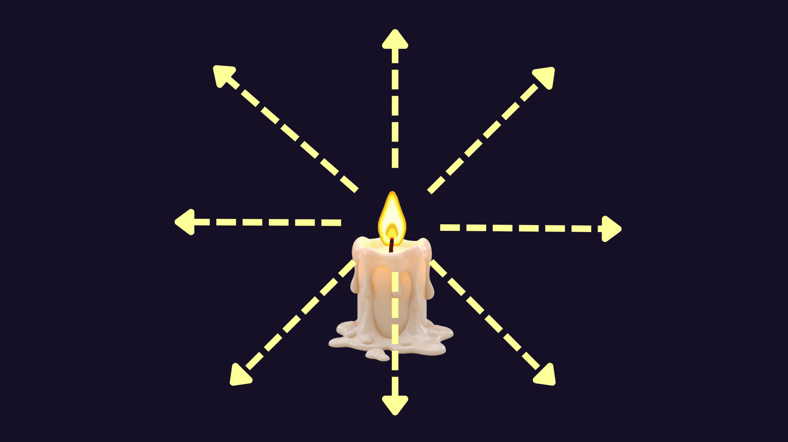
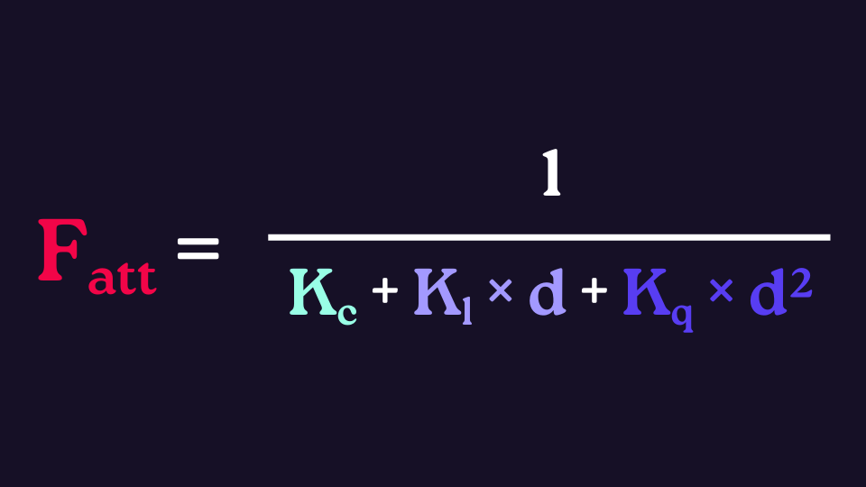
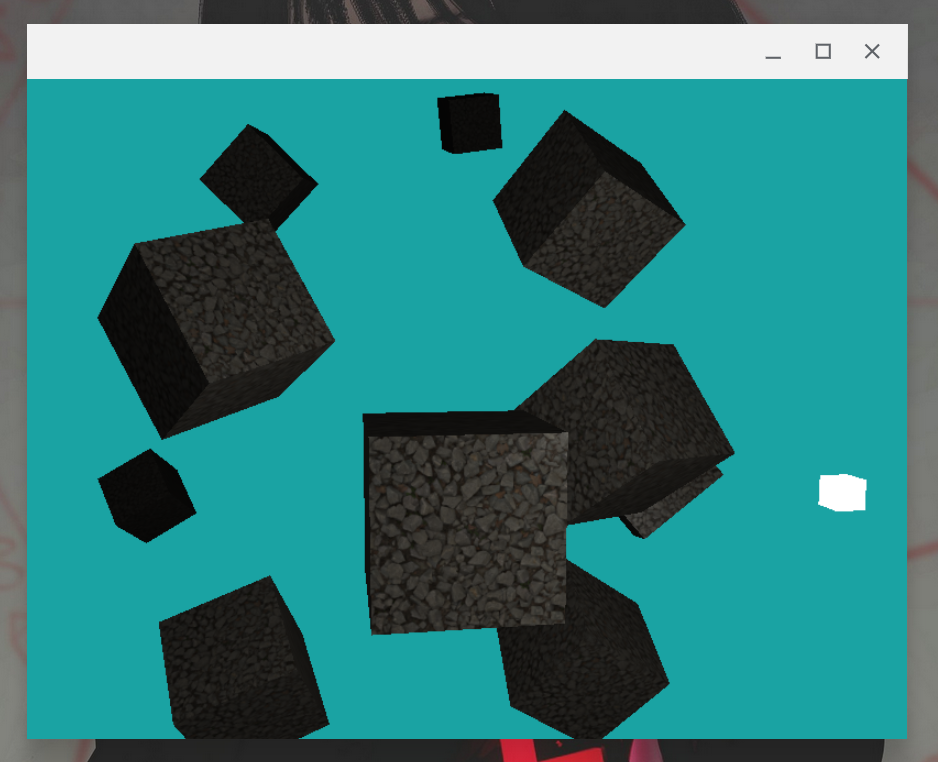
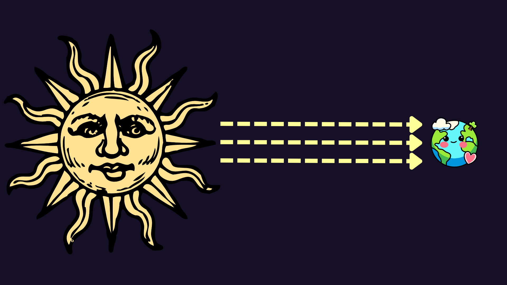
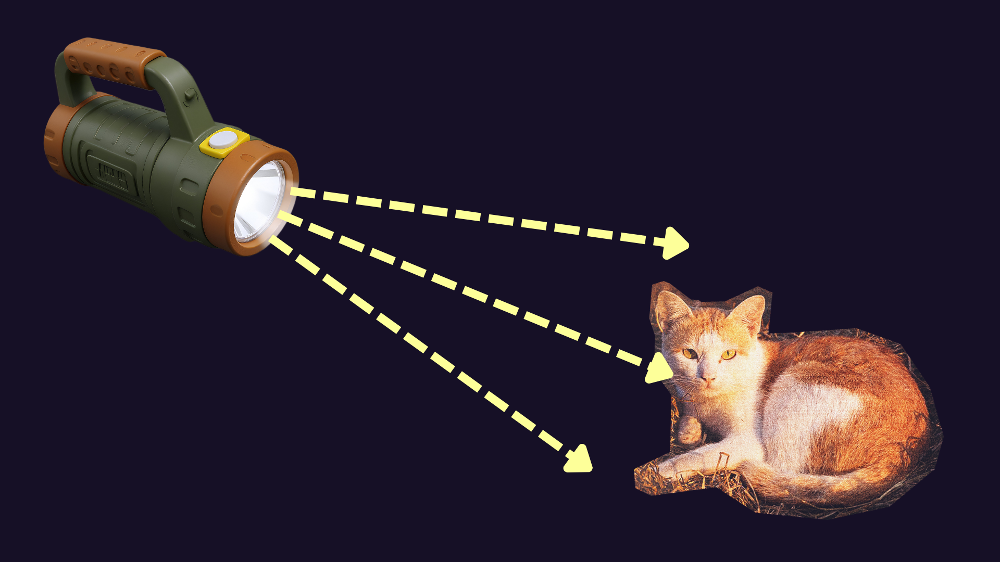
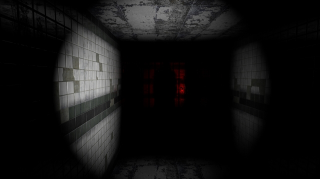
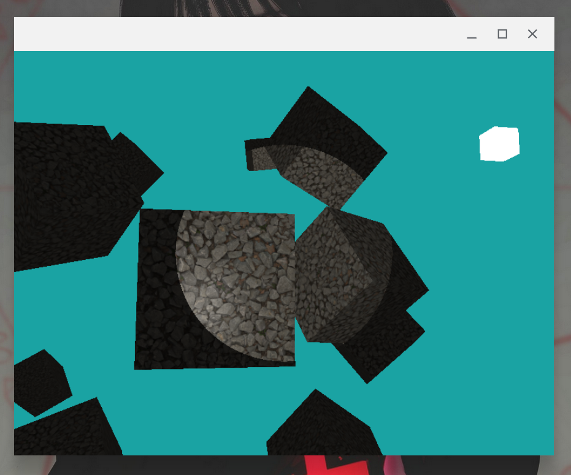
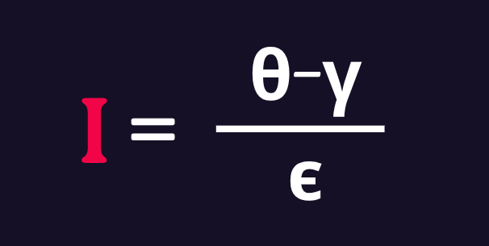
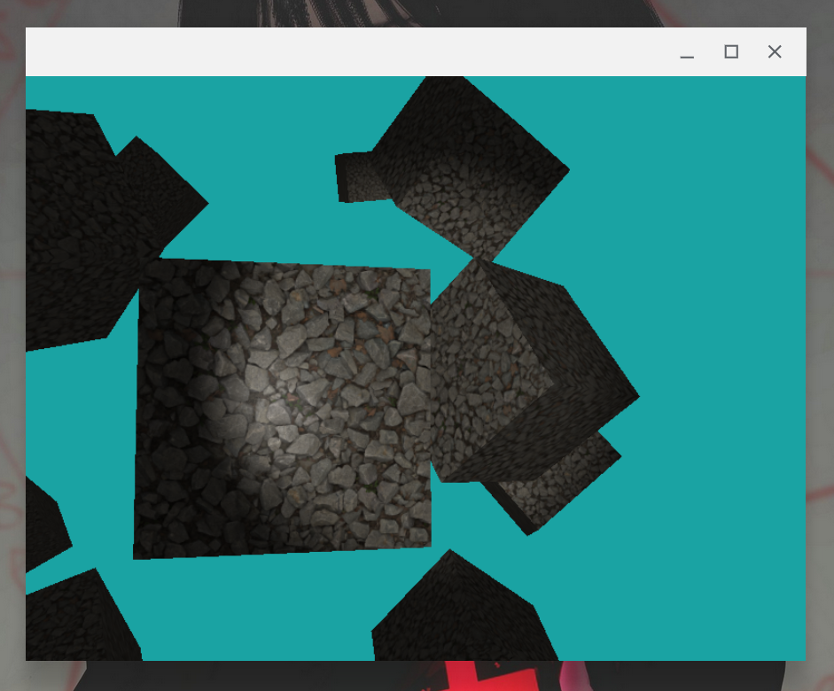

# Emissores de Luz

O mundo é muito bonito. Por quê? O motivo é simples: existem emissores de luz com muitos formatos e características distintas. Você pode até tentar discordar, mas essa é a verdade. Eu posso inclusive dar alguns exemplos para provar categoricamente o meu ponto:

- **Velas** possuem uma luz que é emitida em todas as direções a partir de um ponto
- A luz do **sol** chega na terra basicamente como um monte de raios paralelos
- **Lanternas** formam uma espécie de cone de luz em frente delas
- Etc e tals.


> ❤️ Bilhões devem sorrir! Você importa :) ❤️

Na computação gráfica ocorre a mesma coisa (por isso ela é também é linda), nós podemos simular tantos tipos de emissão de de luz quanto pudermos imaginar! Ok, talvez não qualquer um, mas o céu ainda é o limite. Neste capítulo iremos ver 3 tipos de emissores de luz

1. Luz ponto com atenuação
2. Luz direcional
3. Lanterna
4. Combando legal

## Luz ponto com atenuação



Nós já temos trabalhado com uma luz ponto até agora. Ela é o tipo de luz que é emitida igualmente em todas as direções a partir de um ponto (a posição do emissor). Contudo, até agora, nossa luz possuia a mesma intensidade independentemente da distância que ela tinha para o objeto iluminado. O que vamos fazer aqui é adicionar "atenuação" nela. Ou seja, quanto mais longe um objeto estiver do **ponto**, menos iluminado ele será.

Antes de adicionarmos a atenuação em si, vamos fazer uma modificação para deixar nossas mudanças na iluminação mais visíveis a partir de agora - adicionar mais cubos na cena. No main, defina uma lista de posições para colocarmos nossos cubos:

``` cpp
glm::vec3 posicoesCubos[] = {
    glm::vec3(0.0f, 0.0f, 0.0f),    glm::vec3(2.0f, 5.0f, -12.0f),
    glm::vec3(-1.5f, -2.0f, -2.5f), glm::vec3(-4.0f, -2.0f, -10.f),
    glm::vec3(2.5f, -0.5f, -3.5f),  glm::vec3(-1.7f, 3.0f, -7.5f),
    glm::vec3(1.5f, -2.0f, -2.5f),  glm::vec3(1.5f, 2.0f, -2.5f),
    glm::vec3(1.5f, 0.2f, -1.5f),   glm::vec3(-1.5f, 1.0f, -1.5f)};
```

E no loop de renderização, aonde atualmente renderizamos o cubo único, crie um loop interno que crie cubos com essas posições e uma rotação diferenciada. O trecho modificado deve ficar mais ou menos assim:

``` cpp
glm::mat4 model = glm::mat4(1.0);
model = glm::scale(model, glm::vec3(2.0));
glm::mat4 view;
view = camera.MatrizView();
glm::mat4 projection;
projection = glm::perspective(glm::radians(camera.Zoom), 800.0f / 600.0f, 0.1f, 100.0f);

meuShaderInsano.setMat4("view", view);
meuShaderInsano.setMat4("projection", projection);

glActiveTexture(GL_TEXTURE0);
glBindTexture(GL_TEXTURE_2D, mapaDifuso);
glActiveTexture(GL_TEXTURE1);
glBindTexture(GL_TEXTURE_2D, mapaARM);

glBindVertexArray(VAO);
for (unsigned int i = 0; i < 10; i++) {
    model = glm::mat4(1.0);
    model = glm::scale(model, glm::vec3(2.0));
    model = glm::translate(model, posicoesCubos[i]);
    model = glm::rotate(model, glm::radians(20.0f * i),
                        glm::vec3(0.8f, 0.25f, 0.42f));
    meuShaderInsano.setMat4("model", model);
    glDrawArrays(GL_TRIANGLES, 0, 36);
}
```

Beleza, agora vamos ao que interessa. Para que a luz perca intensidade conforme a distância, precisaremos apenas fazer uma pequena alteração em nosso shader atual. A alteração se baseia nessa fórmula para decidir o fator de atenuação para um dado fragmento (`Fatt`):



Na vida real, a luz não decai linearmente conforme a distância; na verdade, o decaimento se assemelha mais a um decaimento quadrático. Por conta disso, essa fórmula é feita para criar um fator entre 0 e 1 que multiplicará a intensidade da luz seguindo este efeito realista. O significado dos termos é o seguinte:

- `d`: é a distância do fragmento para o ponto de emissão de luz.
- `Kc`: é a constante **independente**, geralmente definida para ser igual a `1`. Ela impede que o denominador seja menor do que 1, o que faria com que a luz ganhasse intensidade com a distância ao invés de perder.
- `Kl`: é a constante **linear**, que faz com que a luz. Para distâncias mínimas, ele contrubui mais do que o próximo termo, mas se torna irrelevante rapidamente conforme `d` cresce.
- `Kq`: é a constante **quadrática**, que de fato faz com que o efeito de decaimento rápido em longas distâncias prevaleça.

Mas como escolhemos o valor destes termos? Bom, depende muito da escala do seu mundo, do tamanho total da cena e do efeito que você quer gerar naquele emissor específico. No nosso caso, usaremos os valores `1.0`, `0.02` e `0.005`. Se você quiser que sua luz tenha um alcance maior, basta diminuir os componentes linear e quadrático, e se quiser que a luz tenha um alcance menor, basta aumentá-los.

Indo ao código de nosso shader de fragmento, a primeira coisa que iremos fazer é calcular a atenuação com base em tudo que vimos até aqui:

``` glsl
float Kc = 1.0;
float Kl = 0.02;
float Kq = 0.005;
float distancia = length(luz.posicao - fragPos);
float atenuacao = 1.0 / (Kc + Kl * distancia + Kq * (distancia * distancia));
```

Com a atenuação em mãos, você pode até escolher em quais componentes (dentre o ambiente, o especular e o difuso) você quer que a atenuação afete. Realisticamente, pelo menos o difuso e o especular devem ser afetados. Contanto, para poupar o esforço de ter que modificar 2 linhas ao invés de uma só, vou aplicar a atenuação direto na cor final do fragmento, o que efetivamente faz ela valer para o componente ambiente também:

``` glsl
vec3 cor = atenuacao * (ambiente + difuso + especular);
```

E simples assim, nós temos nosso desejado efeito:



## Luz direcional



A luz direcional representa de certa forma uma fonte de luz que está muito longe de todos os objetos, e que é _grande_ e _forte_ o suficiente para ainda assim iluminá-los. Um exemplo disso, como dito na introdução, é o sol - ele está tão longe e é tão grande, que seus raios chegam aqui praticamente paralelos uns aos outros.

Implementar uma luz direcional é bem tranquilo, tanto que você provavelmente conseguiria implementá-la com o que já aprendemos na trilha sem sequer ler esta seção, mas aqui estamos. Tudo que precisamos é decidir de qual direção a luz está vindo. Com isso, o resto do nosso modelo de iluminação se mantém o mesmo. Por exemplo, vamos esquecer a luz ponto que implementamos agora pouco e definir uma luz direcional que vem de cima para baixo.

O primeiro passo é definir o vetor de direção. Poderiamos fazer isso no main, mas só por comodidade bora fazer no próprio shader:

``` glsl
// substitua a antiga linha que definia luzDir por essa aqui
vec3 luzDir = vec3(0.0, 1.0, 0.0);
```

Pronto... agora nossos cubos estão sendo iluminados por algo que vêm de cima

## Lanterna



A luz de lanterna é parecida com a luz de ponto no sentido de que ambas tem uma posição no espaço. Contudo, a luz de lanterna possui uma **direção** (para onde a lanterna está "olhando") e um **ângulo de abertura** (o quão aberto é o cone iluminado pela lanterna).

Para refletir essas propriedades, vamos precisar mudar nossa estrutura `Luz` para ficar assim:

``` glsl
struct Luz {
    vec3 posicao;
    vec3 direcao; // propriedade nova
    float abertura; // propriedade nova
    vec3 ambiente;
    vec3 difuso;
    vec3 especular;
};
```

E no main definir o valor delas:

``` cpp
meuShaderInsano.setVec3("luz.posicao", camera.Posicao);
meuShaderInsano.setVec3("luz.direcao", camera.Direcao);
meuShaderInsano.setFloat("luz.abertura", glm::cos(glm::radians(12.5f)));
```

> Note que a abertura é passada como o cosseno do ângulo de abertura, e não como o ângulo de abertura em si. Daqui a pouco entenderemos o porquê.

Nesse trecho, estamos usando os valores da câmera para definir a posição e a direção da lanterna. Ou seja, estamos assumindo que o "câmera man" está segurando a lanterna e apontando-a sempra para onde ele olha. Isso cria o clássico efeito muito utilizado em jogos de terror:



O truque para fazer o efeito de lanterna funcionar será garantir que apenas fragmentos que formem um ângulo menor do que nossa abertura (`12.5°`) com a câmera sejam iluminados. Para descobrir o ângulo que o fragmento faz com a câmera, iremos usar o produto escalar entre o vetor de direção da lanterna e o vetor que vai da lanterna até o fragmento:

``` glsl
vec3 luzDir = normalize(luz.posicao - fragPos);
float angulo = dot(luzDir, normalize(-luz.direcao));
```

Mas na verdade o produto escala entre vetores normais não nos dá o ângulo em si, mas sim o cosseno dele - por isso que definimos nossa abertura como um cosseno também. Agora, podemos saber se o fragmento será iluminado ou não; se o cosseno `angulo` for maior do que o cosseno `luz.abertura`, então o fragmento está iluminado. Nós podemos afirmar isso pois o cosseno é uma função decrescente entre 0 e π (0° e 180°), então nesta faixa de valores quanto menor o ângulo, maior seu cosseno.

> Também temos a garantia que nossos ângulos estão entre 0 e 180° pois o campo de visão (FOV) que definimos para nossa câmera possui uma abertura menor do que essa. Logo, todo fragmento poderia formar um ângulo de 180°+ com a câmera já foi descartado pela pipeline.

``` glsl
    if(angulo > luz.abertura) {
        // calcula os componentes difuso e ambiente
        // define a cor do fragmento
    } else {
        // cor do fragmento é apenas o componente ambiente
    }
```

Resumindo: vamos sempre considerar o componente ambiente, mas iremos calcular os componentes difuso e ambiente apenas se o ângulo do fragmento com a lanterna for menor do que o ângulo de abertura da lanterna.

Rodando este código, você verá algo assim:



No entanto, tem algo de errado com essa lanterna: as bordas delas são muito rígidas. Em um pixel o bloco está todo iluminado, e no pixel do lado não está nem um pouco iluminado... não é assim que lanternas funcionam. Para corrigir isso, vamos adicionar um efeito de suavização nessa borda, que será regido por esta fórmula:



Aqui, os termos significam o seguinte:

- `ϵ`: é a diferença entre o cosseno do arco interno (onde começará o fade-out) e do arco externo (onde o fade-out termina)
- `θ`: é o cosseno do ângulo entre o fragmento e a lanterna
- `γ`: é o cosseno do ângulo do argo externo

Ou seja, estamos fazendo uma interpolação linear entre o arco externo e o interno com o parâmetro que controla esta interpolação sendo o `θ`. Em código, isso vai ficar assim:

``` glsl
float angulo = dot(luzDir, normalize(-luz.direcao));
float cosDif = luz.abertura - luz.arcoExterno;
float intensidade = clamp((angulo - luz.arcoExterno) / cosDif, 0.0, 1.0);
```

Mas é claro que antes temos que definir qual o cosseno que representa o ângulo do nosso `arcoExterno`:

``` cpp
meuShaderInsano.setFloat("luz.arcoExterno", glm::cos(glm::radians(17.5f)));
```

E também precisamos mudar nosso `if` para considerar todo ângulo dentro não apenas da abertura, mas também do arco externo, e multiplicar nossos componentes difusos e especular pela intensidade que calculamos:

``` glsl
if (angulo > luz.arcoExterno) {
    // o resto continua o mesmo
    // ...

    vec3 cor = ambiente + intensidade * (difuso + especular);
    FragColor = vec4(cor, 1.0);
} else {
    // ...
}
```

Pronto! Rodando isso, você verá a iluminação via lanterna mais bonita de sua vida inteira, e nunca mais se esquecerá deste momento:



## Combando legal

Por que devemos nos limitar a apenas um tipo de iluminação, afinal? Por incrível que pareça, essa é uma pergunta que a humanidade faz desde o primórdio da luz e dos fragmentos. Contudo, graças a Newton e Charles Darwin, nós podemos nos extravagar e usar vários emissores de luz ao mesmo tempo. Então é isso que faremos aqui.

Como este será apenas um experimento que será prontamente descartado no próximo capítulo, vou esquecer os bons costumes e definir a maioria das variáveis hard-coded direto no shader. A única parte da iluminação que vou manter direitinha será a da lanterna porque foi a última que a gente implementou.

A partir de agora, tomarei um monte de decisões arbitrárias, então você pode escolher me acompanhar ou dar uma customizada em cada passo para ficar ao seu gosto.

Para começar, vou mudar a cor da lanterna para um tom mais alaranjado:

``` cpp
meuShaderInsano.setVec3("luz.difuso", glm::vec3(0.62f, 0.62f, 0.25f));
meuShaderInsano.setVec3("luz.difuso", glm::vec3(1.0f, 0.8f, 0.6f));
```

Também irei mudar a cor da iluminação ambiente para um tom mais azulado:

``` cpp
meuShaderInsano.setVec3("luz.ambiente", glm::vec3(0.16f, 0.16f, 0.28f));
```

Depois, vou adicionar atenuação na própria lanterna, da mesma forma que fizemos com a luz de ponto (só mudei o valor dos coeficientes):

``` glsl
float intensidade = clamp((angulo - luz.arcoExterno) / cosDif, 0.0, 1.0);
float distLanterna = length(fragPos - luz.posicao);
float atenuacaoLanterna = 1.0 / (1.0 + 0.05 * distLanterna + 0.02 * distLanterna);
intensidade *= atenuacaoLanterna;
```

também vou adicionar uma função que calcula um pouco de iluminação direcional no shader. A direção vai ser novamente de cima para baixo, e a cor vai ser um tanto azulada, para simular o céu:

``` glsl
// fora do main
vec3 CalculaLuzCeu(vec3 normal) {
    vec3 luzDir = vec3(0.0, 1.0, 0.0);
    float dif = max(dot(normal, luzDir), 0.0);
    return (dif * vec3(0.05, 0.1, 0.15));
}

// no main
vec3 luzCeu = CalculaLuzCeu(normal) * dif * ao * (1 - metal);
```

Essa função deverá surtir efeito tanto dentro quanto fora do alcance da lanterna. Ou seja,seu resultado será usado tanto no `if` quanto no `else` (amém).

Também adicionarei uma função que calcula a influência de uma luz pontual meio avermelhada com atenuação:

``` glsl
// fora do main
vec3 CalculaLuzPonto(vec3 normal) {
    vec3 corLuz = vec3(0.4, 0.1, 0.25);
    vec3 luzPos = vec3(5.0, 2.0, 6.0);
    vec3 luzDir = normalize(luzPos - fragPos);
    vec3 reflexoDir = reflect(-luzDir, normal);
    float dif = max(dot(normal, luzDir), 0.0);
    float espec = pow(max(dot(luzDir, reflexoDir), 0.0), material.brilhosidade);
    // atenuação
    float distancia = length(luzPos - fragPos);
    float atenuacao = 1.0 / (1.0 + 0.02 * distancia + 0.005 * (distancia * distancia));
    // resultado
    vec3 difuso = corLuz * dif * vec3(texture(material.difuso, texCoords));
    vec3 especular = corLuz * espec * (1 - texture(material.ARM, texCoords).g);
    return atenuacao * (difuso + especular);
}

// no main
vec3 luzPonto = CalculaLuzPonto(normal);
```

O resultado dela também independe da lanterna, e portanto será usado dentro e fora do alcance dela.

No fim do dia, o `if` e o `else` ficarão assim:

``` glsl
if (angulo > luz.arcoExterno) {
    // componente difuso da lanterna
    vec3 difusoLant = texture(material.difuso, texCoords).rgb;
    difusoLant *= luz.difuso * dif * ao * (1 - metal);
    // componente especular da lanterna
    vec3 especularLant = luz.especular * espec * (1 - roughness);
    // resultado
    vec3 cor = ambiente + luzCeu + luzPonto + intensidade * (difusoLant + especularLant);
    FragColor = vec4(cor, 1.0);
} else {
    vec3 cor = ambiente + luzCeu + luzPonto;
    FragColor = vec4(cor, 1.0);
}
```

E botando essa belezura pra teste, nós ficamos com um resultado assim:


Com essa vista bonita, podemos encerrar o capítulo

## Conclusão

A iluminação é muitas vezes o que distingue um jogo bonitinho com um jogo bonitão. Entender e dominar o poder de cada tipo de luz irá com certeza te ajudar a criar cenas magníficas nessa carreira de sucesso como Programador de Gráficos que você está prestes a criar. Como sempre, espero que tenha curtido a leitura, e até a próxima.

```
         _\|/_
         (o o)
 +----oOO-{_}-OOo----------------+
 |                               |
 | Que seu futuro seja iluminado |
 |                               |
 +-------------------------------+
```

## Exercícios propostos

1. Existe um tipo de emissor de luz muito importante que não abordamos aqui, chamados de "Area Lights", que são capazes de criar sombras suaves e realistas. Pesquise e aprenda um pouco sobre eles.
2. Pense em um tipo de atmosfera que você curte (por exemplo, fundo do mar) e tente recriá-la com os emissores de luz que explicamos aqui. Use quantos você quiser.
