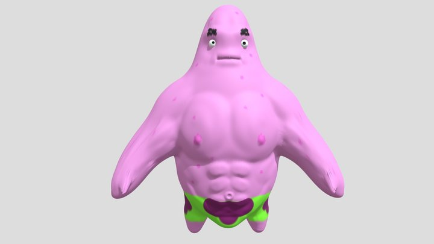
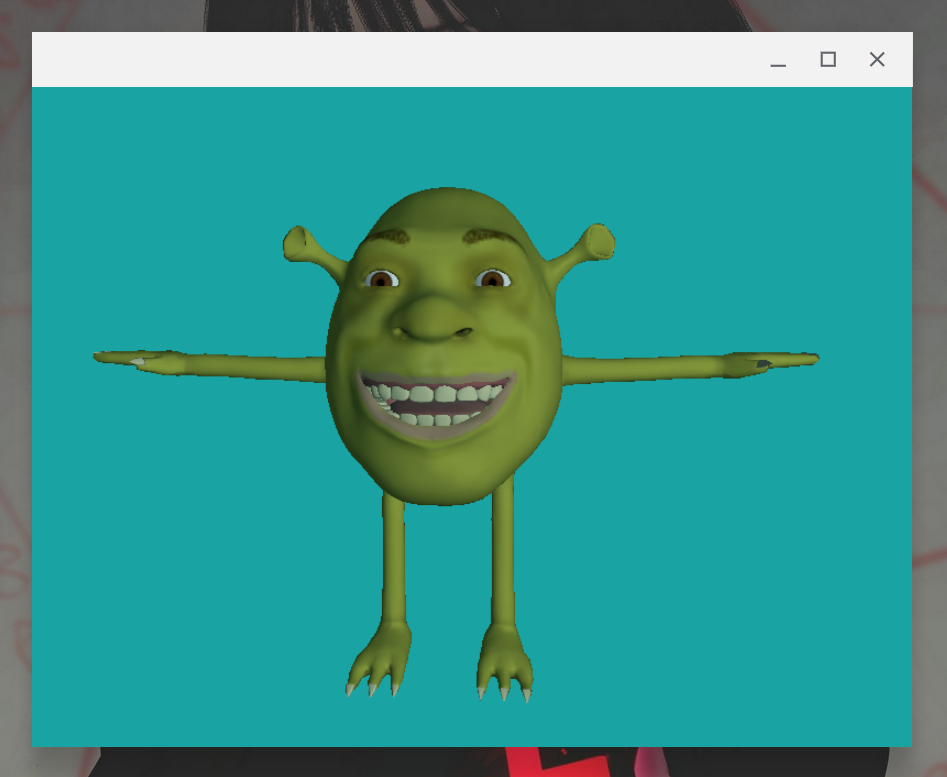

# Modelos 3D

Cubos podem até ser bem irados, mas você provavelmente não jogaria Dark Souls se todos os bosses fossem um cubo com uma textura de monstro. Por sorte (ou intervenção divina), artistas 3D existem - e eles usam ferramentas como o [Blender](https://www.blender.org/) para criar modelos bonitos e complexos.



Estes modelos são então exportados (juntamente com possíveis texturas/mapas, materiais, animações, etc) em um formato como `.obj`, `.gltf` ou `.glb`. Neste capítulo, veremos como importar e renderizar objetos neste tipo de formato com a biblioteca _Assimp_ (Asset Importer).

1. Instalando o Assimpp
2. Uma cena do Assimp
3. Meshes
4. Modelos
5. Botando em prática

## Instalando o Assimp

Se você está no Linux Debian/Ubuntu/Essa galera aí, consegue baixar o assimp com o comando abaixo:

``` sh
sudo apt-get install libassimp-dev assimp-utils
```

Caso esteja no Arch ou no Fedora, os comandos são:

``` sh
# Arch
sudo pacman -S assimp
# Fedora
sudo dnf install assimp-devel
```

Se você está no Windows, pode instalar o executável direto no site [assimp.org](https://kimkulling.itch.io/the-asset-importer-lib).

Também é possível buildar a partir do código fonte seguindo [estas instruções](https://github.com/assimp/assimp/blob/master/Build.md) no repositório deles no Github.

## Uma cena do Assimp

Como cada formato de arquivo para modelos 3D utiliza um padrão e uma estrutura diferente para representar seus dados, o Assimp nos faz o belo favor de colocá-los em uma estrutura própria e relativamente simples. A ideia geral é que nós teremos um objeto que representa uma **Cena** (_Scene_). A cena possui uma árvore, uma lista de **Meshes** e uma lista de **Materiais**. Cada nó da árvore possui uma lista dos índices dos meshes que o compoẽm. Já os _Meshes_ em si são objetos com informações sobre vértices, materiais, coordenadas de textura e outras informações sobre um objeto 3D da cena. A imagem abaixo demonstra aproximadamente a estrutura de uma cena do Assimp.


## Meshes

Mas o que são meshes, afinal? Quando um artista 3D cria um modelo - digamos, de uma cabeça de dinossauro - ele não faz o modelo inteiro completamente conectado e de uma vez só, ele geralmente irá modelar e compor partes menores para formar o objeto final, como o olho do dinossauro, os dentes, a mandíbula, etc... Cada uma dessas partes menores é um **mesh**. Ou seja, meshes são modelos 3D mínimos que juntos formam o modelão.


Para renderizarmos meshes em nosso programa, primeiro precisamos ser capazes de representar eles dentro do código. Antes de qualquer coisa, iremos definir estruturas mais fundamentais que serão usadas para a criação de uma classe `Mesh`.

Considerando que meshes são formados por vértices e possuem texturas, definiremos estruturas que encapsulem estes tipos de dados em um arquivo chamado `mesh.hpp`:

``` cpp
struct Vertice {
    glm::vec3 Posicoes;
    glm::vec3 Normal;
    glm::vec2 TexCoords;
};

struct Textura {
    unsigned int id;
    string tipo;
};
```

Até aqui, nada de muito novo. Com isso, vamos definir nossa classe `Mesh`. Ela armazenará uma lista de vértices, uma lista de índices (que serão usados como EBO, caso você se lembre deles) e uma lista de texturas. Já os seus métodos são poucos: um construtor, um método de renderização e um método de setup.

``` cpp
class Mesh {
    public:
        vector<Vertice>      vertices;
        vector<unsigned int> indices;
        vector<Textura>      texturas;

        Mesh(vector<Vertice> vertices, vector<unsigned int> indices, vector<Textura> texturas);
        void Draw(Shader &shader);
    private:
        unsigned int VAO, VBO, EBO;

        void setupMesh();
};
```

Note que também definimos alguns atributos privados que estão mais diretamente relacionados com o comportamento do próprio OpenGL: o `VAO`, `VBO` e `EBO`. Partindo para a implementação dos nossos métodos (em um arquivo `mesh.cpp`), definiremos o construtor da classe, cujo propósito será apenas inicializar os atributos públicos:

``` cpp
Mesh::Mesh(vector<Vertice> vertices, vector<unsigned int> indices, vector<Textura> texturas) {
    this->vertices = vertices;
    this->indices = indices;
    this->texturas = texturas;

    setupMesh();
}
```

Ao fim do construtor, chamamos o `setupMesh`, que por sua vez terá a responsabilidade de inicializar os atributos privados. Este método sim interage com a máquina de estados do OpenGL, configurando um VAO e bufferizando os dados que recebemos no construtor. O processo é basicamente o mesmo que já vimos nos capítulos anteriores, com a pequena diferença de que os dados que vamos colocar no VBO não estão diretamente em um array, mas sim em um array de structs (a `struct Vertice` de agora poucos).

``` cpp
void Mesh::setupMesh() {
    glGenVertexArrays(1, &VAO);
    glGenBuffers(1, &VBO);
    glGenBuffers(1, &EBO);
  
    glBindVertexArray(VAO);
    glBindBuffer(GL_ARRAY_BUFFER, VBO);

    glBufferData(GL_ARRAY_BUFFER, vertices.size() * sizeof(Vertice), &vertices[0], GL_STATIC_DRAW);  

    glBindBuffer(GL_ELEMENT_ARRAY_BUFFER, EBO);
    glBufferData(GL_ELEMENT_ARRAY_BUFFER, indices.size() * sizeof(unsigned int), 
                 &indices[0], GL_STATIC_DRAW);

    // posições dos vértices
    glEnableVertexAttribArray(0);	
    glVertexAttribPointer(0, 3, GL_FLOAT, GL_FALSE, sizeof(Vertice), (void*)0);
    // normais dos vértices
    glEnableVertexAttribArray(1);	
    glVertexAttribPointer(1, 3, GL_FLOAT, GL_FALSE, sizeof(Vertice), (void*)offsetof(Vertice, Normal));
    // coordenadas de textura dos vértices
    glEnableVertexAttribArray(2);	
    glVertexAttribPointer(2, 2, GL_FLOAT, GL_FALSE, sizeof(Vertice), (void*)offsetof(Vertice, TexCoords));

    glBindVertexArray(0);
}
```

Para calcularmos o deslocamento dos atributos `Normal` e `TexCoords` dentro da struct `Vertice` para passar como argumento no `glVertexAttribPointer`, usamos uma diretiva de pré-processamento chamada `offsetof`. Esta diretiva recebe como argumento o nome de uma struct e o nome de um atributo dela, e então retorna o offset deste atributo dentro da struct em bytes (lembrando que atributos de structs ficam lado a lado na memória).

Agora, na implementação do método `Draw` encontraremos um novo desafio: nós precisamos bindar as texturas em uniforms nos shaders mas _não sabemos quantas texturas_ nosso mesh tem. Para resolver isso, assumiremos que os samplers que esperam N texturas difusas serão nomeados dentro do shader de uma forma bem padronizada:

``` glsl
uniform sampler2D textura_difusa1;
uniform sampler2D textura_difusa2;
// ...
uniform sampler2D textura_difusaN;
```

E o mesmo vale para os outros tipos de texturas.

Apesar de o Assimp definir muitos tipos de textura, como `aiTextureType_DIFFUSE`, `aiTextureType_SPECULAR`, `aiTextureType_NORMALS` e muitas outras, ele não define um tipo específico para as texturas ARM que vimos anteriormente. Caso um modelo 3D tenha uma textura dessas, ela provavelmente cairia dentro do tipo `aiTextureType_UNKNOWN`. Contudo, o Assimp define separadamente 3 tipos que correspondem aos 3 canais do ARM: `aiTextureType_METALNESS`, `aiTextureType_DIFFUSE_ROUGHNESS` e `aiTextureType_AMBIENT_OCCLUSION`.

Sendo assim, iremos também capturar estes 3 tipos de textura tanto em nossa classe quanto nos shaders:

``` glsl
uniform sampler2D textura_AO1;
// ...
uniform sampler2D textura_rugosa1;
// ...
uniform sampler2D textura_metal1;
// ...
```

Dito tudo isso, podemos finalmente implementar o método `Draw`:

``` cpp
void Mesh::Draw(Shader &shader) {
    unsigned int nDifusa = 1;
    unsigned int nAO = 1;
    unsigned int nRugosa = 1;
    unsigned int nMetal = 1;
    for(unsigned int i = 0; i < texturas.size(); i++)
    {
        // Ativando uma unidade de textura nova
        glActiveTexture(GL_TEXTURE0 + i);
        string numero;
        string nome = texturas[i].tipo;
        if(nome == "textura_difusa")
            numero = std::to_string(nDifusa++);
        else if(nome == "textura_AO")
            numero = std::to_string(nAO++);
        else if(nome == "textura_rugosa")
            numero = std::to_string(nRugosa++);
        else if(nome == "textura_metal")
            numero = std::to_string(nMetal++);

        shader.setInt((nome + numero).c_str(), i);
        glBindTexture(GL_TEXTURE_2D, texturas[i].id);
    }
    glActiveTexture(GL_TEXTURE0);

    // draw mesh
    glBindVertexArray(VAO);
    glDrawElements(GL_TRIANGLES, indices.size(), GL_UNSIGNED_INT, 0);
    glBindVertexArray(0);
}
```

É isso aí, primeiro iteramos sobre as texturas e bindamos cada uma com um "slot" de textura e um uniform com nome padronizado. Depois, ativamos nosso VAO e fazemos uma chamada de renderização com o `glDrawElements`, que faz uso do nosso EBO com a array de índices. Mas você deve estar se perguntando: onde está o Assimp em tudo isso? **MUITA CALMA**, ele entra agora, pois vamos definir uma classe para representar um modelo 3D inteiro com todos os seus meshes.

## Modelos

Como sempre, primeiro vejamos a declaração da classe que representará nossos modelos, em um arquivo `modelo.hpp`:

``` cpp
class Modelo {
    public:
        Modelo(string path);
        void Draw(Shader &shader);	
    private:
        vector<Mesh> meshes;
        string diretorio;

        void processaNo(aiNode *no, const aiScene *cena);
        Mesh processaMesh(aiMesh *mesh, const aiScene *cena);
        vector<Textura> carregaTexturas(aiMaterial *mat, aiTextureType tipo, 
                                             string nomeTipo);
};
```

Aqui nós temos, na seção pública, o construtor e o método de renderização. Já na seção privada, temos a lista de meshes do nosso modelo, o diretório onde os arquivos do modelo se encontram e alguns outros métodos que farão uma ponte mais simples com o Assimp.

Podemos começar nossas implementações no arquivo `modelo.cpp` com o método `Draw`, pois dessa vez ele é bem mais tranquilo. Tudo que ele precisa fazer é iterar sobre os meshes chamando as funções de renderização deles:

``` cpp
void Modelo::Draw(Shader &shader) {
    for(unsigned int i = 0; i < meshes.size(); i++)
        meshes[i].Draw(shader);
}
```

Depois, podemos passar para o construtor. Nosso construtor já vai chamar uma função importante do Assimp, então no topo de nosso arquivo já podemos importar a biblioteca:

``` C
#include <assimp/Importer.hpp>
#include <assimp/scene.h>
#include <assimp/postprocess.h>
```

Agora vou mostrar o construtor direto para você e só depois explicar melhor o que que tá pegando.

``` cpp
void Modelo(string path) {
    Assimp::Importer importador;
    const aiScene *cena = importador.ReadFile(path, aiProcess_Triangulate | aiProcess_FlipUVs);	
	
    if(!cena || cena->mFlags & AI_SCENE_FLAGS_INCOMPLETE || !cena->mRootNode) 
    {
        cout << "ERROR::ASSIMP::" << importador.GetErrorString() << endl;
        return;
    }
    diretorio = path.substr(0, path.find_last_of('/'));

    processaNo(cena->mRootNode, cena);
}
```

Na primeira linha do método, criamos uma instância de `Assimp::Importer`, que irá apenas nos dar acesso à função `ReadFile`. Logo em seguida, usamos esta função para importar a estrutura de dados que representa uma cena do Assimp (`aiScene`) como descrevemos no começo do capítulo. Na chamada da função, passamos como segundo argumento duas flags combinadas com um OR bit-a-bit, essas flags são:

- `aiProcess_Triangulate`: pede para o assimp triangular qualquer geometria que já não seja um triângulo no modelo 3D, pois aqui no OpenGL nós lidamos apenas com triângulos.
- `aiProcess_FlipUVs`: por padrão, no sistema de coordenadas das texturas do assimp a origem fica no canto inferior esquerdo, então esta flag inverte a textura verticalmente - efetivamente fazendo a origem ir para o canto superior esquerdo, como é de se desejar para nós.

Depois, checamos por condições nas quais não é possível montar o modelo ou ele está vazio, e então definimos nosso atributo privado `diretorio`. No finalzinho, chamamos o método `processaNo` passando a raiz da nossa árvore para preencher nossa lista de meshes recursivamente. O corpo deste método é este aqui:

``` cpp
void Modelo::processaNo(aiNode *no, const aiScene *cena)
{
    // processando cada mesh do nó atual
    for(unsigned int i = 0; i < no->mNumMeshes; i++) {
        aiMesh *mesh = cena->mMeshes[no->mMeshes[i]]; 
        meshes.push_back(processaMesh(mesh, cena));			
    }
    // chamadas recursivas para os nós filhos
    for(unsigned int i = 0; i < no->mNumChildren; i++) {
        processaNo(no->mChildren[i], cena);
    }
}
```

Basicamente nós apenas iteramos sobre todos os meshes do nó atual e passamos o processamento deles para o método `processaMesh`. Feito isso, partimos para os nós filhos recursivamente, da mesma forma que navegamos por qualquer árvore.

> Se você está atento talvez tenha percebido que neste método nós poderíamos apenas iterar e processar todos os meshes da cena diretamente, ignorando completamente a árvore. Apesar de isso ser verdade para nosso caso simples, no geral é recomendado fazer a inicialização dessa forma, pois isto possibilita criar uma relação de hierarquia entre meshes, que pode ser aproveitada de diferentes formas.

Ok, agora podemos implementar o método `processaMesh`. Ele fará algumas coisas diferente:

1. Coletar todos os atributos de vértice: posição, normais e coordenadas de textura. Estes dados estão respectivamente nos atributos `mVertices`, `mNormals` e `mTextureCoords` das meshes do Assimp.
2. Pegar os indices dos vértices de cada face para compor nosso futuro EBO. As faces ficam no atributo `mFaces`, e seus índices no atributo `mIndices` de cada face.
3. Carregar as texturas que nos interessam do modelo, com a ajuda do nosso método `carregaTexturas`. As texturas ficam na lista `mMaterials` da cena, e seus índices no atributo `mMaterialIndex` de cada mesh.

``` cpp
Mesh Modelo::processaMesh(aiMesh *mesh, const aiScene *cena) {
  vector<Vertice> vertices;
  vector<unsigned int> indices;
  vector<Textura> texturas;

  // Pega os atributos de vértice
  for (unsigned int i = 0; i < mesh->mNumVertices; i++) {
    Vertice vertice;
    glm::vec3 vec;
    vec.x = mesh->mVertices[i].x;
    vec.y = mesh->mVertices[i].y;
    vec.z = mesh->mVertices[i].z;
    vertice.Posicoes = vec;
    vec.x = mesh->mNormals[i].x;
    vec.y = mesh->mNormals[i].y;
    vec.z = mesh->mNormals[i].z;
    vertice.Normal = vec;
    if (mesh->mTextureCoords[0]) {
      glm::vec2 vec;
      vec.x = mesh->mTextureCoords[0][i].x;
      vec.y = mesh->mTextureCoords[0][i].y;
      vertice.TexCoords = vec;
    } else
      vertice.TexCoords = glm::vec2(0.0f, 0.0f);
    vertices.push_back(vertice);
  }
  // Pega os índices
  for (unsigned int i = 0; i < mesh->mNumFaces; i++) {
    aiFace face = mesh->mFaces[i];
    for (unsigned int j = 0; j < face.mNumIndices; j++)
      indices.push_back(face.mIndices[j]);
  }
  // Carrega texturas
  if (mesh->mMaterialIndex >= 0) {
    aiMaterial *material = cena->mMaterials[mesh->mMaterialIndex];
    vector<Textura> mapasDifusos =
        carregaTexturas(material, aiTextureType_DIFFUSE, "textura_difusa");
    texturas.insert(texturas.end(), mapasDifusos.begin(), mapasDifusos.end());
    vector<Textura> mapasAO = carregaTexturas(
        material, aiTextureType_AMBIENT_OCCLUSION, "textura_AO");
    texturas.insert(texturas.end(), mapasAO.begin(), mapasAO.end());
    vector<Textura> mapasRugosos = carregaTexturas(
        material, aiTextureType_DIFFUSE_ROUGHNESS, "textura_rugosa");
    texturas.insert(texturas.end(), mapasRugosos.begin(), mapasRugosos.end());
    vector<Textura> mapasMetalicos =
        carregaTexturas(material, aiTextureType_METALNESS, "textura_metal");
    texturas.insert(texturas.end(), mapasMetalicos.begin(),
                    mapasMetalicos.end());
  }

  return Mesh(vertices, indices, texturas);
}
```

Belezura, isso já nos dá uma visão melhor de como nossos meshes são populados. O que falta agora é ver como as texturas são de fato carregadas. Por sorte o processo é simples e nós faremos uso de uma função que já criamos há muito tempo. Tudo que fazemos é:

1. Ver quantas texturas de um tipo existem com a função `GetTextureCount` e loopar este número de vezes
2. Descobrir o caminho para o arquivo de uma textura específica com `GetTexture`
3. Carregar a textura com a nossa velha amiga `loadTexture`

``` cpp
vector<Textura> Modelo::carregaTexturas(aiMaterial *mat, aiTextureType tipo,
                                        string nomeTipo) {
  vector<Textura> texturas;
  for (unsigned int i = 0; i < mat->GetTextureCount(tipo); i++) {
    aiString str;
    mat->GetTexture(tipo, i, &str);
    Textura textura;
    textura.id = loadTexture(diretorio + '/' + string(str.C_Str()));
    textura.tipo = nomeTipo;
    texturas.push_back(textura);
  }
  return texturas;
}
```

> Para isso funcionar, precisamos mover a função `loadTexture` do arquivo main para o arquivo de nossa classe (ou um outro header, você que sabe). Além disso, também mude o tipo do parâmetro `path` para `string` ao invés de `const char *`.

E é isso, nossa classe está completa! Agora podemos finalmente colocar em prática a renderização de Shreks ou sei lá...

## Botando em prática

Delete tudo sobre os vértices que definimos manualmente nos outros capítulos e esqueça tudo que você aprendeu até agora! Acabamos de entrar em uma nova geração.

Vá para o site [Sketchfab](https://sketchfab.com/3d-models/popular) (ou algum outro de sua preferência), e baixe um modelo 3D irado. Como exemplo, usaremos este modelo do [Shrek Wazowski](https://sketchfab.com/3d-models/shrek-wazowski-15753cc5826d4a94830309cf5c8c290d), feito por um tal de Mareduvs.

No main, instancie seu modelo da seguinte forma:

``` cpp
Modelo shrekWazowski(string("models/shrek_wazowski/scene.gltf"));
```

E então chame a função de renderização dele no loop:

``` cpp
shrekWazowski.Draw(meuShaderInsano);
```

Muito provavelmente seu modelo exigirá que você mude a matriz de transformação `model` para redimensionar e posicionar o objeto em frente à câmera. Para o Shrek Wazowski, eu achei que essa matriz ficou massa:

``` cpp
glm::mat4 model = glm::mat4(1.0);
model = glm::scale(model, glm::vec3(0.05));
model = glm::translate(model, glm::vec3(0.0, -20.0, 0.0));
```

Também será necessário fazer alterações no shader para lidar com as texturas que seu modelo 3D disponibiliza. Como estava difícil achar modelos do Shrek com mapas de AO, rugosidade e metalicidade, meu shader acabou ficando simples assim:

``` cpp
void main() {
    // componente ambiente
    vec3 ambiente = luz.ambiente * texture(textura_difusa1, texCoords).rgb;

    // componente difuso
    vec3 normal = normalize(normal);
    vec3 luzDir = normalize(luz.posicao - fragPos);
    float dif = max(dot(normal, luzDir), 0.0);
    vec3 difuso = luz.difuso * dif * texture(textura_difusa1, texCoords).rgb;

    vec3 cor = ambiente + difuso;
    FragColor = vec4(cor, 1.0);
}
```

Cheguei até a eliminar o componente especular para o Shrekazowski não ficar lustroso demais. Além dessas alterações, você pode checar o código fonte completo na pasta `codigos/capitulo10` para ver o projeto completo e pequenos detalhes (como os `#include <>`) que foram omitidos para não prolongar essa bagaça ainda mais. Enfim, chegou a hora de compilar e apreciar a vista. Rodando `make; bin/trilha.out`, vemos:



EBAAAAAA!!! Tudo deu certo e todo mundo está feliz. Nesta nota positiva, iremos encerrar este capítulo fantástico.

## Conclusão

Este foi basicamente o último capítulo da trilha. Se você chegou até aqui, você é um verdadeiro guerreiro, um **dragão guerreiro"" até! Parabéns por ter perseverado por todos os desafios e dificuldades que eu sei que você encontrou. Nós não falamos muito sobre isso no início da trilha para não desanimá-lo, mas OpenGL tem uma curva de aprendizado bem íngreme, não é de modo algum uma biblioteca boba de se aprender. Muito do comportamento desta máquina 
de estados está oculto sob um longo manto de funções crípticas e conceitos estrangeiros. Contudo, esperamos que tenha valido a pena aprender um pouco deste mundo; saiba que muito do que você viu aqui será facilmente transferível para outras APIs gráficas e até mesmo para outros nichos da programação.

Parabéns novamente pelo esforço e até a próxima!

```
         _\|/_
         (o o)
 +----oOO-{_}-OOo--------------------------------+
 |                                               |
 | Tudo vale a pena quando a alma não é pequena! |
 |          Continue sempre aprendendo.          |
 |                                               |
 +-----------------------------------------------+
```

## Exercícios propostos

- Importe uns modelos diferentes e monte uma cena bacana com toda uma trupe legal
- Procure um modelo com texturas de diferentes tipos e brinque com elas no shader de fragmentos
